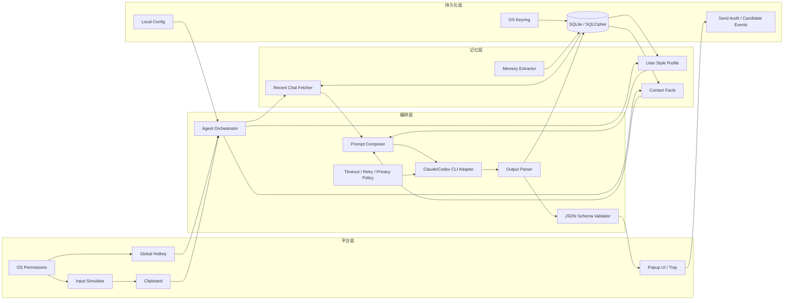
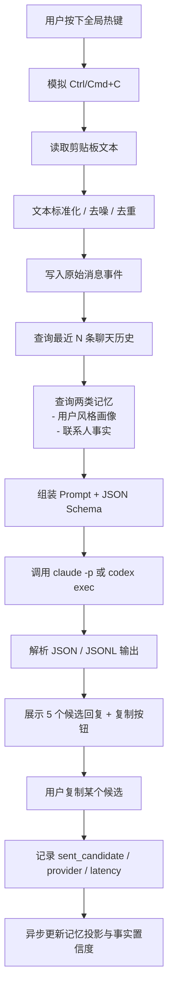
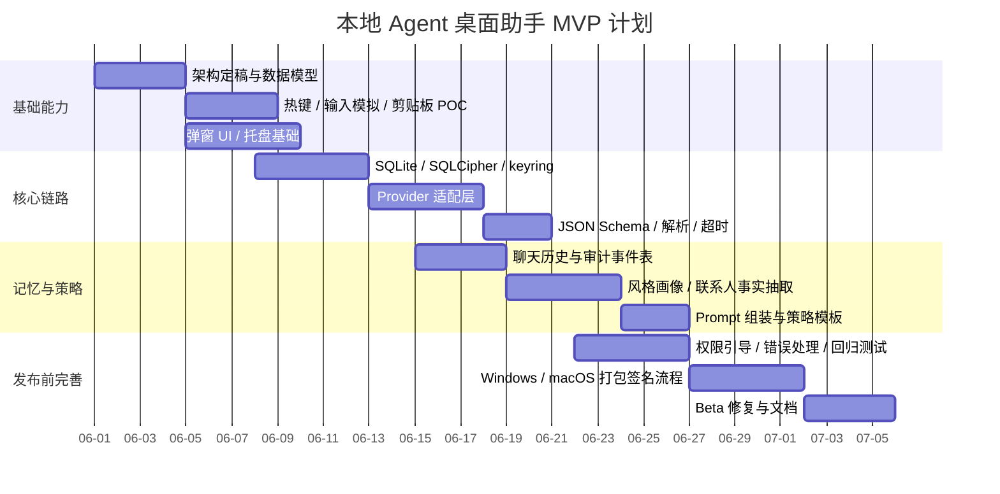

# 微信AI助手回复方案

**User:** Anonymous  
**Created:** 5/27/2026 21:17:52  
**Updated:** 5/27/2026 23:50:25  
**Exported:** 5/28/2026 0:54:21  
**Link:** [https://chatgpt.com/c/6a16eed2-2008-8322-ad0d-5cc16f264810](https://chatgpt.com/c/6a16eed2-2008-8322-ad0d-5cc16f264810)  

## Prompt:
2026/5/27 21:17:51

wechat 有没有什么方法可以操控，达到AI助手聊天的目的，可不自动回复，但是要提供几个选项给我，帮我回复妹子的消息

## Response:
2026/5/27 21:17:52

> **浏览微信自动化工具与API限制**
>
> [从零到一：微信机器人开发的实战心得](https://developer.aliyun.com/article/1576871)
> [WeCom-Work Communication&Tools - App Store - Apple](https://apps.apple.com/sg/app/wecom-work-communication-tools/id1189898970)
> [微信机器人开发文档- 奇迹婉婉](https://www.cnblogs.com/jinjing522/p/19403587)
> [WeChat Official Accounts Guide for Business (2026)](https://blog.omnichat.ai/wechat-official-account/)
> [What to Know about WeChat Service Accounts Foldering](https://it-consultis.com/insights/wechat-service-accounts-foldering/)
> [微信机器人协议](https://blog.csdn.net/u013865953/article/details/136544488)
> [WeChat Official Account Complete Guide 2023](https://www.imbee.io/resource/wechat-weixin-complete-guide)
> [微信小程序对接企业微信客服](https://juejin.cn/post/7158818531700637703)
> [我封你心：微信封号机制，其实是个“行为协议”？ - 腾讯云](https://cloud.tencent.com/developer/article/2521031)
> [腾讯抱紧“龙虾”，堪比一年前拥抱DeepSeek](https://m.36kr.com/p/3715557242532613)
> [A Guide to Approved WeChat on WeCom for Pharma in ...](https://intuitionlabs.ai/articles/approved-wechat-on-wecom-pharma-china)
> [企业微信api进行微信消息接收和推送功能实践](https://zhuanlan.zhihu.com/p/460215635)
> [微信机器人完全指南2026：从零搭建到AI接入，一篇读懂](https://post.smzdm.com/p/a827gndn)
> [WeChat API Integration](https://apix-drive.com/en/blog/other/wechat-api-integration)
> [发送消息 - 企业微信API](https://qiyeweixin.apifox.cn/api-10061328)
>
> **搜索官方站点相关文档**
>
>
> **搜索微信客服 API 官方文档**
>
> [微信客服](https://easywechat.com/5.x/wework/kf.html)
> [概述- 企业微信API](https://qiyeweixin.apifox.cn/doc-417793)
> [增加企业微信客服号channel #1761](https://github.com/zhayujie/chatgpt-on-wechat/pull/1761/files)
> [微信公众平台开发（十二） 发送客服消息](https://developer.aliyun.com/article/260744)
> [企业微信主动调用接口- wechatpy 2.0.0.alpha26 文档](https://docs.wechatpy.org/zh_CN/master/work/client.html)
>
> 已思考 30s

我先按“安全不封号、你手动确认发送”为目标来整理：哪些方式可行、哪些方式容易踩微信风控，以及一个最推荐的落地流程。

可以做，但**不建议直接“操控个人微信自动收发”**。个人微信没有公开的、合规的机器人 API；市面上常见的个人微信 Hook、iPad 协议、PC 协议逆向方案都属于灰色方案，容易触发风控、掉线甚至封号。更稳的是做成**“半自动 AI 回复建议器”**：只帮你读上下文、生成 3～5 个回复选项，你自己点复制/手动发送。

## 最推荐方案：不碰微信协议，只做“辅助回复”

流程是这样：

```text
妹子发消息
   ↓
你复制文字 / 截图发给 AI 助手
   ↓
AI 分析语气、关系阶段、聊天目标
   ↓
给你 3～5 个回复选项
   ↓
你挑一个，复制到微信手动发送
```

这个方案最安全，基本不会被微信风控，因为它**不登录微信、不 Hook、不自动发消息**。

你以后可以直接这样发给我：

```text
她说：
“今天好累，不想动了”

背景：
刚认识两周，聊得还行，想暧昧一点但别油。

帮我给 5 个回复：
1. 温柔关心
2. 幽默一点
3. 暧昧一点
4. 推进见面
5. 安全保守
```

我就可以给你这种选项：

**chat_message: **

1. 温柔关心版：那今天就别硬撑了，先好好休息。要是我在旁边，可能会给你点个热的，再监督你早点睡。

2. 轻松幽默版：那你今天的任务就是躺平，其他事交给明天的你，今天的你已经下班了。

3. 暧昧一点版：辛苦啦，要不要我远程哄你一下，虽然不能帮你分担累，但可以负责让你心情好一点。

## 如果想做成本地工具，可以这样设计

你可以做一个**本地悬浮窗/小工具**，不要直接控制微信发送：

```text
微信 PC 端
  ↓ 手动复制聊天内容
本地 AI 回复助手
  ↓ 调 OpenAI / 本地大模型
展示 3～5 个候选回复
  ↓
点击复制
  ↓
手动粘贴到微信发送
```

技术实现可以选：

| 方案 | 安全性 | 开发难度 | 说明 |
|---|---:|---:|---|
| 手动复制 + 网页小工具 | 最高 | 低 | 最推荐 |
| 截图 OCR + AI 生成回复 | 高 | 中 | 不读微信协议，只识别图片 |
| Raycast / Alfred / uTools 插件 | 高 | 中 | 适合 Mac/Windows 快捷调用 |
| AutoHotkey / Keyboard Maestro 辅助复制 | 中 | 中 | 可以做快捷键，但别自动发送 |
| 微信 Hook / 协议机器人 | 低 | 高 | 不推荐，封号风险大 |

## 官方可行但不适合“妹子聊天”的方案

如果是企业客服场景，可以走**企业微信 / 微信客服 API**。企业微信的微信客服支持通过 API 接收、读取、发送客服消息；但这是企业客服链路，不是个人微信私聊。微信客服发送消息还有窗口限制，例如客户主动发消息后 48 小时内可下发，且有条数限制。([企业微信 API](https://qiyeweixin.apifox.cn/doc-417793?utm_source=chatgpt.com))

所以它适合：

```text
客户咨询 → AI 生成客服回复 → 人工确认 → API 发送
```

不适合：

```text
个人微信好友私聊 → AI 代聊妹子
```

## 不推荐的方案

这些尽量别碰：

```text
PC 微信 Hook
iPad 协议
个人微信机器人框架
模拟登录协议
自动读取所有聊天记录
自动发送消息
```

原因很简单：个人微信没有官方机器人接口，很多方案依赖逆向、Hook 或非官方协议，存在封号和隐私风险。公开资料里也普遍把个人微信机器人归为非官方接入方式，风险点主要是协议逆向、Hook、异常行为风控。([36氪](https://m.36kr.com/p/3715557242532613?utm_source=chatgpt.com))

## 我建议你做的版本

做一个**“恋爱聊天回复副驾驶”**，功能控制在这几个：

```text
1. 输入/粘贴对方消息
2. 可选关系阶段：刚认识 / 暧昧期 / 已约过 / 冷淡中
3. 可选目标：延续聊天 / 升温 / 约见面 / 化解尴尬 / 道歉
4. 输出 5 个候选回复
5. 每个回复标注风险：
   - 稳妥
   - 幽默
   - 暧昧
   - 推进
   - 高风险
6. 点击复制，不自动发送
```

这样既能帮你聊天，又不会变成“机器人代聊”，也不容易踩微信风控。

你要是真想开发，我建议用这个最小技术架构：

```text
前端：Electron / Tauri / 普通 Web 页面
后端：Go / Python
输入：手动复制文本，或者截图 OCR
模型：OpenAI API / 本地 Qwen / DeepSeek / Ollama
输出：候选回复 + 风险说明 + 复制按钮
```

核心原则就一句：**AI 只给建议，不直接碰微信发送按钮。**

---

**Sources:**

- [概述- 企业微信API](https://qiyeweixin.apifox.cn/doc-417793?utm_source=chatgpt.com)
- [腾讯抱紧“龙虾”，堪比一年前拥抱DeepSeek](https://m.36kr.com/p/3715557242532613?utm_source=chatgpt.com)

## Prompt:
2026/5/27 22:19:38

那如果监控到我剪贴板的来源是微信，并且联系人是指定的妹子，就将消息，通过 claude 或者 codex 的skill 来给我几个推荐的回复，具体的 skill ，风格之类的可以设定，或者默认5个候选，让我能复制，这样行吗？

## Response:
2026/5/27 22:19:39

> **考虑设计可行性和隐私问题**
>
> 用户问的是关于实现本地监控剪贴板的设计问题，可能不需要网页。但涉及到小心隐私与授权，尤其是如何处理剪贴板和微信 contacts。可以提议一个架构，避免自动发送，比如获取明确的剪贴板权限，列出联系人白名单。安全性与微信无需绕过。
>
> **考虑Mac和Windows的实现方案**
>
> 用户使用Mac，可以考虑通过OCR或辅助功能读取活动窗口标题，避免私密泄露。可以设计一个包含剪贴板监控、源检测、联系人匹配等功能的Go语言方案，并提供UI托盘。考虑通过活动窗口来确认来自哪个应用的内容，而不是从剪贴板直接检测。
>
> 已思考 24s

这个思路是可行的，而且比“接管微信”安全很多。关键点是：只监听你主动复制出来的内容，AI 只生成候选，不自动发送、不注入微信、不逆向协议。

行，而且这是我最推荐的方向：**“微信剪贴板监听 + 指定联系人过滤 + AI 候选回复面板 + 手动复制发送”**。  
这个方案不碰微信协议、不自动发消息、不 Hook 微信，风险低很多。

核心要注意一点：**剪贴板本身通常不会告诉你“这段内容来自微信、来自哪个联系人”**。所以要靠“复制发生时的前台窗口信息”来判断。

---

## 推荐架构

```text
微信聊天窗口
   ↓ 你手动复制对方消息
本地 Clipboard Watcher 监听剪贴板变化
   ↓
检测当前前台应用是不是 WeChat / 微信
   ↓
读取当前窗口标题 / UI 元素 / 手动指定联系人
   ↓
判断是不是指定联系人
   ↓
调用 Claude / OpenAI / 本地模型
   ↓
弹出 5 个候选回复
   ↓
你点击复制其中一个
   ↓
手动粘贴到微信发送
```

这个是安全边界比较清楚的做法：**只读你复制的内容，只给建议，不代替你发。**

---

## 关键问题：怎么判断“来源是微信 + 指定妹子”

### 方案一：前台窗口检测，推荐

当剪贴板变化时，立刻获取当前前台应用和窗口标题。

例如：

```text
当前前台应用：WeChat
当前窗口标题：小美
剪贴板内容：今天好累啊，不想动了
```

然后判断：

```text
app == "WeChat"
&& window_title in whitelist_contacts
```

优点：体验自然。  
缺点：不同系统、不同微信版本，窗口标题不一定稳定。

---

### 方案二：快捷键触发，更稳

比如你在微信里选中对方消息后，按：

```text
Option + Shift + R
```

工具执行：

```text
1. 模拟 Cmd + C / Ctrl + C
2. 读取剪贴板
3. 获取当前前台窗口
4. 判断是不是微信
5. 弹候选回复
```

这个比纯后台监听更稳，因为它只在你主动触发时工作，隐私和误触风险都更低。

我更推荐这个。

---

### 方案三：手动指定联系人，最稳但麻烦一点

在本地工具里配置：

```yaml
current_contact: 小美
relationship_stage: 暧昧期
reply_style:
  - 温柔
  - 幽默
  - 轻微暧昧
  - 不油腻
  - 不强行推进
```

你复制消息后，只要当前配置是“小美”，就按她的风格生成回复。

优点：最稳定。  
缺点：需要你手动切换联系人。

---

## 技术实现建议

你是 Go 后端开发，建议后端用 Go 做本地 Agent。

### 本地模块拆分

```text
wechat-reply-assistant/
├── cmd/
│   └── assistant/
│       └── main.go
├── internal/
│   ├── clipboard/      # 剪贴板监听
│   ├── window/         # 前台窗口检测
│   ├── contact/        # 联系人白名单匹配
│   ├── llm/            # Claude / OpenAI / Ollama 调用
│   ├── skill/          # 回复风格 skill
│   └── ui/             # 弹窗 / 托盘 / Web UI
├── skills/
│   └── dating-reply/
│       ├── SKILL.md
│       └── style.yaml
└── config.yaml
```

---

## config.yaml 可以这样设计

```yaml
app:
  mode: hotkey
  candidate_count: 5
  auto_send: false
  save_history: false

wechat:
  app_names:
    - WeChat
    - 微信
  allowed_contacts:
    - 小美
    - 小周
  group_chat_enabled: false

model:
  provider: claude
  model: claude-3-5-sonnet-latest
  api_key_env: ANTHROPIC_API_KEY

reply_profile:
  default_stage: 暧昧期
  tone:
    - 自然
    - 温柔
    - 幽默
    - 不油腻
    - 不暴露需求感
  forbidden:
    - 不要跪舔
    - 不要查户口
    - 不要连续追问
    - 不要强行约
    - 不要PUA
```

---

## Skill 可以这样写

比如 `skills/dating-reply/SKILL.md`：

```markdown
# Dating Reply Assistant Skill

你是一个中文微信聊天回复助手。

目标：
- 根据对方消息，生成 5 条候选回复。
- 回复要自然、像真人、不像 AI。
- 不要过度讨好，不要油腻，不要说教。
- 可以轻微幽默和暧昧，但不要冒犯。
- 不要自动替用户承诺事情。
- 不要编造现实中没有发生过的经历。
- 用户会自己选择是否发送。

输入包含：
- contact_name：联系人名称
- relationship_stage：关系阶段
- latest_message：对方最新消息
- recent_context：最近聊天上下文，可为空
- user_goal：用户目标
- tone：用户希望的语气

输出格式必须是 JSON：

{
  "analysis": "一句话分析对方情绪和聊天机会",
  "candidates": [
    {
      "label": "稳妥",
      "message": "...",
      "risk": "低",
      "why": "..."
    },
    {
      "label": "幽默",
      "message": "...",
      "risk": "低",
      "why": "..."
    },
    {
      "label": "暧昧",
      "message": "...",
      "risk": "中",
      "why": "..."
    },
    {
      "label": "推进",
      "message": "...",
      "risk": "中",
      "why": "..."
    },
    {
      "label": "反差",
      "message": "...",
      "risk": "中",
      "why": "..."
    }
  ]
}
```

---

## 候选回复展示效果

比如对方发：

```text
今天好累，不想动了
```

你的工具可以弹出：

**chat_message: **

1. 稳妥：那今天就别硬撑了，先好好休息，明天再处理那些烦人的事。

2. 温柔：辛苦啦，今天允许你彻底摆烂一会儿。吃点热的，早点躺平。

3. 幽默：那你今天的身份就是“充电中的小废物”，其他事情明天再说。

4. 轻微暧昧：要是我在旁边，可能会给你点杯热的，然后监督你早点休息。

5. 推进一点：那今晚就别折腾了，改天带你吃点好吃的回血。

---

## Claude / Codex / OpenAI 怎么接

从工程角度，不要把 Skill 和模型强绑定。建议统一成一个接口：

```go
type ReplyRequest struct {
    ContactName       string   `json:"contact_name"`
    RelationshipStage string   `json:"relationship_stage"`
    LatestMessage     string   `json:"latest_message"`
    RecentContext     []string `json:"recent_context"`
    UserGoal          string   `json:"user_goal"`
    Tone              []string `json:"tone"`
}

type ReplyCandidate struct {
    Label   string `json:"label"`
    Message string `json:"message"`
    Risk    string `json:"risk"`
    Why     string `json:"why"`
}

type ReplyResponse struct {
    Analysis   string           `json:"analysis"`
    Candidates []ReplyCandidate `json:"candidates"`
}
```

然后后面你想换模型都很简单：

```text
Claude API
OpenAI API
本地 Ollama
DeepSeek API
Qwen API
```

只是 `llm.Provider` 不同，业务逻辑不用改。

---

## 前端 UI 建议

不用一开始做复杂 App，最小版本可以是：

```text
本地 HTTP 服务：127.0.0.1:17888
前端页面：展示候选回复
快捷键：触发复制 + 请求 AI
系统托盘：开关监听
```

弹窗里放：

```text
联系人：小美
关系：暧昧期
对方消息：今天好累，不想动了

候选回复：
[稳妥] [复制]
[幽默] [复制]
[暧昧] [复制]
[推进] [复制]
[反差] [复制]
```

---

## 风险控制建议

你这个工具最好明确限制：

```text
1. 不自动发送。
2. 不读取所有微信消息，只处理你复制的内容。
3. 只对白名单联系人生效。
4. 默认不保存聊天记录。
5. 不上传联系人真实备注名，可以本地映射成 contact_id。
6. 不处理群聊，除非你明确开启。
7. 不注入微信、不 Hook、不逆向协议。
```

尤其是第 2 点很重要：**不要做全量聊天记录监听**，只做“用户主动复制后的 AI 辅助”。

---

## 最推荐的 MVP 路线

第一版这样做就够了：

```text
1. 手动复制微信消息。
2. 本地工具监听剪贴板。
3. 判断当前前台应用是不是微信。
4. 判断窗口标题是不是白名单联系人。
5. 调用 Claude / OpenAI。
6. 输出 5 个候选回复。
7. 点击按钮复制。
8. 用户手动粘贴发送。
```

第二版再加：

```text
1. 快捷键触发。
2. 最近 3～5 轮上下文缓存。
3. 不同联系人不同风格配置。
4. 关系阶段配置。
5. 回复风险等级。
6. 一键改写：更暧昧 / 更冷淡 / 更幽默 / 更短。
```

结论：**这个方案可以做，而且方向很合理。**  
我建议你不要从“自动监听所有微信”开始，而是从**快捷键触发 + 白名单联系人 + AI 候选回复**开始，稳定、安全、开发量也小。

## Prompt:
2026/5/27 22:26:52

方案二 比较好吧，但是注意不调用 api，而是直接调用 codex，或者 claude code ，-p 这样的，这可以吗？Agent要注意需要Windows 和 Mac两个版本的。方案二都不需要判断是否是微信或者联系人了，我现在就一个相亲对象啊，没有多个的。

## Response:
2026/5/27 22:26:55

> **浏览OpenAI和Anthropic官方文档**
>
> [Output styles - Claude Code Docs](https://docs.anthropic.com/en/docs/claude-code/output-styles)
> [Command line options – Codex CLI](https://developers.openai.com/codex/cli/reference)
> [exec_command shell commands hang the CLI for 30 ...](https://github.com/openai/codex/issues/6715)
>
> **寻找Claude Code CLI官方参考资料**
>
> [Command line options – Codex CLI | OpenAI Developers](https://developers.openai.com/codex/cli/reference)
> [Output styles - Claude Code Docs](https://docs.anthropic.com/en/docs/claude-code/output-styles)
>
> **搜索Claude Code CLI参考文档**
>
> [Commands - Claude Code Docs](https://code.claude.com/docs/en/commands)
> [Manage costs effectively - Claude Code Docs](https://docs.anthropic.com/en/docs/claude-code/costs)
>
> **搜索CLI参考线**
>
> [CLI reference - Claude Code Docs](https://code.claude.com/docs/en/cli-reference)
>
> **Searching Codex and Claude Code usage details**
>
> [Agent Skills – Codex](https://developers.openai.com/codex/skills)
>
> **寻找可能的开放技能**
>
> [Agent Skills – Codex | OpenAI Developers](https://developers.openai.com/codex/skills)
>
> 已思考 41s

对，方案二更适合你这个场景：一个相亲对象、你主动按快捷键触发，就没必要再做微信来源和联系人识别。唯一要确认的是 Codex / Claude Code 的非交互调用参数和本地登录态。

可以，**方案二是最适合你的**：按快捷键触发，不需要判断是不是微信，也不需要判断联系人。你现在只有一个相亲对象，那就默认“当前复制的内容 = 她的消息”，直接生成 5 个候选回复。

不过有两个关键点要注意：

1. **Claude Code 可以用 `claude -p "..."`**，官方文档里 `claude -p` 就是“查询后退出”，也支持管道输入。([Claude Code](https://code.claude.com/docs/en/cli-reference))  
2. **Codex 不建议写成 `codex -p`**，因为 Codex CLI 里 `-p` 是 profile 参数，不是 prompt。Codex 的非交互调用应该用 `codex exec "..."` 或 `codex e "..."`。([OpenAI 开发者](https://developers.openai.com/codex/cli/reference))

还有一点：虽然你的程序“不直接调用 API”，但 **Codex / Claude Code CLI 本身还是会联网调用模型服务**，只是鉴权和调用逻辑由 CLI 管了，你的 Agent 不需要维护 API Key。

---

## 最终推荐形态

```text
你在微信里选中她的消息
    ↓
按快捷键：Option/Alt + Shift + R
    ↓
Agent 自动复制当前选中文本
    ↓
调用 claude -p 或 codex exec
    ↓
弹出 5 个候选回复
    ↓
你点“复制”
    ↓
你手动粘贴到微信发送
```

这个设计就不需要：

```text
不需要监听所有剪贴板
不需要判断是不是微信
不需要识别联系人
不需要自动发送
不需要 Hook 微信
不需要逆向微信协议
```

---

## 我建议优先用 Claude Code

因为你的场景不是写代码，而是**短文本生成**。Claude Code 的 `claude -p` 很适合这种“一次输入，一次输出”的场景。官方 CLI 参考里也明确支持：

```bash
claude -p "explain this function"
cat logs.txt | claude -p "explain"
```

也就是可以把你复制的微信消息通过 stdin 传进去，然后让它输出候选回复。([Claude Code](https://code.claude.com/docs/en/cli-reference))

Claude Code 还支持自定义 output style，可以用来固定“恋爱聊天助手”的回复风格；自定义 output style 是 Markdown 文件，可以放在 `~/.claude/output-styles`，它会修改 Claude Code 的系统提示词。([Claude API Docs](https://docs.anthropic.com/en/docs/claude-code/output-styles))

---

## Codex 也可以，但调用方式要换

Codex 用这个：

```bash
codex exec --ephemeral "根据下面的微信消息，生成5个回复候选..."
```

官方文档说明 `codex exec` 是非交互模式，适合脚本/自动化，输出最终结果到 stdout。([OpenAI 开发者](https://developers.openai.com/codex/noninteractive))  
`--ephemeral` 可以避免持久化 session rollout 文件，更适合这种临时聊天辅助场景。([OpenAI 开发者](https://developers.openai.com/codex/noninteractive))

Codex 也有 Skills，Skill 是一个带 `SKILL.md` 的目录，可以封装可复用的工作流；Codex 可以显式或隐式调用 Skill。([OpenAI 开发者](https://developers.openai.com/codex/skills))

但我对你的建议是：

```text
首选：Claude Code -p
备选：Codex exec
不要一开始两个都接
```

---

## Windows / Mac 双版本怎么做

建议用 **Go 写一个跨平台 Agent**，外面再分别处理快捷键和弹窗。

```text
wechat-reply-agent/
├── cmd/
│   └── agent/
│       └── main.go
├── internal/
│   ├── hotkey/       # 全局快捷键
│   ├── clipboard/    # 复制和读取剪贴板
│   ├── llm/          # 调 claude / codex 命令
│   ├── prompt/       # Prompt 模板
│   ├── parser/       # 解析 JSON 结果
│   └── ui/           # 弹窗展示
├── prompts/
│   └── dating_reply.md
├── skills/
│   └── dating-reply/
│       └── SKILL.md
└── config.yaml
```

### macOS

快捷键触发后：

```text
1. 执行 Cmd+C
2. 读取剪贴板
3. 调用 claude -p
4. 展示结果
```

### Windows

快捷键触发后：

```text
1. 执行 Ctrl+C
2. 读取剪贴板
3. 调用 claude.exe -p 或 codex.exe exec
4. 展示结果
```

Claude Code 现在支持 macOS 和 Windows；官方安装文档里列了 macOS 13+、Windows 10 1809+ 等要求，也提供 Windows PowerShell / CMD 安装方式。([Claude Code](https://code.claude.com/docs/en/setup))  
Codex CLI 官方文档也说明支持 macOS、Windows、Linux，Windows 可以原生 PowerShell 运行，也可以用 WSL2。([OpenAI 开发者](https://developers.openai.com/codex/cli))

---

## config.yaml 建议

```yaml
agent:
  mode: hotkey
  hotkey_mac: "option+shift+r"
  hotkey_windows: "alt+shift+r"
  candidate_count: 5
  auto_send: false
  save_history: false

llm:
  provider: claude_code
  claude_command: "claude"
  codex_command: "codex"
  timeout_seconds: 60

reply:
  relationship_stage: "相亲初期"
  goal: "自然推进关系，保持轻松，不油腻"
  tone:
    - 自然
    - 温柔
    - 幽默
    - 不跪舔
    - 不查户口
    - 不暴露强需求感
  output_format: json
```

---

## Prompt 模板建议

`prompts/dating_reply.md`：

```markdown
你是一个中文微信聊天回复助手。

用户正在和一个相亲对象聊天。
你需要根据对方最新消息，生成 5 个候选回复。

要求：
1. 回复要像真人，不要像 AI。
2. 不要油腻，不要跪舔，不要说教。
3. 不要连续追问，不要查户口。
4. 可以轻微幽默、轻微暧昧，但不要冒犯。
5. 不要自动替用户承诺见面、送礼、转账等行为。
6. 每条回复控制在 10～35 个中文字符左右。
7. 输出 JSON，不要输出多余解释。

关系阶段：
{{relationship_stage}}

用户目标：
{{goal}}

语气：
{{tone}}

对方最新消息：
{{message}}

输出格式：
{
  "analysis": "一句话分析对方情绪和回复策略",
  "candidates": [
    {
      "label": "稳妥",
      "message": "...",
      "risk": "低"
    },
    {
      "label": "温柔",
      "message": "...",
      "risk": "低"
    },
    {
      "label": "幽默",
      "message": "...",
      "risk": "低"
    },
    {
      "label": "暧昧",
      "message": "...",
      "risk": "中"
    },
    {
      "label": "推进",
      "message": "...",
      "risk": "中"
    }
  ]
}
```

---

## Claude Code 调用方式

macOS / Linux：

```bash
cat prompt.txt | claude -p
```

Windows PowerShell：

```powershell
Get-Content .\prompt.txt -Raw | claude -p
```

Go 里面可以这样抽象：

```go
type Provider interface {
    Generate(prompt string) (string, error)
}

type ClaudeCodeProvider struct {
    Command string
}

func (p *ClaudeCodeProvider) Generate(prompt string) (string, error) {
    cmd := exec.Command(p.Command, "-p")
    cmd.Stdin = strings.NewReader(prompt)

    var stdout bytes.Buffer
    var stderr bytes.Buffer
    cmd.Stdout = &stdout
    cmd.Stderr = &stderr

    err := cmd.Run()
    if err != nil {
        return "", fmt.Errorf("claude failed: %w, stderr: %s", err, stderr.String())
    }

    return stdout.String(), nil
}
```

---

## Codex 调用方式

Codex 建议这样：

```bash
codex exec --ephemeral "你的完整 prompt"
```

或者从 stdin 传上下文：

```bash
cat prompt.txt | codex exec --ephemeral "根据输入内容生成5个微信回复候选，输出JSON"
```

Go 里：

```go
type CodexProvider struct {
    Command string
}

func (p *CodexProvider) Generate(prompt string) (string, error) {
    cmd := exec.Command(
        p.Command,
        "exec",
        "--ephemeral",
        "根据输入内容生成5个微信回复候选，输出JSON",
    )
    cmd.Stdin = strings.NewReader(prompt)

    var stdout bytes.Buffer
    var stderr bytes.Buffer
    cmd.Stdout = &stdout
    cmd.Stderr = &stderr

    err := cmd.Run()
    if err != nil {
        return "", fmt.Errorf("codex failed: %w, stderr: %s", err, stderr.String())
    }

    return stdout.String(), nil
}
```

---

## UI 第一版别做复杂

第一版直接弹一个小窗口就够：

```text
对方消息：
今天好累，不想动了

AI 分析：
她在表达疲惫，适合轻关心，不适合强行约。

候选回复：
[稳妥]  那今天就别硬撑了，早点休息
[温柔]  辛苦啦，今晚允许你彻底摆烂
[幽默]  那你今天就是充电中的小废物
[暧昧]  要是我在旁边，就监督你早点睡
[推进]  改天带你吃点好吃的回血

每条后面一个【复制】按钮
```

---

## 隐私建议

这个 Agent 最好默认做到：

```text
不保存聊天记录
不自动发送
不后台监听所有剪贴板
不记录联系人备注
不读取微信数据库
不注入微信进程
不做屏幕 OCR 常驻监听
```

如果要保存上下文，也只保存在本地，比如最近 3～5 轮，而且可以一键清空。

---

## 结论

你的方案可以做，而且比之前的监听方案更干净：

```text
快捷键触发
只处理当前复制内容
默认一个相亲对象
不识别微信
不识别联系人
不自动发送
调用本机 claude -p / codex exec
弹出 5 个候选
你手动复制发送
```

我建议技术路线定为：

```text
第一版：Go Agent + 全局快捷键 + 剪贴板 + Claude Code -p + 简单弹窗
第二版：支持 Codex exec
第三版：加本地上下文、风格配置、候选回复评分
```

---

**Sources:**

- [CLI reference - Claude Code Docs](https://code.claude.com/docs/en/cli-reference)
- [Command line options – Codex CLI | OpenAI Developers](https://developers.openai.com/codex/cli/reference)
- [Output styles - Claude Code Docs](https://docs.anthropic.com/en/docs/claude-code/output-styles)

## Prompt:
2026/5/27 22:34:32

需要保存聊天记录吧？不然怎么根据历史记录回复啊？前后矛盾之类的会不会发生

## Response:
2026/5/27 22:34:34

对，**需要保存“必要的聊天上下文”**，否则确实容易出现前后矛盾，比如：

```text
她之前说不吃辣，AI 后面推荐川菜。
她之前说周六加班，AI 后面约她周六出去。
她之前说感冒了，AI 后面完全不关心。
你之前说自己不会做饭，AI 后面回复成“我下次做饭给你吃”。
```

所以最佳方案不是“不保存”，而是：**本地保存、分层保存、可清理、默认不上传完整历史**。

---

## 推荐设计：保存三类上下文

### 1. 最近聊天原文：用于接上当前语境

保存最近 20～50 条即可，比如：

```text
她：今天加班到好晚
我：辛苦了，回去早点休息
她：刚到家，累死
```

这个用于让 AI 判断当前该关心、幽默、推进，还是收一下。

### 2. 长期事实记忆：用于避免矛盾

把关键信息抽出来，不一定保存所有原文。

例如：

```yaml
她:
  不吃辣
  喜欢喝奶茶
  周末经常加班
  不喜欢太油腻的表达
  最近在准备考试
  家在苏州
我:
  表达风格偏自然幽默
  不想太舔
  想慢慢推进关系
关系:
  相亲初期
  已经聊了 8 天
  还没见面
  目标是自然约第一次见面
禁忌:
  不要频繁问“在干嘛”
  不要连续追问
  不要过早说喜欢
```

这部分比原文更重要，因为它能长期约束 AI。

### 3. 阶段总结：用于控制关系进度

比如每天或每 20 条消息生成一次总结：

```text
当前关系：相亲初期，聊天氛围尚可，对方会主动分享工作疲惫，但还没有明显暧昧。
最近重点：她最近工作忙、睡眠不好，不适合强行约见面。
建议策略：多轻松陪伴，少查户口；可以在周末前轻微试探约饭。
```

这样不用每次把所有历史都塞给模型。

---

## 不建议保存什么

不建议无脑保存全部内容，也不要长期明文保存特别隐私的内容。

尤其不要保存：

```text
完整微信数据库
所有联系人消息
群聊消息
图片、语音、文件
身份证、手机号、住址等敏感信息
```

你这个工具只服务一个相亲对象，所以边界可以很清楚：

```text
只保存你手动触发时复制进去的内容
只保存这个聊天对象的上下文
只在本机保存
不自动读取微信数据库
不自动扫描聊天记录
```

---

## 最合理的上下文结构

每次按快捷键时，Agent 应该拿这几部分拼 prompt：

```text
1. 最近 20 条聊天原文
2. 长期事实记忆
3. 当前关系阶段
4. 用户回复风格
5. 本次复制的最新消息
6. 禁忌规则
7. 输出 5 个候选回复
```

也就是：

```text
最新消息不是孤立处理，而是在“最近上下文 + 长期记忆 + 当前关系阶段”里处理。
```

这样前后矛盾会少很多。

---

## 本地存储建议

直接用 SQLite 就够了。

```text
data/
├── assistant.db
├── config.yaml
└── skills/
    └── dating-reply/
        └── SKILL.md
```

表设计可以这样：

```sql
CREATE TABLE messages (
    id INTEGER PRIMARY KEY AUTOINCREMENT,
    role TEXT NOT NULL,              -- me / her
    content TEXT NOT NULL,
    created_at DATETIME DEFAULT CURRENT_TIMESTAMP
);

CREATE TABLE memories (
    id INTEGER PRIMARY KEY AUTOINCREMENT,
    category TEXT NOT NULL,          -- her / me / relationship / taboo
    content TEXT NOT NULL,
    confidence REAL DEFAULT 1.0,
    source_message_id INTEGER,
    created_at DATETIME DEFAULT CURRENT_TIMESTAMP,
    updated_at DATETIME DEFAULT CURRENT_TIMESTAMP
);

CREATE TABLE summaries (
    id INTEGER PRIMARY KEY AUTOINCREMENT,
    summary TEXT NOT NULL,
    from_message_id INTEGER,
    to_message_id INTEGER,
    created_at DATETIME DEFAULT CURRENT_TIMESTAMP
);
```

第一版甚至可以更简单，只做三个文件：

```text
history.md
memory.yaml
summary.md
```

但后面要做检索、清理、去重，SQLite 更舒服。

---

## 关键流程应该这样

### 第一次触发

你复制她的消息，按快捷键。

Agent 弹窗问一下：

```text
这条消息是谁发的？
[她发的] [我发的]
```

或者设置快捷键：

```text
Alt + Shift + H：记录她说的话并生成回复
Alt + Shift + M：只记录我发的话
```

### 日常使用

推荐流程：

```text
1. 她发消息
2. 你选中她的消息
3. 按 Alt/Option + Shift + R
4. Agent 自动复制
5. 保存为 her 消息
6. 读取最近上下文 + 记忆
7. 调用 Claude Code / Codex
8. 弹出 5 个候选
9. 你点复制
10. 粘贴到微信手动发送
11. Agent 记录你选中的那条候选为 me 消息
```

这里最重要的是第 11 步：  
**AI 必须知道你最后实际发了哪一句**，否则它下次不知道你有没有用它的建议。

---

## 防止前后矛盾的核心机制

不是简单保存历史，而是要让模型每次回复前检查：

```text
1. 是否和她的已知偏好冲突？
2. 是否和我之前说过的话冲突？
3. 是否推进太快？
4. 是否重复问过的问题？
5. 是否忽略她最近的情绪？
6. 是否承诺了我做不到的事情？
```

Prompt 里可以加一段：

```markdown
生成回复前，必须检查以下冲突：
- 不要违背“长期事实记忆”
- 不要重复最近已经问过的问题
- 不要假装发生过不存在的事情
- 不要替用户承诺见面、送礼、转账
- 不要和用户历史人设矛盾
- 如果信息不足，选择更保守自然的回复
```

---

## 更推荐的保存策略

我建议你用这个等级：

```text
Level 1：保存最近 50 条原文
Level 2：保存结构化长期记忆
Level 3：保存每日/每阶段总结
Level 4：超过 30 天的原文自动清理，只保留总结和记忆
```

这样既能保证上下文，又不会无限堆聊天记录。

---

## 配置可以这样加

```yaml
memory:
  enabled: true
  storage: sqlite
  encrypt: true
  save_raw_messages: true
  raw_message_retention_days: 30
  recent_message_limit: 30
  auto_summary_every_messages: 20
  auto_extract_memory: true

privacy:
  local_only: true
  read_wechat_db: false
  auto_send: false
  save_clipboard_all: false
  only_save_hotkey_triggered_text: true
```

---

## 结论

你说得对：**完全不保存聊天记录，会影响回复质量，也容易前后矛盾。**

但正确做法不是“全量监听保存微信”，而是：

```text
只保存你主动触发的聊天内容
保存最近原文
提取长期记忆
定期生成阶段总结
本地 SQLite 加密存储
每次生成回复时带上上下文和记忆
你选择哪条回复，就把那条也记录进去
```

这样既能保证聊天连续性，又不会变成高风险的微信监控工具。

## Prompt:
2026/5/27 22:40:49

但是还有一个问题，需不需要先喂AI我自己的聊天记录，形成数字分身类似的效果？防止前后差别过大？

## Response:
2026/5/27 22:40:53

需要，但**不建议一上来把大量完整聊天记录直接喂给 AI**。更好的做法是：用你的历史聊天记录生成一个**“个人聊天风格画像 / 数字分身配置”**，以后每次生成回复时带上这个画像，而不是每次塞一大堆历史原文。

结论可以这样定：

```text
需要“学习你的风格”
不需要“长期保存并反复上传所有原始聊天记录”
```

## 为什么需要

如果完全不学习你的风格，AI 很容易出现这种问题：

```text
你平时说话：哈哈哈，那你这也太惨了
AI 回复：亲爱的，辛苦你了，我一直都在
```

或者：

```text
你平时比较含蓄
AI 突然输出很暧昧、很油、很会撩
```

这样妹子很容易感觉到：**这人今天说话风格怎么突然不一样了**。

所以你需要给 Agent 建一个“你的说话风格档案”。

---

## 不要做“完整数字分身”，做“风格约束器”

不要让 AI 完全模仿你所有聊天记录，因为容易变成：

```text
过度拟合
学到你的口头禅但用得很尬
泄露历史聊天里的隐私
把过去和别人聊过的话复用到相亲对象身上
```

更适合的是提取这些东西：

```yaml
user_style:
  说话长度: "偏短，通常 1~2 句"
  语气: "自然、轻松、偶尔开玩笑"
  暧昧程度: "轻微，不主动说太满"
  常用表达:
    - "哈哈哈"
    - "还行"
    - "有点东西"
    - "那确实"
  不常用表达:
    - "亲爱的"
    - "宝贝"
    - "我一直都在"
    - "想你了"
  标点习惯: "少用感叹号，不用太多 emoji"
  关系推进方式: "先轻松聊，再找机会约饭，不强推"
  禁忌:
    - "不要突然深情"
    - "不要发小作文"
    - "不要太油"
    - "不要像客服"
```

这个东西才是真正有用的“数字分身”。

---

## 推荐流程

### 第一步：导入你的历史聊天样本

不用很多，先拿这些就够：

```text
你和朋友的正常聊天：50~100 条
你和女生聊天的记录：30~80 条
你自己觉得“这句像我”的回复：20 条
你觉得“这句不像我”的反例：10 条
```

重点不是数量越多越好，而是要覆盖你的真实风格。

### 第二步：让 AI 提取你的风格画像

生成一个 `user_profile.yaml`：

```yaml
identity:
  relationship_stage: "相亲初期"
  preferred_persona: "自然、幽默、有边界感，不油腻"

style:
  sentence_length: "短句为主，偶尔两句话"
  tone: ["轻松", "自然", "不端着", "不舔"]
  humor_level: "中低"
  flirt_level: "低到中"
  directness: "中等偏含蓄"
  emoji_usage: "少用或不用"

habits:
  common_phrases:
    - "哈哈哈"
    - "那确实"
    - "有点东西"
    - "也不是不行"
  avoid_phrases:
    - "宝贝"
    - "亲爱的"
    - "我一直都在"
    - "你开心我就开心"

rules:
  - "不要突然变得很深情"
  - "不要连续追问"
  - "不要过度解释"
  - "不要每次都把话题往约会引"
  - "不要编造用户没有说过的经历"
```

### 第三步：每次生成回复时带上它

每次 Agent 调 Claude / Codex 时，Prompt 里带：

```text
1. 用户个人聊天风格画像
2. 当前相亲对象的长期记忆
3. 最近 20~50 条聊天上下文
4. 本次她的新消息
5. 输出 5 个候选回复
```

这样 AI 就不会忽然变成另一个人。

---

## 最重要的是：保存两套记忆

你这个 Agent 应该有两套核心记忆。

### 1. 我的风格记忆

用于保证“像我”。

```yaml
me:
  风格: 自然、短句、轻松
  不能说: 宝贝、亲爱的、我想你
  常用语: 哈哈哈、那确实、有点东西
  推进方式: 慢慢来，不强推
```

### 2. 她的事实记忆

用于保证“不矛盾”。

```yaml
her:
  不吃辣: true
  最近工作忙: true
  喜欢喝咖啡: true
  周六可能加班: true
  对太油腻表达反感: unknown
```

最终效果是：

```text
我的风格记忆 = 像不像我
她的事实记忆 = 会不会前后矛盾
最近聊天上下文 = 当前该怎么接
```

这三者缺一不可。

---

## 不建议直接把所有聊天记录都长期塞给 Claude / Codex

原因有几个：

```text
1. token 太多，慢且贵
2. 模型容易抓错重点
3. 隐私风险更高
4. 历史聊天里可能有和其他人的表达，不适合复用
5. 容易把过去的关系语气迁移到现在相亲对象上
```

比如你以前和熟人开玩笑比较放飞，AI 学了之后拿去和相亲对象说，就可能翻车。

所以要做的是：

```text
原始聊天记录 → 风格提取 → 人设配置 → 候选回复约束
```

而不是：

```text
每次都把所有聊天记录丢给 AI
```

---

## MVP 可以这样做

第一版就做三个文件：

```text
data/
├── my_style.yaml          # 我的说话风格
├── her_memory.yaml        # 她的事实和偏好
└── chat_history.md        # 最近聊天上下文
```

每次调用时拼成：

```text
你是我的微信回复助手。

必须遵守我的说话风格：
{{my_style.yaml}}

必须遵守她的事实记忆：
{{her_memory.yaml}}

最近聊天：
{{recent_chat_history}}

她的新消息：
{{latest_message}}

请生成 5 个候选回复。
要求：
1. 像我本人
2. 不前后矛盾
3. 不油腻
4. 不过度推进
5. 每条 10~35 个中文字符
```

---

## 最佳实践

我建议你这样落地：

```text
第一阶段：
手动整理 50~100 条你自己的聊天样本，生成 my_style.yaml。

第二阶段：
日常聊天时，只保存你主动触发的内容和最终发送的回复。

第三阶段：
每 20 条消息，让 AI 更新一次：
- 她的偏好
- 当前关系阶段
- 不能再重复的话题
- 是否适合推进见面

第四阶段：
每次生成回复前做冲突检查。
```

冲突检查 Prompt 可以这样写：

```text
生成候选回复前，先检查：
1. 是否不像用户平时说话？
2. 是否违背她已知偏好？
3. 是否重复最近问过的问题？
4. 是否推进太快？
5. 是否太油腻？
6. 是否编造了没有发生过的事？

如果有风险，降低暧昧程度，选择更自然的表达。
```

---

## 结论

**需要先喂一部分你的聊天记录，但目的不是训练模型，而是提取你的聊天风格画像。**

最推荐方案是：

```text
少量历史样本
   ↓
提取 my_style.yaml
   ↓
日常保存最近上下文 + 她的长期记忆
   ↓
每次生成回复时用 my_style.yaml 约束
   ↓
你选择后再记录最终发送内容
```

这样既能防止前后风格差别过大，也不会因为保存和上传大量原始聊天记录带来隐私和失控问题。

## Prompt:
2026/5/27 22:45:04

先做技术方案设计，我扔给 codex cli 去完成App开发。但是选取 golang 的话，rust 是不是更好更快？

## Response:
2026/5/27 22:45:06

# Rust 与 Go 构建本地跨平台 Agent 桌面助手的技术选型报告

## 执行摘要

这类应用的真正难点，不在于“调用一个大模型”本身，而在于桌面集成的边角条件：全局热键、模拟复制、剪贴板一致性、加密 SQLite、macOS 权限、Windows 完整性级别限制、CLI 超时与 JSON 解析、以及最终的安装器与签名流程。对你描述的需求而言，**语言只决定一部分体验**；另外一大部分由 GUI 框架、输入模拟库、SQLite 加密方案、以及 Claude Code / Codex CLI 的工作方式决定。官方文档表明，Claude Code 已经支持 `claude -p`、`json` / `stream-json` 输出和 `--json-schema`，Codex CLI 也支持 `codex exec`、JSONL 流和 `--output-schema`，因此“通过本地子进程编排外部 CLI”这条路线是成立的。[^1]

如果把目标限定为 **Windows 10+ 与 macOS 12+、本地常驻热键守护进程、小弹窗展示 5 个候选回复、保存结构化历史并抽取记忆**，那么结论可以非常明确地分成两层：

**短期 MVP（4–8 周、单人或 Go 背景团队）优先 Go**。Go 的标准库在子进程、上下文取消、结构化日志、测试方面非常顺手；Go 官方调查也显示开发者满意度持续很高，且 Go 在 CLI 与后台工具场景非常强。对一个以“热键 + 剪贴板 + SQLite + subprocess + 小 UI”组成的本地助手来说，Go 能更快把主链路做通。[^2]

**长期产品化桌面应用优先 Rust，尤其是 Rust + Tauri 2**。原因不是“Rust 一定更快”这么简单，而是它在这个题目里同时拿到几项关键优势：无 GC 带来的更低 idle 负担、Tauri 更完整的桌面分发与权限模型、成熟的全局快捷键与剪贴板插件、以及对系统 API/原生依赖的长期控制力。官方资料还显示 Tauri 使用系统 WebView，最小应用体积可以做到很小，并且 bundler、插件权限、GitHub Actions 流程都很完整。[^3]

综合你的场景，我的推荐是：

**结论性建议：先 Go 做 MVP，但从第一天就按“未来可迁移到 Rust”的方式设计边界。**  
更具体一点：

- 如果你是 **单人开发、Go 熟悉、目标是 4–8 周内可用**：先做 **Go 核心 + Fyne 小弹窗外壳**，把平台集成、CLI 适配、记忆抽取、数据库都抽象成接口；这样最快。Fyne 的托盘与无渲染测试能力，对这种小弹窗工具非常合适。[^4]
- 如果你从第一天就更看重 **安装器质量、最小权限、长期维护、较低常驻资源、桌面壳产品化**：直接做 **Rust + Tauri 2**。这会更慢上手，但长期更顺。[^5]

需要特别说明的是，**目前没有针对“热键复制 + 外部 LLM CLI + 小弹窗 UI”这一精确工作负载的官方端到端基准**。因此下面关于启动、内存、维护性的结论，部分是基于运行时模型、工具链设计和官方生态文档做出的工程判断，而不是某个统一 benchmark 的机械结论。[^6]

## 对比结论与总表

先给一个简化版判断：**Go 更像“快做出来”的答案，Rust 更像“做得更像产品”的答案。** 下面这张表把你要求的维度逐项展开。

| 维度 | Go | Rust | 结论 | 依据 |
|---|---|---|---|---|
| 冷启动与常驻内存 | 有运行时、调度器与 GC；可通过 `GOGC` 等调节，但运行时始终存在 | 无 GC，内存由所有权规则在编译期约束；运行时负担通常更轻 | 对“常驻热键守护进程”这类工具，Rust 一般更有 idle RSS 优势；但端到端响应常被 CLI 调用和 UI 初始化主导 | [^6] |
| 并发模型 | goroutine + channel 上手快，I/O 编排很省心 | `async`/Tokio 功能强，但 `Send/Sync`、生命周期与取消语义理解成本更高 | 这个项目需要的并发主要是 I/O 编排而非 CPU 计算，Go 更利于首版开发；Rust 更适合严格控制状态与资源 | [^7] |
| 外部 CLI 调用 | `os/exec` + `context` 非常直接，支持取消、环境变量、stdout/stderr 管线 | `std::process` 与 `tokio::process` 都成熟；异步流式处理更灵活，但样板更多 | 两边都能做好；**Go 更省事，Rust 更细粒度** | [^2] |
| 流式 I/O 与 JSON 输出 | 读取 `stdout`/`stderr`、逐行解析 JSON 很自然 | Tokio 的 process + stream 也很强，适合 JSONL 事件流 | 如果你要消费 `codex exec --json` 的 JSONL 流或 `claude -p --output-format stream-json`，两边都行；Rust 的异步模型更优雅，Go 的实现更短 | [^8] |
| 超时、取消与错误处理 | `CommandContext` 默认可杀进程；`WaitDelay` 还能防 I/O 管道挂死 | `timeout`、`kill_on_drop`、`Child::kill` 更显式；错误类型表达力更强 | **Go 在“够用且简单”上更好，Rust 在“边界条件正确性”上更强** | [^2] |
| 开发效率 | Go 团队主观满意度很高；常见痛点是 idiom、缺少某些语言特性、第三方模块筛选 | Rust 生产力在提升，但非用户对“难”“学习成本高”的感知仍明显；典型痛点是编译慢、调试支撑与工具资源占用 | 对 Go 背景开发者，**Go 首版速度显著更高**；Rust 更适合愿意为长期收益支付前期学习成本的团队 | [^9] |
| GUI 工具链 | Fyne 适合纯 Go 小工具与托盘；Wails 适合 webview 桌面壳，但需要 Node 前端栈 | Tauri 2 桌面壳能力强；另有 Slint、egui、iced 等路线 | **Rust 桌面生态整体更强；Go 做小弹窗可用但选择少一些** | [^10] |
| 全局热键 | `golang.design/x/hotkey` 支持 macOS/Windows，但 macOS 需主线程事件循环 | `global-hotkey` / Tauri 官方插件都支持 Windows/macOS；macOS 也要求主线程事件循环 | 两边都可行；Rust 在 Tauri 内集成更顺，Go 在 Fyne 集成也有现成示例 | [^11] |
| 剪贴板 | `golang.design/x/clipboard` 跨平台直接可用 | `arboard` 可跨平台；Tauri 有官方 clipboard manager 插件 | 两边都成熟；如果已经选 Tauri，Rust 组合更统一 | [^12] |
| 输入模拟 | 常用方案是 RobotGo；但会引入 GCC / 平台权限 / 原生依赖问题 | `enigo` 跨平台输入模拟更聚焦；权限说明单独文档化 | 在“模拟 Ctrl/Cmd+C”这个点上，**Rust 的库边界更清晰；Go 的现成库更偏 RPA 大而全** | [^13] |
| SQLite | 纯 Go 有 `modernc.org/sqlite`，对 plain SQLite 非常友好 | `rusqlite` 很成熟 | 如果只是 SQLite，Go 很舒服；但你要求**加密 SQLite**，两边都要面对 SQLCipher 与原生链接复杂度 | [^14] |
| 加密 SQLite | `mattn/go-sqlite3` 是 cgo；SQLCipher 方案存在但会拉高构建复杂度 | `rusqlite` 支持 `bundled-sqlcipher` / `bundled-sqlcipher-vendored-openssl`；在 Windows 上如不用 vendored OpenSSL，会更麻烦 | **这项是 Go MVP 的最大扣分项，也是 Rust 长期方案的加分项** | [^15] |
| 打包、安装器与签名 | Fyne 能打桌面包；Wails 文档已给出 NSIS、DMG、WiX、GoReleaser 路线 | Tauri bundler 可生成 `.msi`、NSIS、`.app` 等，并有官方 GitHub Actions 指南 | **Rust/Tauri 在桌面分发 story 上更完整**；Go 也能做，但更依赖具体 GUI 框架和额外脚本 | [^10] |
| 二进制体积 | 纯 Go 可单文件，但一旦引入 cgo/SQLCipher/自动化依赖，体积与构建复杂度都会上升 | Tauri 使用系统 WebView，官方称最小 app 可低于 600KB | 如果选 Tauri，Rust 在“安装包体积/资源占用”叙事上更占优；Go 是否更小非常取决于你选 Fyne 还是 Wails、以及是否引入 cgo | [^5] |
| FFI / 系统 API | `cgo` 易理解，但会把工具链复杂度直接带进来；Windows 可用 `x/sys/windows` | Rust 有 Microsoft 官方 `windows` crate 和 `objc2` 生态；unsafe 成本高，但能力边界更完整 | 简单定制 Go 易上手；深度平台集成 Rust 更强 | [^16] |
| 测试与调试 | `go test`、结构化日志、Fyne 无渲染 UI 测试很友好 | `cargo test` 很成熟；但 Rust 社区官方调查仍把编译慢、调试支持列为生产力限制 | 为这个项目做回归测试，**Go 更轻松**；Rust 需要更好的工程纪律 | [^17] |
| 安全模型 | 主要靠你自己定边界；框架层内建权限模型较弱 | Tauri 插件与文件系统有显式权限/作用域；Codex 还有 CLI sandbox；Rust 本身又降低一类内存错误风险 | **Rust/Tauri 更适合做“默认最小权限”** | [^18] |
| 社区与长期维护 | Go 官方调查显示满意度高，文档/标准库/工具链稳定 | Rust 官方调查显示在工作中使用比例上升，且企业使用增长明显 | 两边社区都强；Go 更“稳”，Rust 更“热”且在系统与桌面产品领域势头更足 | [^9] |

把这张表浓缩成一句话：  
**如果你把这个应用当“个人效率工具”去做，Go 更合适；如果你把它当“桌面产品外壳”去做，Rust 更合适。** 这个项目的性能瓶颈往往不是语言本身，而是模型网络调用、CLI 启动、WebView 初始化、数据库 I/O 和权限交互。所以语言差异更多体现在 **长期稳定性、常驻资源、打包发布与平台边界**，而不是“单次生成回复快多少毫秒”。这一点需要特别避免被常见的“语言跑分”误导。[^8]

## 推荐架构

### 总体架构原则

无论 Go 还是 Rust，我都建议你把应用拆成四个层次：

1. **平台层**：全局热键、模拟复制、剪贴板、窗口显示、托盘、系统权限。  
2. **编排层**：拉取最近历史、检索记忆、拼 Prompt、调用 CLI、校验 JSON、生成候选。  
3. **持久化层**：消息历史、候选回复、记忆条目、审计事件、配置、密钥引用。  
4. **策略层**：风格模板、隐私策略、保留周期、CLI provider 切换、超时与重试。

这样做的核心价值，不是“代码更优雅”，而是为你未来的迁移留出空间：**最容易变化的是桌面壳与平台层，最应该保持稳定的是数据模型、Prompt Schema 与记忆规则。**

### 模块架构图



### 数据流图



### Go 方案

如果你选择 Go，我建议做成 **“单常驻进程 + 主线程 UI + 事件驱动编排”**：

- **UI**：Fyne 小窗 + 托盘；如果以后要更漂亮的 web UI，再换 Wails 外壳。Fyne 已经有系统托盘能力，并且支持无渲染 UI 测试，这对小工具非常实用。[^4]
- **热键**：`golang.design/x/hotkey`，macOS 走主线程事件循环。该库文档还明确提到与 Fyne 共用主线程模型的用法。[^11]
- **剪贴板**：`golang.design/x/clipboard`。[^12]
- **输入模拟**：首版用 RobotGo；如果以后要更稳，Windows 直接走 `SendInput`，macOS 直接走 CoreGraphics / Accessibility。RobotGo 能跑，但它的依赖与权限面更大。[^13]
- **数据库**：如果严格要求“SQLite 文件整体加密”，建议直接接受 cgo 成本，走 SQLCipher 路线；如果你先做 plain SQLite MVP，`modernc.org/sqlite` 会让跨平台构建轻松很多。[^14]
- **子进程**：Go 标准库 `os/exec` + `context`。[^2]
- **日志**：`log/slog`。[^19]

建议的包划分如下：

```text
/internal/app          // 程序入口、依赖注入
/internal/platform     // hotkey, clipboard, input, popup, tray
/internal/agent        // orchestrator, prompt composer, schema, parsing
/internal/provider     // claude, codex adapters
/internal/store        // sqlite repo, migrations, audit repo
/internal/memory       // style extractor, contact facts extractor, projections
/internal/config       // local config, defaults, validation
/internal/security     // keyring, db key bootstrap, redaction
/internal/testkit      // fake clipboard, fake provider, golden prompts
```

推荐的接口边界：

```go
type Clipboard interface {
    ReadText() (string, error)
    WriteText(text string) error
}

type InputSimulator interface {
    CopySelection(ctx context.Context) error
}

type HotkeyListener interface {
    Register() (<-chan struct{}, error)
    Close() error
}

type Provider interface {
    GenerateCandidates(ctx context.Context, req PromptRequest) (CandidateEnvelope, error)
}

type ChatStore interface {
    SaveMessage(ctx context.Context, m Message) error
    RecentMessages(ctx context.Context, contactID string, limit int) ([]Message, error)
    SaveCandidates(ctx context.Context, c CandidateBatch) error
    RecordSend(ctx context.Context, e SendEvent) error
}

type MemoryStore interface {
    LoadStyleProfile(ctx context.Context, localUserID string) (StyleProfile, error)
    LoadContactFacts(ctx context.Context, contactID string) (ContactFacts, error)
    ApplyMemoryPatch(ctx context.Context, patch MemoryPatch) error
}
```

### Rust 方案

如果你选择 Rust，我建议做成 **“Tauri 2 外壳 + Rust core service + provider adapter +严格 schema 输出”**：

- **UI**：Tauri 2。它的 bundler、插件权限、GitHub Actions、系统 WebView 使用方式都更完整，适合真正分发桌面应用。[^5]
- **热键**：优先 Tauri 官方 global shortcut 插件；如果不走 Tauri，也可以直接用 `global-hotkey` crate。[^20]
- **剪贴板**：优先 Tauri 官方 clipboard manager；纯 Rust 备选 `arboard`。[^21]
- **输入模拟**：`enigo`。[^22]
- **数据库**：`rusqlite` + `bundled-sqlcipher-vendored-openssl`。这是该题下我最推荐的加密 SQLite 组合。[^23]
- **子进程**：`tokio::process`；同步场景也可用 `std::process`。[^24]
- **日志**：`tracing` + `tracing-subscriber`。[^25]

建议的 crate 划分：

```text
src-tauri/src/
  app/                // boot, dependency wiring
  platform/           // hotkey, clipboard, input sim, permissions
  agent/              // orchestrator, prompt, parser, schema
  provider/           // claude.rs, codex.rs
  store/              // sqlite repos, migrations
  memory/             // style.rs, facts.rs, projection.rs
  security/           // keyring, db key, redaction
  ui/                 // tauri commands, window open/close, tray
  domain/             // message, candidate, memory_item, events
```

推荐的 trait 边界：

```rust
pub trait Provider {
    fn generate_candidates(
        &self,
        req: PromptRequest,
    ) -> impl std::future::Future<Output = anyhow::Result<CandidateEnvelope>> + Send;
}

pub trait ChatRepository {
    fn save_message(&self, msg: &Message) -> anyhow::Result<()>;
    fn recent_messages(&self, contact_id: &str, limit: usize) -> anyhow::Result<Vec<Message>>;
    fn record_send(&self, event: &SendEvent) -> anyhow::Result<()>;
}

pub trait MemoryRepository {
    fn load_style_profile(&self, user_id: &str) -> anyhow::Result<StyleProfile>;
    fn load_contact_facts(&self, contact_id: &str) -> anyhow::Result<ContactFacts>;
    fn apply_patch(&self, patch: &MemoryPatch) -> anyhow::Result<()>;
}
```

### 记忆模型建议

你在前面的对话里担心“没有历史就会前后矛盾”，这个担心是对的。这里最稳的不是“把所有聊天直接喂给模型”，而是做成 **事件日志 + 两类记忆投影**：

- **原始事件表**：完整消息、候选回复、最终发送记录、时间戳、provider、latency。
- **用户风格画像**：偏好短句/长句、是否爱用 emoji、是否主动提问、是否轻松幽默、是否偏礼貌、是否偏克制等。
- **联系人事实表**：工作、城市、作息、家人、偏好、禁忌、最近约会/话题、已承诺事项。
- **记忆证据表**：每个记忆都带 `evidence_message_ids`、`confidence`、`superseded_by`，避免硬覆盖造成事实漂移。

这一层建议做成**可解释记忆**，而不是一段“人物小传”。因为你未来一定会遇到：同一事实被更新、某个结论其实只是猜测、或者两段聊天互相冲突。如果每条记忆都有证据链，修正会容易得多。这部分属于工程设计建议，不依赖某一官方文档，但它是这类“聊天辅助器”避免前后矛盾的关键。

### 推荐第三方库清单

#### Go

| 类别 | 推荐 | 说明 | 备注 |
|---|---|---|---|
| GUI | Fyne | 纯 Go 小窗、托盘、可无渲染测试，适合 MVP 小工具 [^4] | UI 观感不如 webview 壳灵活 |
| GUI 备选 | Wails | 适合需要更现代前端与安装器的 Go 桌面壳；Windows 无需额外 DLL [^26] | 要引入 Node/前端构建 |
| 热键 | `golang.design/x/hotkey` | 跨平台，全局热键，且有 Fyne 示例 [^11] | macOS 必须主线程 |
| 剪贴板 | `golang.design/x/clipboard` | 简洁，跨平台文本读写 [^12] | 复杂富文本能力有限 |
| 输入模拟 | RobotGo | 支持键盘鼠标/窗口；首版够用 [^13] | 依赖重、权限面大、偏 RPA |
| SQLite | `modernc.org/sqlite` | plain SQLite 场景下最利于跨平台构建 [^14] | 不等于 SQLCipher |
| 加密 SQLite | `mattn/go-sqlite3` + SQLCipher，或 go-sqlcipher 系路线 | 满足“加密 SQLite”需求 [^15] | cgo 与 OpenSSL/SQLCipher 构建复杂 |
| 密钥管理 | `zalando/go-keyring` | 跨平台系统 keyring 封装 [^27] | 适合作为 DB key 存储 |
| 备份加密 | `filippo.io/age` | 导出历史备份时很好用 [^28] | 不替代 SQLCipher |
| 子进程 | 标准库 `os/exec` | 最稳妥的默认选择 [^2] | 无须额外库 |
| 日志 | `log/slog` | 标准库结构化日志 [^19] | 足够此类桌面工具 |

#### Rust

| 类别 | 推荐 | 说明 | 备注 |
|---|---|---|---|
| GUI | Tauri 2 | 打包、权限、插件、Actions、系统 WebView 路线完整 [^5] | 需要前端壳 |
| GUI 备选 | Slint | 非 webview、声明式 native GUI 路线 [^29] | 生态不如 Tauri 完整 |
| 热键 | `tauri-plugin-global-shortcut` / `global-hotkey` | 官方插件或底层 crate 二选一 [^20] | 依旧要主线程事件循环 |
| 剪贴板 | `tauri-plugin-clipboard-manager` / `arboard` | 官方插件优先；纯 Rust 备选成熟 [^21] | 取决于是否选 Tauri |
| 输入模拟 | `enigo` | 聚焦跨平台输入模拟，能力边界清晰 [^22] | macOS/Windows 权限仍要自己处理 |
| SQLite | `rusqlite` | Rust 侧最务实的 SQLite 选择 [^23] | 同步 API 为主 |
| 加密 SQLite | `rusqlite` + `bundled-sqlcipher-vendored-openssl` | 我最推荐的 Rust 加密 SQLite 方案 [^23] | 编译会慢一些 |
| 密钥管理 | `keyring` | 跨平台系统凭据存储 [^30] | 适合保存 DB key |
| 应用级加密 | `orion` | 纯 Rust、提供 AEAD/KDF/Argon2i 等 [^31] | 用于额外字段级加密更合适 |
| 子进程 | `tokio::process` / `std::process` | 非阻塞/同步均有成熟 API [^24] | 选一种即可 |
| 日志 | `tracing` + `tracing-subscriber` | 结构化事件日志与诊断生态很好 [^25] | 建议从 day 1 就接入 |

值得单独强调的一点是：**“加密 SQLite”几乎会改变这道题的选型结论。**  
如果没有这个要求，Go 的跨平台构建会轻松很多，因为 `modernc.org/sqlite` 能避免 cgo；但一旦必须上 SQLCipher，Go 的“轻构建”优势会明显下降，而 Rust 的 `bundled-sqlcipher-vendored-openssl` 组合反而更像一条长期可维护路径。[^14]

## 实现细节与代码

### 与 Claude Code CLI / Codex CLI 的集成策略

从官方文档看，你完全可以把两个 provider 都放在同一套抽象之下：

- **Claude Code**：`claude -p` 支持 print mode，支持 `--output-format text|json|stream-json`，并支持 `--json-schema`、`--max-turns`、`--no-session-persistence`、权限模式等。[^1]
- **Codex CLI**：`codex exec` 是官方非交互入口；默认在只读 sandbox 运行，支持 `--json` 的 JSONL 流、`--output-schema`、`--ephemeral`，但默认要求在 Git 仓库中运行，非仓库场景需要 `--skip-git-repo-check`。[^8]

基于此，我建议你的 provider 层统一成下面这个思路：

1. **PromptRequest**：统一输入，包括最近聊天片段、风格画像、联系人事实、当前剪贴板文本、候选数、风格模板、禁用话题、JSON Schema。
2. **ProviderAdapter**：把统一请求映射到 `claude -p` 或 `codex exec` 参数。
3. **Schema-first**：优先使用官方结构化输出能力，而不是靠正则或 fenced JSON。
4. **Timeout + kill**：无条件设定超时；Claude/Codex 都要当作“不可靠外部进程”处理。
5. **审计可追踪**：保存 prompt hash、provider、stdout 摘要、stderr 摘要、exit code、latency、用户选中的候选 ID。

建议的统一 JSON Schema 可以很简单：

```json
{
  "type": "object",
  "properties": {
    "candidates": {
      "type": "array",
      "minItems": 5,
      "maxItems": 5,
      "items": {
        "type": "object",
        "properties": {
          "text": { "type": "string" },
          "tone": { "type": "string" },
          "strategy": { "type": "string" },
          "risk": { "type": "string" }
        },
        "required": ["text", "tone", "strategy", "risk"],
        "additionalProperties": false
      }
    }
  },
  "required": ["candidates"],
  "additionalProperties": false
}
```

### Go 示例

下面这段 Go 代码重点示范三件事：**stdin、stdout/stderr 捕获、超时/WaitDelay**。这正好对应 Go 官方 `os/exec` 文档里最关键的能力。[^2]

```go
package provider

import (
	"bytes"
	"context"
	"encoding/json"
	"errors"
	"fmt"
	"os/exec"
	"time"
)

type Candidate struct {
	Text     string `json:"text"`
	Tone     string `json:"tone"`
	Strategy string `json:"strategy"`
	Risk     string `json:"risk"`
}

type CandidateEnvelope struct {
	Candidates []Candidate `json:"candidates"`
}

type CLIResult struct {
	Stdout []byte
	Stderr []byte
}

func runCLI(ctx context.Context, bin string, args []string, stdinPayload []byte, timeout time.Duration) (CLIResult, error) {
	ctx, cancel := context.WithTimeout(ctx, timeout)
	defer cancel()

	cmd := exec.CommandContext(ctx, bin, args...)
	// 防止子进程退出后 I/O pipe 长时间不关闭
	cmd.WaitDelay = 2 * time.Second

	var stdout, stderr bytes.Buffer
	cmd.Stdout = &stdout
	cmd.Stderr = &stderr

	if len(stdinPayload) > 0 {
		cmd.Stdin = bytes.NewReader(stdinPayload)
	}

	err := cmd.Run()
	res := CLIResult{
		Stdout: stdout.Bytes(),
		Stderr: stderr.Bytes(),
	}

	if err != nil {
		return res, fmt.Errorf("run %s %v failed: %w; stderr=%s", bin, args, err, stderr.String())
	}
	return res, nil
}

func CallClaude(ctx context.Context, prompt string, jsonSchema string) (CandidateEnvelope, error) {
	args := []string{
		"-p",
		"--output-format", "json",
		"--json-schema", jsonSchema,
		"--max-turns", "2",
		"--no-session-persistence",
		prompt,
	}

	res, err := runCLI(ctx, "claude", args, nil, 45*time.Second)
	if err != nil {
		return CandidateEnvelope{}, err
	}

	// 按官方 CLI 约定，json 模式下应返回可解析 JSON；生产环境建议兼容 structured_output 嵌套结构。
	var out CandidateEnvelope
	if err := json.Unmarshal(res.Stdout, &out); err == nil {
		return out, nil
	}

	// 兼容 {"structured_output": {...}} 的包装形式
	var wrapped struct {
		StructuredOutput CandidateEnvelope `json:"structured_output"`
	}
	if err := json.Unmarshal(res.Stdout, &wrapped); err == nil && len(wrapped.StructuredOutput.Candidates) > 0 {
		return wrapped.StructuredOutput, nil
	}

	return CandidateEnvelope{}, errors.New("claude output is not valid candidate JSON")
}

func CallCodex(ctx context.Context, prompt string, schemaFile string, extraContext []byte) (CandidateEnvelope, error) {
	args := []string{
		"exec",
		"--json",
		"--output-schema", schemaFile,
		"--ephemeral",
		"--skip-git-repo-check",
		prompt,
	}

	// 如果 stdin 有内容，Codex 会把 prompt 视作指令、stdin 视作额外上下文
	res, err := runCLI(ctx, "codex", args, extraContext, 45*time.Second)
	if err != nil {
		return CandidateEnvelope{}, err
	}

	// 这里为了简洁，假设你已在别处做 JSONL 逐行提取；
	// 如果你只关心最终结构化输出，建议把 -o 指到临时文件后再读取。
	var out CandidateEnvelope
	if err := json.Unmarshal(res.Stdout, &out); err == nil {
		return out, nil
	}

	return CandidateEnvelope{}, fmt.Errorf("codex stdout is not final JSON; stderr=%s", string(res.Stderr))
}
```

这个实现有两个工程上很实用的点：

- `CommandContext` 会在超时后中断进程；  
- `WaitDelay` 能避免“子进程死了但 pipe 没关，Wait 卡住”的问题。  

这两个点在做桌面守护进程时非常重要，否则你迟早会遇到“偶发卡死、用户以为没响应、越来越多僵尸进程”的问题。[^2]

### Rust 示例

Rust 这段代码采用同步 `std::process` 路线，原因很简单：**更容易清晰地演示 stdin、stdout/stderr 捕获与超时杀进程**。如果你后面要消费 `codex exec --json` 的 JSONL 流，建议再切到 `tokio::process` + `BufReader`。官方标准库与 Tokio 都支持这条路。[^24]

```rust
use anyhow::{anyhow, bail, Context, Result};
use serde::Deserialize;
use std::io::{Read, Write};
use std::process::{Command, Stdio};
use std::sync::mpsc;
use std::thread;
use std::time::{Duration, Instant};

#[derive(Debug, Deserialize)]
struct Candidate {
    text: String,
    tone: String,
    strategy: String,
    risk: String,
}

#[derive(Debug, Deserialize)]
struct CandidateEnvelope {
    candidates: Vec<Candidate>,
}

fn run_cli(
    bin: &str,
    args: &[&str],
    stdin_payload: Option<&[u8]>,
    timeout: Duration,
) -> Result<(Vec<u8>, Vec<u8>)> {
    let mut child = Command::new(bin)
        .args(args)
        .stdin(Stdio::piped())
        .stdout(Stdio::piped())
        .stderr(Stdio::piped())
        .spawn()
        .with_context(|| format!("failed to spawn {bin}"))?;

    if let Some(payload) = stdin_payload {
        if let Some(mut stdin) = child.stdin.take() {
            stdin.write_all(payload)?;
            // 关闭 stdin，让子进程知道输入结束
            drop(stdin);
        }
    } else {
        let _ = child.stdin.take();
    }

    let mut stdout_reader = child
        .stdout
        .take()
        .ok_or_else(|| anyhow!("missing stdout pipe"))?;
    let mut stderr_reader = child
        .stderr
        .take()
        .ok_or_else(|| anyhow!("missing stderr pipe"))?;

    let (tx_out, rx_out) = mpsc::channel();
    let (tx_err, rx_err) = mpsc::channel();

    thread::spawn(move || {
        let mut buf = Vec::new();
        let _ = stdout_reader.read_to_end(&mut buf);
        let _ = tx_out.send(buf);
    });

    thread::spawn(move || {
        let mut buf = Vec::new();
        let _ = stderr_reader.read_to_end(&mut buf);
        let _ = tx_err.send(buf);
    });

    let start = Instant::now();
    loop {
        match child.try_wait()? {
            Some(status) => {
                let stdout = rx_out.recv().unwrap_or_default();
                let stderr = rx_err.recv().unwrap_or_default();
                if !status.success() {
                    bail!(
                        "process exited with status {}: {}",
                        status,
                        String::from_utf8_lossy(&stderr)
                    );
                }
                return Ok((stdout, stderr));
            }
            None => {
                if start.elapsed() >= timeout {
                    let _ = child.kill();
                    let _ = child.wait();
                    bail!("process timeout after {:?}", timeout);
                }
                thread::sleep(Duration::from_millis(25));
            }
        }
    }
}

fn call_claude(prompt: &str, json_schema: &str) -> Result<CandidateEnvelope> {
    let args = [
        "-p",
        "--output-format",
        "json",
        "--json-schema",
        json_schema,
        "--max-turns",
        "2",
        "--no-session-persistence",
        prompt,
    ];

    let (stdout, _stderr) = run_cli("claude", &args, None, Duration::from_secs(45))?;

    if let Ok(v) = serde_json::from_slice::<CandidateEnvelope>(&stdout) {
        return Ok(v);
    }

    #[derive(Deserialize)]
    struct Wrapped {
        structured_output: CandidateEnvelope,
    }

    let wrapped: Wrapped = serde_json::from_slice(&stdout)
        .context("claude output is not valid candidate JSON")?;
    Ok(wrapped.structured_output)
}

fn call_codex(prompt: &str, schema_file: &str, extra_context: &[u8]) -> Result<CandidateEnvelope> {
    let args = [
        "exec",
        "--json",
        "--output-schema",
        schema_file,
        "--ephemeral",
        "--skip-git-repo-check",
        prompt,
    ];

    let (stdout, stderr) = run_cli("codex", &args, Some(extra_context), Duration::from_secs(45))?;

    // 若实际是 JSONL 流，生产环境应逐行提取最终对象；这里仅示意直接解析最终 JSON。
    serde_json::from_slice::<CandidateEnvelope>(&stdout).with_context(|| {
        format!(
            "codex stdout is not final JSON; stderr={}",
            String::from_utf8_lossy(&stderr)
        )
    })
}
```

如果你后续走 Tauri 2，实际更推荐在 Rust 里把 provider 调用单独放进 `spawn_blocking` 或异步任务中，让 UI 线程只接收候选结果，而不直接等待外部 CLI。

### Claude 与 Codex 的实务差异

这两家 CLI 在实务上有几处很关键的差别，值得你在架构里提前吸收：

- **Claude 更适合“严格 schema 返回 5 个候选回复”**。`claude -p` 的 `--json-schema`、`--output-format json`、`--no-session-persistence` 对这个场景非常贴合。[^1]
- **Codex 更像“带 sandbox 的脚本 Agent”**。`codex exec` 默认只读 sandbox，这对安全是好事；但它默认要求在 Git 仓库中运行，所以你的聊天助手这种“非 repo 目录”场景，必须显式考虑 `--skip-git-repo-check`。[^8]
- **Codex 的 JSONL 流能力更强**，适合做高级进度展示；但你这个产品只需要 5 个候选文本，所以首版完全可以只取最终结构化结果。[^8]

在中文资源可得性方面，Anthropic 的 Claude Code 文档已经提供 **zh-CN 的 Agent SDK / Skills 内容**；Tauri 文档站也提供简体中文界面切换。相比之下，Codex CLI 官方文档目前仍以英文为主。JetBrains 的 2024 开发生态系统报告也提供官方简体中文版，可作为补充阅读。[^32]

## 打包发布与迁移

### Windows 与 macOS 打包建议

#### Go 路线

如果你选 **Fyne**，最省事的首版做法是先生成 `.app` / `.exe` 包，然后再接额外安装器。Fyne 官方文档已经提供 `fyne package` 的桌面打包流程。[^10]

如果你选 **Wails**，安装器路线更成熟：

- Windows 可直接用 `wails build -nsis` 生成 NSIS 安装器。[^33]
- Wails v3 文档已经把 Windows（NSIS / WiX）、macOS（DMG / codesign / notarize）、Linux 包装、以及 GoReleaser 自动化全部列出来了。[^34]

建议的 Windows 构建链：

```bash
# 仅示意
go build -trimpath -ldflags="-s -w" -o build/bin/agent.exe ./cmd/agent
# 如用 Wails
wails build -nsis
```

建议的 macOS 构建链：

```bash
# Fyne
fyne package -os darwin -icon app.png

# 或 Wails
wails build
hdiutil create -volname "Agent" -srcfolder build/bin/Agent.app -ov -format UDZO Agent.dmg
codesign --deep --force --verify --verbose --sign "Developer ID Application: YOUR NAME" Agent.app
xcrun notarytool submit Agent.dmg --wait
```

#### Rust 路线

如果你选 **Tauri 2**，官方 bundler 与 CI 文档都已经非常完整：

- Windows 支持 `.msi`（WiX）与 NSIS setup。[^35]
- `tauri build` 能直接生成安装器；GitHub Actions 也有官方 `tauri-action` 指南。[^35]

建议的本地构建：

```bash
# Windows
cargo tauri build

# macOS
cargo tauri build
```

Tauri 在 Windows 上还要注意一点：**MSI 只能在 Windows 上构建**；NSIS 跨编译虽可行，但官方也明确说“应作为最后手段”。所以比较理想的 CI 还是 **Windows runner 构建 Windows，macOS runner 构建 macOS**。[^35]

### CI 建议

最实用的 CI 方案是 **GitHub Actions matrix**：

- **Go**：
  - `ubuntu-latest` 跑纯逻辑测试；
  - `windows-latest` / `macos-latest` 分别产物构建；
  - 如果用 Wails，可参考其官方 cross-platform build 指南或 GoReleaser。[^36]
- **Rust/Tauri**：
  - 用官方 `tauri-action`；
  - 分别在 Windows / macOS 原生 runner 生成安装器；
  - code signing 和 notarization 放在 release workflow。[^37]

一个稳妥的 release 流程应该包含：

1. 单元测试与 schema golden tests  
2. 平台 runner 原生构建  
3. 产物签名  
4. macOS notarization  
5. 产物 hash / SBOM / release notes  
6. smoke test：热键、复制、剪贴板、弹窗、数据库打开、provider dry-run

### 签名与 installer 现实问题

如果你要分发给真实用户，**签名与 notarization 不是可选项**：

- Apple 官方要求，面向 macOS 10.15+ 的 Developer ID 分发软件应经过 notarization。[^38]
- Microsoft 官方文档也明确指出，非商店分发时签名与 SmartScreen 声誉相关，且声誉会随着时间积累。[^39]

这意味着，无论 Go 还是 Rust，你都要把下面这些视为“产品成本”，而不是“发布前再补”：

- Apple Developer ID
- macOS codesign + notarization
- Windows code signing / SmartScreen 声誉搭建

### 从 Go 迁到 Rust，或反过来

这是这道题里非常值得提前设计的部分。

#### 先 Go，后 Rust

这是我最推荐的迁移顺序。做法是：

- **数据库 schema 稳定优先**：`messages`、`candidate_batches`、`send_events`、`memory_items`、`memory_evidence` 的表结构不要绑死语言实现。
- **PromptRequest / CandidateEnvelope 用 JSON Schema 固化**：这样 provider 调用层以后可直接平移。
- **平台适配器单独抽象**：`Clipboard`、`HotkeyListener`、`InputSimulator`、`PopupPresenter` 不要把具体 GUI 框架 API 渗透进业务层。
- **CLI 适配器独立**：把 Claude/Codex 的命令构造、stdout 解析、stderr 摘要等封装起来。
- **记忆抽取保持幂等**：让 Rust 重写后可以直接从消息事件表重建两类记忆。

迁移顺序我建议是：

1. 先保持 DB 与 JSON Schema 不变；  
2. 先把平台壳、输入模拟和 provider adapter 迁到 Rust；  
3. 最后再看是否需要迁 core orchestration。  

这样最小化了对真实用户历史数据的影响。

#### 先 Rust，后 Go

这种顺序通常只在“团队后来决定回到 Go 完成二开工具或内部版”时成立。此时建议反过来保持：

- CLI contract 不变  
- Prompt Schema 不变  
- SQLite schema 不变  
- 只替换 UI 壳或简化 provider 组合  

但就这个题目而言，**先 Rust 再 Go** 并不是主流路径。

## 安全与隐私基线

### 平台权限与边界

你的应用一定会碰到系统权限：

- **macOS**：输入监控与辅助功能权限是敏感项。Apple 官方支持文档明确说明 Input Monitoring 用于监控键盘/鼠标，Accessibility 权限用于允许辅助功能类应用控制系统。输入模拟类工具几乎不可避免会触发这些权限。[^40]
- **Windows**：`SendInput` 受 UIPI 约束，只能向相同或更低完整性级别的进程注入输入。也就是说，你的普通用户态应用不能可靠控制更高权限进程。[^41]

因此默认策略应该是：

- **绝不要求管理员权限**；
- **只在用户当前会话、当前完整性级别下工作**；
- 在 macOS 首次启动就主动解释为什么需要 Accessibility，而不是让用户撞墙后自己猜。

### 默认安全配置建议

下面这张表是我建议的默认配置。

| 配置项 | 默认值 | 说明 |
|---|---|---|
| `telemetry` | `none` | 不做 opt-out，直接默认不采集遥测 |
| `local_http_server` | `disabled` | 不开本地 HTTP 服务，避免额外攻击面 |
| `retention.raw_messages_days` | `90` | 90 天原始消息保留；到期按批清理 |
| `retention.send_events_days` | `180` | 审计发送事件可保留更久 |
| `candidate_count` | `5` | 与产品需求一致 |
| `provider.default` | `claude` 或 `codex` | 用户可切换，但只启用一个默认 provider |
| `provider.timeout_seconds` | `45` | 外部 CLI 一律硬超时 |
| `provider.retry` | `0` 或 `1` | 首版不要做多重自动重试，避免重复生成 |
| `prompt.max_recent_messages` | `20` | 近期上下文控制在可预期范围 |
| `memory.style_items_limit` | `30` | 风格画像保持稀疏、可解释 |
| `memory.contact_fact_items_limit` | `50` | 联系人事实不要无限膨胀 |
| `db.encryption` | `sqlcipher` | 数据库默认加密 |
| `db.key_storage` | `os_keyring` | 通过系统 keyring 保存主密钥引用 |
| `export.backup_encryption` | `age` | 导出备份二次加密 |
| `sandbox.workspace` | `app_data_temp` | provider 工作目录固定在应用私有 temp |
| `provider.codex.flags` | `--json --output-schema ... --ephemeral --skip-git-repo-check` | 非 repo 场景避免误判 |
| `provider.claude.flags` | `-p --output-format json --json-schema ... --no-session-persistence --max-turns 2` | 控制输出与落盘 |

这些默认值中，最关键的不是参数本身，而是两个原则：

**第一，最小权限。**  
对 Codex，默认保留只读 sandbox，不要一开始就给 `workspace-write` 或更大权限。官方文档也是这么建议的。[^8]

**第二，最小持久化。**  
Claude Code 官方提供了 `--no-session-persistence`，非常适合你这种“本地工具自己持久化、不要再让 provider 私自保存会话”的场景。[^1]

### 安全与隐私检查清单

上线前至少做完下面这些项：

- 外部 CLI 路径使用 **绝对路径 allowlist**，不要直接信任 `PATH`。
- 所有 provider 调用都带 **硬超时**、**stderr 摘要**、**退出码审计**。
- 所有消息入库前做一次 **本地敏感信息脱敏**，例如手机号、邮箱、银行卡模式识别。
- 数据库主密钥不写入配置文件，使用 **OS keyring** 保存。[^27]
- 保持 **事件日志与记忆投影分离**，删除记忆时不要直接破坏原始审计。
- 不自动上传日志；崩溃日志也要本地留存、用户手动导出。
- provider 的工作目录固定到应用私有目录，不在聊天记录目录执行任何 CLI。
- macOS 首次启动提供 **权限向导**；Windows 明示“无法控制管理员权限窗口”。
- 对 Codex 非 repo 模式显式加 `--skip-git-repo-check`，并且只在你自己控制的应用目录内运行。[^8]
- 如果以后加“粘贴发送”，必须增加 **发送前确认**，不要自动发送。

### 关于“本地 only”的一个现实提醒

如果你的 provider 是 Claude Code CLI 或 Codex CLI，那么**应用本身可以是本地架构，但模型推理并不等于离线**。你现在给出的需求没有指定本地模型，所以本文所谓“local only”应理解为：

- 不自建云端中间层；
- 历史与记忆主要本地存储；
- 通过用户机器上的官方 CLI 调用服务商能力。  

如果你未来真的需要完全离线、内网可用、零外发上下文，那会把选型问题改写成“本地模型 + 本地推理引擎 + 本地向量/规则系统”，那是另一道题。

## 工期评估与风险矩阵

### MVP 时间线

下面给一个现实可落地的 **6 周 MVP** 节奏；它落在你要求的 4–8 周区间里。



### 开发量估算

| 方案 | 预计人周 | 说明 |
|---|---:|---|
| Go MVP | 4–6 人周 | 假设你熟 Go，UI 选 Fyne，先不追求很花哨的前端 |
| Go + Wails MVP | 5–7 人周 | 前端壳更漂亮，但要搭 Node/Vite 与安装器流程 |
| Rust + Tauri MVP | 6–8 人周 | 如果你是 Go 背景单人开发，学习成本显著 |
| Rust + Tauri 产品化首版 | 8–10 人周 | 包括签名、notarization、权限引导、重试与审计完善 |

这些数字不是“语言跑分”，而是包含了桌面项目最耗时的杂事：权限、签名、构建、异常路径、UI 状态机、数据库迁移。

### 风险矩阵

| 风险 | 概率 | 影响 | 哪边更容易遇到 | 缓解策略 |
|---|---|---|---|---|
| macOS 权限导致输入模拟失败 | 高 | 高 | 两边都高 | 首启权限向导、预检、失败提示回退为“手动复制文本” |
| SQLCipher 跨平台构建问题 | 中高 | 高 | Go 更高 | MVP 若必须加密，早点做；Rust 走 vendored OpenSSL |
| 外部 CLI 输出格式漂移 | 中 | 中高 | 两边一样 | 所有 provider 走 JSON Schema，不解析自然语言 |
| Codex 非 repo 模式失败 | 中 | 中 | 两边一样 | 固定加 `--skip-git-repo-check`，单独 temp workspace |
| Go cgo 引入后跨平台构建变脆 | 中高 | 中高 | Go | 纯 Go 能不用 cgo 就不用；必须用则原生 runner 构建 |
| Rust 学习曲线拖慢交付 | 高 | 中高 | Rust | 把首版 scope 压小，只做必需路径 |
| UI 框架能力与平台行为不一致 | 中 | 中 | Go 略高 | Popup 做得极简，不做复杂富组件 |
| 发送审计与记忆更新前后不一致 | 中 | 中 | 两边一样 | 采用事务 + event sourcing |
| SmartScreen / notarization 阻碍安装 | 中 | 高 | 两边一样 | 尽早接入签名与 notarization 流程 |
| 常驻进程偶发卡死 | 中 | 高 | 两边一样 | 所有 provider 外部进程硬超时、stderr 摘要、看门狗 |

### 最后的推荐判断

如果把你的需求按优先级排序，我认为权重最高的是：

- **能不能尽快做出可用链路**
- **本地记录与记忆是否一致**
- **跨平台桌面行为是否稳定**
- **外部 CLI 调用是否可控**
- **发布与权限是否可解释**

按这个排序，最务实的选择是：

**推荐方案 A：Go MVP，Rust 预留升级路径**  
适合你现在就要开工、而且你本身是 Go 后端开发者的情况。你会更快得到一个“能真实使用”的工具。  

**推荐方案 B：Rust/Tauri 作为正式产品主线**  
适合你从第一天就把它当成要长期分发给别人用的桌面应用外壳。  

如果你逼我只给一个最终答案，我会这样写：

> **在“你本人是 Go 开发者、MVP 目标 4–8 周”的前提下，先选 Go；在“要把它长期做成跨平台桌面产品”的前提下，最终目标应是 Rust/Tauri。**

## 开放问题与限制

本报告中有几项输入仍然是未指定状态，因此我只能按最合理假设给出建议：

- **CLI 认证方式未指定**：是用户本机已登录 Claude/Codex，还是要你引导登录，或者走 API key，都会影响启动体验与密钥管理策略。Codex 官方还特别强调了 API key 与 `auth.json` 的暴露风险。[^8]
- **是否允许 provider 保存自己的会话未指定**：Claude 可通过 `--no-session-persistence` 关闭；Codex 有 `--ephemeral`。如果你要完全由自己掌控历史，应该统一关闭/最小化 provider 侧持久化。[^1]
- **是否一定要“严格加密 SQLite”而不是“明文 SQLite + 字段级加密/备份加密”未指定**：这会显著改变 Go 的构建复杂度。
- **是否要分发给真实外部用户还是仅自用未指定**：一旦变成外部分发，签名、notarization、SmartScreen 就必须提到前面做。[^38]
- **性能结论没有官方端到端 benchmark 可直接套用**：关于启动、内存、维护性，文中的判断是基于官方运行时、桌面框架、打包、调查数据所做的工程推断，而不是“同 workload 下的官方基准测试”。[^6]

在这些未指定项之外，本文的高置信结论不变：  
**这类桌面本地 Agent 的成败，主要取决于“平台集成与发布质量”，其次才是语言本身。Go 更快到达 MVP，Rust 更适合做成桌面产品。**

---

## References

[^1]: [https://docs.anthropic.com/en/docs/claude-code/cli-reference](https://docs.anthropic.com/en/docs/claude-code/cli-reference)

[^2]: [https://pkg.go.dev/os/exec](https://pkg.go.dev/os/exec)

[^3]: [https://doc.rust-lang.org/book/ch04-01-what-is-ownership.html](https://doc.rust-lang.org/book/ch04-01-what-is-ownership.html)

[^4]: [https://docs.fyne.io/explore/systray/](https://docs.fyne.io/explore/systray/)

[^5]: [https://v2.tauri.app/start/](https://v2.tauri.app/start/)

[^6]: [https://go.dev/doc/gc-guide](https://go.dev/doc/gc-guide)

[^7]: [https://tokio.rs/tokio/tutorial/spawning](https://tokio.rs/tokio/tutorial/spawning)

[^8]: [https://developers.openai.com/codex/noninteractive](https://developers.openai.com/codex/noninteractive)

[^9]: [https://go.dev/blog/survey2024-h2-results](https://go.dev/blog/survey2024-h2-results)

[^10]: [https://docs.fyne.io/started/packaging/](https://docs.fyne.io/started/packaging/)

[^11]: [https://github.com/golang-design/hotkey](https://github.com/golang-design/hotkey)

[^12]: [https://github.com/golang-design/clipboard](https://github.com/golang-design/clipboard)

[^13]: [https://github.com/go-vgo/robotgo](https://github.com/go-vgo/robotgo)

[^14]: [https://pkg.go.dev/modernc.org/sqlite](https://pkg.go.dev/modernc.org/sqlite)

[^15]: [https://github.com/mattn/go-sqlite3](https://github.com/mattn/go-sqlite3)

[^16]: [https://pkg.go.dev/cmd/cgo](https://pkg.go.dev/cmd/cgo)

[^17]: [https://pkg.go.dev/testing](https://pkg.go.dev/testing)

[^18]: [https://v2.tauri.app/plugin/file-system/](https://v2.tauri.app/plugin/file-system/)

[^19]: [https://pkg.go.dev/log/slog](https://pkg.go.dev/log/slog)

[^20]: [https://v2.tauri.app/plugin/global-shortcut/](https://v2.tauri.app/plugin/global-shortcut/)

[^21]: [https://github.com/tauri-apps/tauri-plugin-clipboard-manager](https://github.com/tauri-apps/tauri-plugin-clipboard-manager)

[^22]: [https://github.com/enigo-rs/enigo](https://github.com/enigo-rs/enigo)

[^23]: [https://docs.rs/crate/rusqlite/latest](https://docs.rs/crate/rusqlite/latest)

[^24]: [https://doc.rust-lang.org/std/process/struct.Command.html](https://doc.rust-lang.org/std/process/struct.Command.html)

[^25]: [https://docs.rs/tracing](https://docs.rs/tracing)

[^26]: [https://wails.io/docs/introduction](https://wails.io/docs/introduction)

[^27]: [https://github.com/zalando/go-keyring](https://github.com/zalando/go-keyring)

[^28]: [https://github.com/filosottile/age](https://github.com/filosottile/age)

[^29]: [https://slint.dev/](https://slint.dev/)

[^30]: [https://crates.io/crates/keyring](https://crates.io/crates/keyring)

[^31]: [https://crates.io/crates/orion](https://crates.io/crates/orion)

[^32]: [https://code.claude.com/docs/zh-CN/agent-sdk/skills](https://code.claude.com/docs/zh-CN/agent-sdk/skills)

[^33]: [https://wails.io/docs/guides/windows-installer/](https://wails.io/docs/guides/windows-installer/)

[^34]: [https://v3.wails.io/guides/installers/](https://v3.wails.io/guides/installers/)

[^35]: [https://v2.tauri.app/distribute/windows-installer/](https://v2.tauri.app/distribute/windows-installer/)

[^36]: [https://wails.io/docs/guides/crossplatform-build/](https://wails.io/docs/guides/crossplatform-build/)

[^37]: [https://github.com/tauri-apps/tauri-action](https://github.com/tauri-apps/tauri-action)

[^38]: [https://developer.apple.com/documentation/security/notarizing-macos-software-before-distribution](https://developer.apple.com/documentation/security/notarizing-macos-software-before-distribution)

[^39]: [https://learn.microsoft.com/en-us/windows/apps/package-and-deploy/smartscreen-reputation](https://learn.microsoft.com/en-us/windows/apps/package-and-deploy/smartscreen-reputation)

[^40]: [https://support.apple.com/en-sg/guide/mac-help/mchl4cedafb6/mac](https://support.apple.com/en-sg/guide/mac-help/mchl4cedafb6/mac)

[^41]: [https://learn.microsoft.com/en-us/windows/win32/api/winuser/nf-winuser-sendinput](https://learn.microsoft.com/en-us/windows/win32/api/winuser/nf-winuser-sendinput)


---
Powered by [ChatGPT Exporter](https://www.chatgptexporter.com)