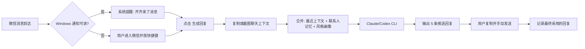

# EchoMate 与微信机器人集成可行性报告

## 执行摘要

基于本次查阅，微信侧现在确实存在一条**相对正规的本地集成路径**：腾讯的 `@tencent-weixin/openclaw-weixin-cli` / `@tencent-weixin/openclaw-weixin`、以及第三方但同样基于 iLink Bot API 的 `sgaofen/cli-in-wechat`、`epiral/weixin-bot`，都采用了**二维码授权 + iLink HTTP 长轮询 + `context_token` 回传回复**的模式，而不是 PC 微信 Hook 或 DLL 注入。技术上，它们都可以在用户自己的机器上运行，并且能与 EchoMate 的“本地候选回复”架构打通；但这些路径**不适合直接成为 EchoMate 的默认正式能力**，原因是：官方/社区实现都受 `context_token` 限制，主动发起新对话受限；OpenClaw 官方插件已有多起兼容性、二维码登录和长任务回包失败问题；任何机器人形态都会显著放大隐私、合规、误发消息和“越界感”的产品风险。对 EchoMate 来说，最优路径不是“把微信做成自动机器人”，而是做“近似机器人”：继续以快捷键 + 剪贴板 + 截图 + 本地记忆为核心，再叠加 Windows 通知监听、macOS Accessibility 上下文识别、联系人 allowlist、本地提醒和风格画像；如果未来要做机器人入口，也应只做**实验性 sidecar、只入站不自动代发**。 citeturn10view0turn10view3turn10view2turn19view0turn25view0turn18view0turn18view1turn18view2

## 关键结论

| 主题 | 结论 | 依据 |
|---|---|---|
| 是否存在“官方/半官方”微信 Bot 技术路径 | 有。当前最清晰的路径是腾讯 `openclaw-weixin` 体系和基于同一 iLink Bot API 的第三方 SDK/桥接项目。 | `openclaw-weixin` 官方 README、`weixin-bot` 协议文档与 `cli-in-wechat` README 都展示了二维码登录、长轮询收消息、HTTP 发消息的同类流程。 citeturn15view2turn11view0turn10view2turn19view0 |
| 是否要把第三方机器人“直接集成进 EchoMate 正式版” | **不建议默认集成。**更适合把机器人能力当实验性 sidecar，而不是核心架构。 | 官方插件本身已有版本兼容、二维码拉起、长任务回包失败等问题；同时主动发消息受 `context_token` 限制。 citeturn18view0turn18view1turn18view2turn25view0 |
| 如果一定要做机器人入口，优先选谁 | 优先选 `epiral/weixin-bot` 作为**最小 sidecar**；`cli-in-wechat` 更适合当参考实现；`openclaw-weixin-cli` 更像“OpenClaw 生态插件安装器”，不是 EchoMate 直接依赖。 | `weixin-bot` 提供 Node/Python SDK、`login/onMessage/reply/run` API；`cli-in-wechat` 是桥接服务；`openclaw-weixin-cli` 只是安装器，真正实现是 `@tencent-weixin/openclaw-weixin`。 citeturn19view0turn10view2turn10view4turn0search3 |
| 是否需要 Hook / 逆向 PC 微信协议 | 在这几条 reviewed 路线里，**不需要**。它们公开描述的都是二维码授权 + iLink HTTP API。 | 协议文档和 README 均展示的是 `get_bot_qrcode`、`getupdates`、`sendmessage` 等 HTTP 接口。 citeturn10view3turn11view0turn15view2 |
| “齐齐来了消息”这类实时提醒是否可做 | **Windows 上可做且较实用；macOS 上只能近似实现，不宜承诺完全可靠。** | Windows 有公开 Notification Listener 能读其他 app 的通知；macOS 官方文档能支撑的是前台应用变化、Accessibility、Pasteboard，不存在同等级公开跨应用通知读取接口的清晰文档。 citeturn30search0turn30search2turn21search0turn21search1turn22search0 |
| 自动代发 / 主动起聊是否值得做 | **不值得做。**技术上回帖式发送可做，但新会话主动发起在官方路径下本来就受限，产品和风险都不划算。 | `weixin-bot` 文档与 OpenClaw issue 都明确说明发送依赖已有 `context_token`。 citeturn19view0turn11view0turn25view0 |
| EchoMate 更有壁垒的方向 | 不是“自动回复”，而是**个人关系 CRM + 本地记忆 + 合适时机提醒 + 风格保留**。 | 从 reviewed 资源看，机器人主要解决“消息进来/出去”；真正差异化价值要靠 EchoMate 自己的本地记忆和提醒层。 citeturn10view2turn19view0turn30search0 |

## 资源对比与技术可行性

用户给的公众号文章直链在公开抓取环境中无法直接打开，因此下面对“用户文章”这一项，采用**同主题公开技术文章**《基于微信 iLink API 的自定义机器人》与官方 `openclaw-weixin` / `weixin-bot` 文档做交叉验证。交叉后的结论非常一致：这条路线的本质是**扫码授权 + 5 个 HTTP 接口（`getupdates`、`sendmessage`、`getuploadurl`、`getconfig`、`sendtyping`）+ `context_token` 会话回传**，而不是 PC 微信 Hook。 citeturn10view4turn11view0turn15view2

### 资源与可行性对照

| 资源 | 能否在本地/用户机器运行 | 依赖与授权 | 是否扫码登录 | 是否需逆向协议 / Hook | Windows / macOS 可行性 | 与 EchoMate 的 CLI 集成方式 | 适合作为 EchoMate 的什么 |
|---|---|---|---|---|---|---|---|
| 用户给的文章对应技术路线 | 可以。本质是本地 Node 服务跑 iLink HTTP 协议。 | 文中示例用 Node.js；本地保存凭证；自己实现长轮询和发送。 | 需要。 | 文中路线是公开 HTTP 接口实现，不是 Hook。 | 工程上可行，但它是“路线说明”不是可直接依赖的稳定包。 | 最适合做一个本地 `weixin-sidecar`，把入站消息 POST 给 EchoMate。 | **协议理解参考**，不建议直接拿文章代码当产品依赖。 citeturn10view4turn6view0turn11view0 |
| `@tencent-weixin/openclaw-weixin-cli` | 可以，但前提是先跑 OpenClaw。 | 需要 OpenClaw；CLI 只是安装器，真正插件是 `@tencent-weixin/openclaw-weixin`；插件有 OpenClaw 版本兼容矩阵。 | 需要，`openclaw channels login --channel openclaw-weixin`。 | reviewed 文档公开的是 iLink HTTP API；未见 Hook 描述。 | OpenClaw 官方支持 macOS、Windows、Linux/WSL2；插件随 OpenClaw 运行。 | 只能**间接集成**：让 EchoMate 变成 OpenClaw agent/外围服务，或把 OpenClaw 当上游消息网关。 | **官方通道验证**，不适合作为 EchoMate 首版核心依赖。 citeturn10view0turn15view2turn12search0turn12search1 |
| `sgaofen/cli-in-wechat` | 可以，是一个本地桥接服务。 | Node.js >=18；微信侧需启用 ClawBot 插件；还需安装 Claude Code / Codex CLI / Gemini 等本地 CLI。 | 需要，首次运行显示二维码。 | README 明说走“微信 ClawBot 官方 iLink Bot API”；未见 Hook 描述。 | README 未给 OS matrix，但其实现是 Node + 跨平台 spawn；结合 Claude/Codex 官方支持，Windows/macOS 工程上可行，这是**工程判断**而非仓库官方承诺。 | 命令路由非常清晰，例如 `@codex fix the bug`、`@claude 写排序算法`；也支持把 CLI 输出继续串联。 | **最佳参考实现**，尤其适合借鉴“本地 spawn/provider 适配层”。 citeturn10view2turn31view4turn7view0turn16search1turn33search3 |
| `epiral/weixin-bot` | 可以，且形态最轻。 | Node SDK 或 Python SDK；零 Webhook、纯本地运行。 | 需要，`login()`。 | 协议文档展示的是 iLink HTTP API；未见 Hook 路线。 | README 没有单独列 OS，但 Node/Python 形态天然跨平台；适合作为 Windows/macOS sidecar。 | 最直接：`onMessage` 收入站，转发给 EchoMate；EchoMate 只回候选，不自动 `reply()`。 | **最适合实验性入站 sidecar**。 citeturn19view0turn10view3 |

### 典型命令与调用方式

`openclaw-weixin` 体系的标准接入命令是：

```bash
npx -y @tencent-weixin/openclaw-weixin-cli install
openclaw channels login --channel openclaw-weixin
openclaw gateway restart
```

官方 README 明确给出了这三步。 citeturn10view0

`cli-in-wechat` 已经把“微信消息 → 本地 CLI”做成了桥接命令模式，例如：

```text
@claude 写排序算法
@codex fix the bug
/resume
/session set <uuid>
```

它还说明了自己的适配层会去调用 `claude -p` / `codex exec` 等 CLI。 citeturn31view4turn10view2

`weixin-bot` 的最小 Node 接入则是：

```ts
import { WeixinBot } from '@pinixai/weixin-bot'

const bot = new WeixinBot()
await bot.login()

bot.onMessage(async (msg) => {
  // 这里只做入站事件转发，不自动回复
})

await bot.run()
```

它的 README 直接公开了 `login`、`onMessage`、`reply`、`sendTyping`、`run` 等 API。 citeturn19view0

## 风险与功能增益评估

### 风险评估

需要先把一个事实说清楚：**这次 reviewed 的几条路线，与传统“个人微信 Hook/逆向客户端协议”不是一回事。**它们公开描述的都是二维码授权 + iLink HTTP API，因此平台风控风险**显著低于** DLL 注入或 PC 协议 Hook；但“低于 Hook”不等于“没有风险”，因为这些方案依然会把聊天事件、凭证、上下文与自动化逻辑引入 EchoMate。 citeturn10view3turn15view2turn10view2

| 资源 | 封号 / 风控 | 隐私泄露 | 法律 / 合规 | 维护成本 | 稳定性 | 主要理由 |
|---|---|---:|---:|---:|---:|---|
| 用户文章代表的自实现 | 中 | 高 | 中高 | 高 | 中 | 你自己接管登录、长轮询、凭证和消息处理；最灵活，但也最容易越过“必要性”边界。文章还建议本地保存凭证。 citeturn10view4turn6view0turn26search0turn26search4 |
| `openclaw-weixin-cli` / `openclaw-weixin` | 中 | 中 | 中 | 高 | 中 | 平台路径相对正，但插件有兼容矩阵，而且公开 issue 显示过插件加载失败、二维码拉起失败、长任务后回包丢失。 citeturn15view2turn18view0turn18view1turn18view2 |
| `cli-in-wechat` | 中 | 中高 | 中 | 中 | 中 | 它走官方 iLink Bot API，但桥接的是高权限本地 CLI，默认甚至强调高权限模式；仓库目前没有 release，运维和约束要自己做。 citeturn10view2turn31view4turn0search4 |
| `epiral/weixin-bot` | 中 | 中 | 中 | 中 | 中 | SDK 最轻，但依然会本地保存凭证、轮询消息，并允许 `send` / `reply`；仓库当前也没有 release，适合 sidecar，不适合承诺“企业级稳定”。 citeturn19view0 |

### 对 EchoMate 功能的增益与风险

| 能力 | 能否直接增强 EchoMate | 实现复杂度 | 风险等级 | 建议 |
|---|---|---:|---:|---|
| 入站消息到达提醒 | 可以。机器人/SDK 都能拿到实时入站事件。 | 中 | 中 | 有价值，但推荐只转成“提醒你来处理”，不要自动回复。 citeturn11view0turn19view0 |
| 指定联系人触发 | 可以。`weixin-bot` / iLink 消息天然有 `user_id`；`cli-in-wechat` 也可做 allowlist。 | 中 | 低中 | 推荐做，只对白名单联系人开启。 citeturn19view0turn31view4 |
| 自动保存最近上下文 | 可以，但更适合只保存**ongoing** 对话，不做全量历史抓取。 | 中 | 中 | 推荐；只存最近 N 条和用户确认的消息。 citeturn11view0turn15view2 |
| typing / “对方正在输入中” | 可以。`sendTyping` 是官方支持的。 | 低 | 中 | 对 EchoMate 价值不大，容易让产品越过“辅助”边界，不推荐首版。 citeturn11view0turn19view0 |
| 媒体上传/图片/文件回复 | 可以，协议支持 `getUploadUrl` + CDN。 | 高 | 中 | 非 MVP，不建议首版。 citeturn11view0turn15view2 |
| 群监控 | reviewed 文档里**没有清晰的群能力说明**。 | 高 | 中高 | 先不要做。把产品范围锁在单联系人。 citeturn19view0turn15view2 |
| 消息历史抓取 / backfill | reviewed 协议核心是 `getupdates` 长轮询，没有现成历史回溯接口。 | 高 | 高 | 不建议为了“补历史”去走抓包、数据库或客户端爬取。 citeturn11view0turn15view2 |
| 自动代发 | 技术上“回帖式回复”可做，但产品风险极高。 | 中 | 高 | 不做。EchoMate 应坚持“展示候选 + 一键复制”。 citeturn11view0turn19view0 |
| 主动发起新消息 | reviewed 资源都受到 `context_token` 限制。 | 高 | 高 | 不做。连官方插件 issue 都明确说没有上下文 token 就无法主动发。 citeturn25view0turn19view0 |
| 流式半成品消息气泡 | 协议里 `GENERATING` 可用，但客户端不渲染。 | 中 | 低 | 不值得做。 citeturn19view0 |

从产品视角看，**真正有价值且风险可控的增强项**只有三类：入站提醒、联系人级上下文归档、合适时机的 follow-up 提醒。自动代发、主动起聊、历史全量抓取，在 EchoMate 这个产品里都属于“成本高、收益低、容易越界”的能力。 citeturn19view0turn25view0turn26search4

## EchoMate 的优先替代方案

与其把第三方机器人直接塞进正式版，不如把 EchoMate 做成一个**近似机器人**：在不碰微信协议、不自动发消息的前提下，依旧做到“消息来了能提醒、上下文能记住、风格能保留、窗口别错过”。这条路径与现有架构最兼容，也最符合 EchoMate 已经确定的“低打扰、本地优先、即时辅助”的定位。 citeturn30search0turn22search3turn21search0turn21search1



### 推荐实现步骤

| 步骤 | 做什么 | Windows | macOS | 所需权限 |
|---|---|---|---|---|
| 联系人白名单 | 用户手动设定“齐齐”之类的联系人别名与触发规则。 | 本地配置即可。 | 本地配置即可。 | 无 |
| 到达提醒 | 尽量不读微信协议，而是用系统级信号提示“有新消息”。 | 优先用 Notification Listener；备选用前台窗口/标题判断。 | 优先用前台应用 + Accessibility 上下文辅助；不把“跨 app 读系统通知”当主方案。 | Windows 通知访问；macOS Accessibility |
| 上下文采集 | 让用户复制选中文本，或截图框选聊天区域。 | 用剪贴板监听 + 当前前台窗口相关性判断。 | 用 Pasteboard + Accessibility 读取选中文本/窗口标题。 | Windows 无额外；macOS 读跨 app 选中文本需 Accessibility |
| 本地记忆入库 | 只存最近消息、用户确认的重要事实、最终采用回复。 | SQLite。 | SQLite。 | 无 |
| 回复生成 | 调本地 Claude/Codex CLI，输出 JSON 候选。 | 可继续走 Windows 本机或 WSL2。 | 直接本机 CLI。 | 无 |
| 用户确认 | 只复制，不代发。 | 系统通知 + 弹窗。 | 菜单栏/托盘 + 弹窗。 | 无 |

Windows 的系统通知读取在技术上是最像“机器人入站”的：微软公开提供了 Notification Listener，允许你的应用访问其他 app 的通知，但必须声明 `userNotificationListener` capability，并向用户请求访问权限；如果用户撤回权限，API 会静默失效。EchoMate 在 Windows 上可以把这条链做成一个**可选 helper**，读取来自微信桌面端的通知标题和正文摘要，然后只触发“生成回复”提醒，不做任何自动回复。 citeturn30search0turn30search2

macOS 的情况不同。Apple 官方文档能明确提供的是：前台应用激活事件 `NSWorkspace.didActivateApplicationNotification`、Pasteboard 变化、以及 Accessibility 信任与 `AXUIElement` UI 读取能力；本次检索里没有找到一个和 Windows Notification Listener 等价的、公开稳定的“跨应用通知读取”接口。因此，在 macOS 上更务实的做法是：**把实时入站提醒视为近似能力**，依赖“你切回微信时我的上下文就能恢复”和“你复制/截图后我能立即生成回复”，而不是承诺严格的“她一来消息我就总能知道”。 citeturn21search0turn21search1turn21search5turn22search0

### 伪代码与命令示例

#### 本地 sidecar 事件流

```ts
// sidecar/wechat_event_bridge.ts
type InboundEvent =
  | { kind: "notification"; app: string; title?: string; body?: string; ts: number }
  | { kind: "clipboard"; text: string; activeApp?: string; windowTitle?: string; ts: number }
  | { kind: "screenshot"; imagePath: string; ts: number };

async function emitToEchoMate(event: InboundEvent) {
  await fetch("http://127.0.0.1:47888/ingest", {
    method: "POST",
    headers: { "content-type": "application/json" },
    body: JSON.stringify(event),
  });
}

// Windows: notification helper (optional)
// if app == "微信" and title contains alias, emit reminder-only event

// macOS: active app/accessibility helper (optional)
// if frontmostApp == "WeChat" and user presses hotkey, read selected text or window title
```

#### EchoMate 侧核心流程

```rust
// pseudocode
match event.kind {
    "notification" => {
        if is_allowlisted_contact(event.title, event.body) {
            db.save_signal(event);
            ui.show_reminder("齐齐来了消息", "要生成 5 条候选回复吗？");
        }
    }
    "clipboard" => {
        if correlate_with_chat_context(event.active_app, event.window_title) {
            db.append_message("unknown", event.text, "clipboard");
        }
    }
    "screenshot" => {
        let parsed = ocr_or_vision_parse(event.image_path);
        db.append_parsed_dialog(parsed);
    }
}

on_hotkey_generate_reply() {
    let ctx = build_context(style_profile, contact_memory, recent_messages);
    let result = provider.generate_candidates(ctx); // 5 candidates
    ui.show_candidates(result);
}
```

#### 继续沿用现有 Claude / Codex CLI

Claude Code 官方文档明确支持 `claude -p` 的无交互模式；Codex 官方文档明确支持 `codex exec` 的非交互脚本模式，而且 Codex CLI 支持 macOS、Windows、Linux，Windows 还支持原生 PowerShell 或 WSL2。EchoMate 因此没有必要为了微信集成而放弃现有 provider 形态。 citeturn34search2turn34search6turn33search0turn33search2turn16search1turn33search3

```bash
# Claude Code（无交互）
cat prompt.txt | claude -p "请输出 5 条候选回复，JSON 数组" --output-format json

# Codex（无交互）
codex exec "读取 prompt.txt 的内容并输出 5 条候选回复，要求 JSON" --sandbox workspace-write
```

如果你在 Windows 上继续沿用 WSL2，可以保留现在的调用方式：

```powershell
wsl -d Ubuntu -- bash -lc 'cat /mnt/c/echomate/prompt.txt | claude -p "输出 JSON"'
wsl -d Ubuntu -- bash -lc 'codex exec "根据 /mnt/c/echomate/prompt.txt 输出 5 条候选回复"'
```

这仍然是 EchoMate 现有 provider 架构的自然延续。 citeturn16search1turn33search0turn34search8

### 如果一定要做“官方入站 sidecar”

如果后续真的要做实验性机器人入口，最稳的不是直接把 `openclaw-weixin` 整进 EchoMate，而是单独做一个**Node sidecar**，基于 `epiral/weixin-bot` 只订阅入站消息，然后把事件扔回 EchoMate 本机端口；**不要在 sidecar 内自动 `reply()`**。这样做能把权限与风险隔离开。 `weixin-bot` 的 README 已经提供了最小接入面。 citeturn19view0

```ts
import { WeixinBot } from '@pinixai/weixin-bot'

const bot = new WeixinBot()
await bot.login()

bot.onMessage(async (msg) => {
  await fetch("http://127.0.0.1:47888/wechat/inbound", {
    method: "POST",
    headers: { "content-type": "application/json" },
    body: JSON.stringify({
      userId: msg.userId,
      text: msg.text,
      contextToken: msg.contextToken,
      ts: Date.now()
    })
  })

  // 不自动 reply
  // 不自动 send
  // 只做“提醒 + 上下文入库 + 候选生成”
})

await bot.run()
```

## 数字分身与本地记忆设计

EchoMate 不需要做一个“会冒充你”的数字替身；它需要的是一个**风格约束器 + 联系人记忆器 + 提醒引擎**。这三者必须分开存：风格负责“像不像你”，联系人记忆负责“会不会前后矛盾”，提醒负责“该不该在这个时机出现”。这也是把“AI 辅助”与“自动操控”区分开的关键。

### 记忆边界

从合规和“不要 creepy”的角度，EchoMate 最好只自动记三类信息：

1. **最近对话上下文**：最近 20～50 条对话片段。
2. **用户显式确认的联系人事实**：例如“她明天面试”“她周末出差”“她不爱吃辣”。
3. **用户最终采用的回复**：用于反推你的风格。

不应自动长期保存的，是**敏感个人信息**与“高误伤解释信息”，尤其是医疗健康、金融账户、行踪轨迹、未成年人信息等。中国《个人信息保护法》明确把这些列为敏感个人信息，要求更严格保护和单独同意；如果 EchoMate 还把消息发送给云端模型，那又会进入“向第三方提供个人信息/跨境提供”的合规语境，更需要告知、最小化和默认本地化处理。 citeturn32view2turn26search4

### 建议的 SQLite schema

| 表 | 用途 | 关键字段 | 设计要点 |
|---|---|---|---|
| `contacts` | 联系人别名与 allowlist | `id`, `alias`, `channel`, `is_allowlisted`, `created_at` | 不强依赖微信内部 ID；先支持用户自定义别名。 |
| `messages` | 最近上下文 | `id`, `contact_id`, `role`, `text`, `source`, `created_at`, `approved` | `source` 可为 `clipboard` / `screenshot` / `notification` / `weixin_sidecar`。 |
| `memories` | 联系人事实记忆 | `id`, `contact_id`, `type`, `value`, `confidence`, `source_message_id`, `expires_at`, `requires_review` | 所有“长期事实”默认 `requires_review = true`。 |
| `reminders` | 主动提醒 | `id`, `contact_id`, `trigger_at`, `reason`, `draft_prompt`, `status`, `cooldown_hours` | 避免重复轰炸，必须有 `cooldown_hours`。 |
| `style_profile` | 用户风格画像 | `id`, `profile_json`, `sample_count`, `updated_at` | 存摘要，不存全部原始样本。 |
| `generation_logs` | 生成链路留痕 | `id`, `contact_id`, `provider`, `prompt_hash`, `candidate_json`, `chosen_index`, `created_at` | 用于评估“候选被采用率”。 |

### 风格画像示例

```yaml
user_style:
  sentence_length: "短句为主，通常 1~2 句"
  tone: ["自然", "轻松", "不端着"]
  humor_level: "低到中"
  flirt_level: "低"
  emoji_usage: "少"
  common_phrases:
    - "哈哈哈"
    - "那确实"
    - "有点东西"
  avoid_phrases:
    - "宝贝"
    - "亲爱的"
    - "我一直都在"
  rules:
    - "不要突然深情"
    - "不要像客服"
    - "不要替用户编造经历"
```

### 联系人记忆示例

```yaml
contact_memory:
  name_alias: "齐齐"
  facts:
    - key: "interview_tomorrow"
      value: true
      source: "她说：明天要去面试"
      expires_at: "2026-06-06T23:00:00+08:00"
    - key: "prefers_light_food"
      value: true
      source: "她说最近胃不太舒服"
      expires_at: null
  avoid:
    - "不要连续追问工作结果"
  reminders:
    - trigger_at: "2026-06-06T20:00:00+08:00"
      reason: "昨天提到今天面试"
```

### 生成时的 Prompt 合并模板

```text
你是 EchoMate 的本地回复副驾。
你的任务不是代替用户聊天，而是生成 5 条可复制的候选回复。

必须遵守这些约束：
[用户风格画像]
{{style_profile}}

[联系人事实记忆]
{{contact_memory}}

[最近聊天上下文]
{{recent_context}}

[当前信号]
- 来源: {{event_source}}
- 新消息: {{latest_message}}
- 是否建议继续聊/收束/转提醒/不追问: 也请一起判断

输出要求：
1. 输出 5 条中文候选回复
2. 每条 10-35 字
3. 标记语气：稳妥 / 轻松 / 幽默 / 关心 / 推进
4. 标记风险：低 / 中 / 高
5. 一并输出一个 next_action：
   - continue
   - wrap_up
   - ask_later
   - schedule_followup
   - do_not_push
6. 不得包含用户未说过的经历
7. 除非用户手动确认，不进行发送动作
```

### 样本量、更新频率与隐私策略

第一版不需要喂海量历史。更实用的做法是：先收集**50～150 条你自己最终发送且你认可“像我”的回复**，提取成 `style_profile`；之后每新增 20 条“用户采用的候选回复”，刷新一次画像。这样既能保持风格稳定，也不会把大量原始聊天长期上传给云端模型。若用户选择 Claude/Codex 这类云模型，默认应提供“名字脱敏 + 最近上下文截断 + 只上传摘要不上传全量历史”的模式。把所有原始消息无差别外送，是 EchoMate 最应该避免的工程偷懒。 citeturn26search0turn32view2

## 实时提醒实现对比

### “齐齐来了消息”类提醒的技术现实

| 方法 | Windows 可行性 | macOS 可行性 | 需要权限 | 误报 / 漏报 | 隐私影响 | 适合度 |
|---|---|---|---|---|---|---|
| 系统通知读取 | 高。可用 Notification Listener 访问其他 app 通知。 | 低到中。没有找到等价公开跨 app 通知读取接口。 | Windows 需通知访问；macOS 若靠 Accessibility 曲线救国则权限更重。 | Windows 中等；macOS 高。用户关闭预览/DND 会漏报。 | 高，因为会看到其他 app 通知。 | Windows 推荐可选；macOS 不推荐首版。 citeturn30search0turn30search2turn21search0turn21search1 |
| 前台应用 / 窗口标题 | 中。`GetForegroundWindow` + `GetWindowText` 可拿前台窗口及标题。 | 中高。`NSWorkspace` 可知前台 app，Accessibility 可读焦点窗口。 | Windows 无；macOS 读窗口标题需 Accessibility。 | 低误报，但只适合“你正在用微信时”的上下文恢复，不是后台实时提醒。 | 低到中。 | 两个平台都适合做“上下文判定器”。 citeturn29search0turn23search0turn21search0turn24search1turn24search0 |
| 剪贴板监听 | 中。`AddClipboardFormatListener` 很稳，但不知道来源 app。 | 中。`NSPasteboard.changeCount` 可轮询变更。 | 无。 | 中到高；需要和前台 app/手动热键联合才能降误报。 | 中。 | 适合继续做 EchoMate 主干，不适合单独当机器人。 citeturn22search1turn30search9turn22search0 |
| 选中文本读取 | 中。UI Automation `TextPattern/GetSelection` 取决于目标控件是否支持。 | 中。Accessibility 有 `kAXSelectedTextAttribute`。 | Windows 通常无额外；macOS 需 Accessibility。 | 中；不同应用支持差异大。 | 中高。 | 适合作为“手动保存上下文”的增强能力。 citeturn27search0turn27search10turn28search0turn21search1 |
| 微信 sidecar 入站事件 | 高，但需要实际运行 bot sidecar。 | 高，但同样要运行 sidecar。 | 二维码授权 + 本地守护进程。 | 低误报；但会引入更多状态与会话维护。 | 中高。 | 只适合实验性模式。 citeturn19view0turn10view0 |

对 EchoMate 来说，最务实的组合是：

- **Windows**：系统通知读取（可选） + 剪贴板主流程 + 前台窗口相关性校验。
- **macOS**：前台应用/窗口标题 + Pasteboard + Accessibility 选中文本；不承诺完整后台通知监听。
- **双平台共通**：截图上下文、最近消息缓存、联系人 allowlist、提醒引擎、风格画像。 citeturn30search0turn22search1turn21search0turn28search0

## 最终建议与实施计划

### 最终建议

从工程与产品综合判断，**不值得把第三方微信机器人直接集成进 EchoMate 的正式版主线**。推荐路径分成三档：

| 路径 | 建议 | 原因 | 估算工作量 | 风险 |
|---|---|---|---:|---:|
| 直接把 `openclaw-weixin` / OpenClaw 体系整进 EchoMate | 不推荐 | 架构错位；EchoMate 不是 OpenClaw agent；还要承担插件兼容矩阵与宿主升级问题。 | 15–25 人日 | 高 citeturn15view2turn18view0turn18view3 |
| 仅参考 `cli-in-wechat` 的实现思路 | 推荐 | 适合借鉴它的“本地 spawn + provider adapter + 会话路由”设计，不必把微信桥接照搬进产品。 | 2–4 人日 research spike | 低中 citeturn31view4turn10view2 |
| 做实验性 `weixin-bot` sidecar，只入站不代发 | 条件性推荐 | 这是最小、最可控、最容易与 EchoMate 解耦的官方 iLink 入站方案。 | 8–12 人日（Windows） / 12–18 人日（Win+mac） | 中 citeturn19view0 |
| 完全不集成机器人，只做近似机器人能力 | 强烈推荐 | 与现有架构最兼容，风险最低，也更符合 EchoMate 的产品边界。 | 10–14 人日 | 低中 citeturn30search0turn22search1turn21search0 |

一句话版建议是：**正式版不接机器人；先做近似机器人。若后续验证出强需求，再以 `weixin-bot` sidecar 作为实验功能上线，而且永不自动发送。**

### 三阶段实施计划

| 阶段 | 目标 | 关键里程碑 | 估算人日 | 成功指标 |
|---|---|---|---:|---|
| 安全近似机器人 | 在不碰微信协议的前提下，把“即时回复副驾”升级为“有上下文、有提醒的本地 CRM”。 | 联系人 allowlist；最近上下文 SQLite；用户采用回复回写；Windows 前台窗口/剪贴板关联；macOS Accessibility 读取选中文本；候选回复 + next_action。 | 10–14 | 候选被采用率 > 25%；0 例自动发送；80% 生成请求能带上最近上下文。 |
| 提醒与记忆引擎 | 补齐 EchoMate 的真正壁垒：从历史中提取事实、生成 follow-up、控制不过界。 | `memories/reminders` 表；事实抽取器；提醒去重与冷却；“为什么提醒我” UI；本地风格画像提取器。 | 12–18 | 每周至少 1 次被用户认可的提醒触发；提醒点击率 > 30%；用户手动纠错率逐周下降。 |
| 实验性官方入站 sidecar | 只在需求确立后，开放“官方 iLink 入站”实验能力。 | `weixin-bot` Node sidecar；本机 localhost 事件桥；二维码登录向导；显式总开关；只入站不代发；日志与删除入口。 | 8–12（Windows first）+ 4–6（macOS hardening） | 入站事件成功率 > 95%；0 例误发；re-login 故障率可控。 |

### 里程碑拆分建议

**第一批最该做的，不是机器人，而是这些：**

1. 联系人 allowlist 与别名系统。
2. 本地消息时间线与“最终采用回复”回写。
3. next_action 判断：继续聊 / 收束 / 稍后问 / 建提醒 / 不要追问。
4. Windows 通知 helper（可选）与 macOS Accessibility helper（可选）。
5. 风格画像抽取与本地提示词合并。

**第一批最不该做的，是这些：**

1. 自动代发。
2. 主动起聊。
3. 全量聊天历史抓取。
4. 群监控。
5. 敏感信息自动记忆。
6. “对方正在输入中”与流式气泡伪装。

这些能力要么在官方 iLink 路径下本来就受限，要么产品风险远大于收益。尤其是主动发起新消息，OpenClaw 侧公开 issue 已经很明确：没有已有会话的 `context_token`，官方插件就发不出去。继续往这条路上用力，只会把 EchoMate 带向一个高风险、低确定性的方向。 citeturn25view0turn19view0turn18view2

整体上，EchoMate 现在最正确的定位仍然是：**用户掌控发送，AI 负责理解上下文、保持风格、提醒时机、给出候选。** 这比“做一个会自己回微信的机器人”更像产品，也更像一个长期可维护的商业方向。