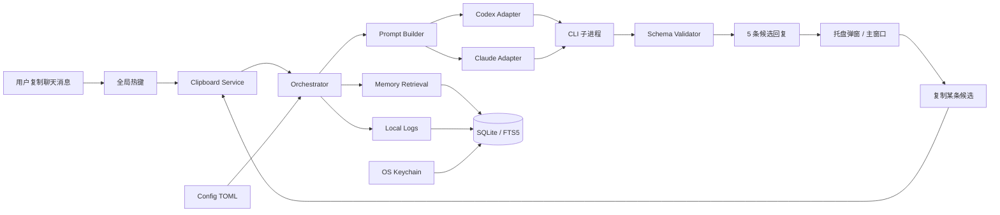

# EchoMate 本地 AI 回复副驾 MVP 技术研究报告

## 执行摘要

针对 EchoMate 的目标形态——**macOS + Windows 跨平台、本地桌面应用、通过全局热键读取当前剪贴板、调用 Claude Code 或 Codex CLI 而非直连 API、在本地保存上下文与记忆、生成 5 条候选回复供手动复制**——最稳妥的 MVP 方案是：**Rust + Tauri 2.x + Rust 后端主导架构 + 剪贴板优先交互 + 本地 SQLite 记忆层 +“双提供商适配器”设计**。Tauri 官方文档明确说明其桌面应用基于 **Rust + OS WebView**，支持托盘型界面，并且通过消息传递让 WebView 调用系统能力；其官方插件体系在 2.0 后被明显强化，适合做热键、剪贴板、日志、窗口定位和打包发布的一体化桌面工具。citeturn21search9turn34search9turn34search19turn20view1turn20view2

语言层面，**Rust 比 Go 更适合这个项目**，不是因为 Go 不够做，而是因为 Tauri 的宿主后端、官方插件、构建链和签名发布路径都天然围绕 Rust 展开；如果坚持 Go，最自然的官方路线其实更接近 **Wails**，而不是 Tauri。Rust 官方文档强调其对性能、可靠性和并发安全的定位，尤其是“fearless concurrency”；Tauri 也明确是 Rust + HTML/WebView 的组合。相比之下，Wails 官方定位就是“Go + Web 技术 + 原生渲染引擎”的 Electron 替代品，因此若选 Tauri，Rust 的工程摩擦最小。citeturn7search16turn7search0turn21search9turn6search0

在模型调用适配上，**Codex CLI 更适合作为主适配器，Claude Code 适合作为次适配器**。原因不是能力高低，而是脚本化接口成熟度：Codex 官方明确把 `codex exec` 定位为**非交互脚本/CI**模式，说明其在运行时将进度输出到 `stderr`，最终结果输出到 `stdout`，并支持 `--json` JSONL 事件流、`--output-last-message`、`--output-schema`、`--ephemeral`、`--sandbox`、`--ignore-user-config` 等，天然利于桌面应用托管。Claude Code 也支持 `claude -p` 非交互运行、JSON 输出和 JSON Schema，但其官方同时说明 **`--bare` 会跳过 hooks/skills/plugins/MCP/auto memory/CLAUDE.md，且跳过 OAuth 与 keychain 读取**；这意味着如果你坚持“**不走 API key，只调用已经登录的 Claude Code**”，就不能一味依赖 `--bare` 来追求完全确定性。citeturn14view3turn14view0turn14view2turn16search4turn11view1turn15view3

对 MVP 的关键产品判断是：**不要做“自动识别微信窗口 + 自动复制选中消息 + 自动判断联系人”的重 UI 自动化版本**，而要做**“你先复制消息，再按全局热键”**的版本。这样可以直接使用 Tauri 官方全局热键与剪贴板插件完成主流程，显著降低 macOS 辅助功能权限、Windows 输入注入限制、微信 UI 变更兼容性和签名/公证风险。Apple 官方文档表明，跨应用键盘事件监控与可访问性信任有关；Microsoft 的 `SendInput` 文档也明确说明输入注入受 UIPI 约束，只能注入到**同等或更低完整性级别**的应用。citeturn20view1turn20view2turn19search13turn19search0turn18search1turn18search9

本地存储建议采用 **Rust 后端内聚的 SQLite**，优先选 **`rusqlite` + FTS5**，而不是把数据库暴露给前端。`rusqlite` 官方文档说明其是面向 SQLite 的 ergonomic wrapper，并可启用 **bundled SQLCipher** 特性；SQLite 官方文档提供了 `FTS5`、`journal_mode=WAL`、`foreign_keys`、`user_version`、`application_id`、`VACUUM INTO` 与在线备份 API 等基础能力。对 EchoMate 而言，这足以支撑“短期聊天历史 + 长期事实 + 风格画像 + 运行日志 + 候选回复缓存”的全部 MVP 数据需求。citeturn8search6turn8search3turn17search1turn29view1turn29view2turn29view0turn28search0turn17search3turn17search22

最后，安全边界要非常明确：**EchoMate 只做“建议回复”，不自动代聊，不自动发送，不后台接管聊天界面**。本地日志默认只记录**时间、耗时、提供商、是否成功、候选条数、哈希摘要**，不记录原文全文；提供“严格隐私模式”时，Claude Code 子进程显式设置 `DISABLE_TELEMETRY=1` / `DISABLE_ERROR_REPORTING=1`，Codex 不配置 OTel 导出器。这样产品才符合“本地副驾”而不是“托管聊天机器人”的定位。citeturn30view4turn30view3turn25search0turn31view2turn31view3

## 技术选型判断

### Rust 与 Go 的取舍

下表不是泛泛而谈语言优劣，而是**针对 EchoMate + Tauri + 本地桌面工具**这一特定组合做判断。

| 维度 | Rust | Go | 对 EchoMate 的结论 |
|---|---|---|---|
| 与 Tauri 的贴合度 | Tauri 架构本身就是 Rust 后端 + WebView + 消息传递；官方插件也主要走 Rust 宿主路径。citeturn21search9turn34search19turn20view1turn20view2 | Go 并不是 Tauri 的一等宿主语言；若以 Go 为核心，官方路径更接近 Wails。citeturn6search0 | **Rust 明显更优**。 |
| 并发与进程托管 | Rust 官方把并发安全作为核心目标；`tokio::process` 支持异步子进程、管道、超时与 kill-on-drop。citeturn7search0turn31view4turn31view5 | Go 的并发模型简单好用，`go build` 体验很好；但若要与 Tauri 深度集成，往往要走 sidecar/IPC 或 cgo。Go 官方文档显示 cgo 就是 Go 调 C 的通道。citeturn6search2turn6search8 | **Rust 更适合做“宿主 + 子进程编排 + 本地存储”**。 |
| 二进制与依赖控制 | Rust/Cargo 的 workspace、features、构建脚本都和 Tauri 官方工具链一致。citeturn7search3turn7search9turn20view3 | Go 也易于产出单二进制，但这更多适合服务或 Wails 风格桌面应用。citeturn6search16turn6search11 | **Rust 更少“跨生态拼接胶水”**。 |
| 数据安全与内存擦除 | Rust 生态里 `secrecy`、`zeroize` 明确面向敏感数据的显式访问和 drop 时擦除。citeturn32search0turn32search1turn32search4 | Go 标准库没有直接对等的“drop 时零化”模型。 | **Rust 更适合保存密钥、临时 prompt、历史摘要**。 |
| 开发速度 | Rust 学习与类型约束更陡，但桌面宿主一体化更顺。citeturn7search16turn21search9 | 如果团队纯 Go，Wails 可能会更快。citeturn6search0 | **如果 EchoMate 明确选 Tauri，Rust 反而整体更快**。 |

**结论**：若你的目标明确是 **Tauri 跨平台产品化桌面应用**，就不要再纠结“Go 会不会更快”这个泛问题。对这个项目，**Rust 更快的是总体交付速度，而不是单个文件的编码速度**。Go 的最快路径是 **Wails**，不是 **Tauri**。这个判断来自 Tauri 与 Wails 的官方架构定位，而不是语言偏好。citeturn21search9turn6search0

### Tauri 与 Electron、Wails 的对比

| 方案 | 官方定位与技术基础 | 资源占用与分发特征 | 对 EchoMate 的适配判断 |
|---|---|---|---|
| Tauri | 基于 Rust 与 OS WebView，WebView 通过消息传递控制系统能力；支持 tray 型应用。citeturn21search9turn34search9 | 不内置 Chromium 运行时，二进制由 Rust 编译；官方插件覆盖桌面常见能力。citeturn34search9turn34search19 | **最佳平衡点**：适合常驻托盘、轻量弹窗、热键/剪贴板/本地数据库。 |
| Electron | 通过把 Chromium 与 Node.js 嵌入二进制来构建桌面应用。citeturn6search1turn6search10turn6search19 | 渲染一致性强，但运行时更重。citeturn6search1turn6search19 | 如果你需要大量现成 JS 桌面库可以考虑，但对 EchoMate 这种“轻常驻工具”，**偏重**。 |
| Wails | 官方定义为 Go + Web 技术 + 原生渲染引擎的轻量 Electron 替代品；不嵌浏览器，复用平台渲染引擎。citeturn6search0turn6search3 | 对 Go 开发者友好，体积轻。citeturn6search0 | 如果你坚持 Go，**Wails 比“Go + Tauri”更自然**。 |

**结论**：对 EchoMate 这类“托盘常驻 + 热键触发 + 短弹窗 + 本地数据”的产品，**Tauri 是最合适的宿主框架**；当且仅当你决定“核心团队只想写 Go”时，才值得重新评估转向 Wails。Electron 不是不能做，而是对这个产品形态来说通常不划算。citeturn34search9turn6search0turn6search1

## 总体架构与模块设计

### 高层架构图

下面是建议的 MVP 架构。它刻意把“平台集成”“本地记忆”“模型编排”“前端展示”分开，这样后续无论增删 Claude/Codex 提供商，还是把热键逻辑扩展到更多使用场景，都不需要重写核心层。该分层与 Tauri 的“WebView 前端 + Rust 宿主 + 插件/系统能力”模型是一致的。citeturn21search9turn20view1turn20view2



### 模块拆分

建议把后端按“**平台能力** / **领域逻辑** / **基础设施**”拆分，而不是全部塞进 `src-tauri/src/main.rs`。Rust 的 Cargo workspace 天然适合管理多个相关包；Tauri 本身也基于 `src-tauri` 配置与桌面宿主构建。citeturn7search3turn34search17

| 模块 | 职责 | 推荐实现 |
|---|---|---|
| `platform::hotkey` | 注册/释放全局热键，处理去抖 | `tauri-plugin-global-shortcut`；按键建议默认 `CmdOrCtrl+Shift+Space`。citeturn20view1 |
| `platform::clipboard` | 读取/写入剪贴板、复制候选结果 | `tauri-plugin-clipboard-manager`。citeturn20view2 |
| `platform::windowing` | 托盘、浮窗、窗口位置、置顶 | Tauri tray + positioner。citeturn34search1turn34search0turn34search2 |
| `core::orchestrator` | 接收一次触发请求，组装上下文，选择 provider，返回候选 | 纯 Rust 业务层，前端只消费结果。 |
| `core::memory` | 短期历史、长期事实、风格画像检索与更新 | `rusqlite` + FTS5。citeturn8search6turn17search1 |
| `core::prompting` | 渲染 system/task/retry prompt 与 JSON Schema | `serde`/`serde_json`/`toml`。citeturn10search24turn10search3 |
| `providers::codex` | 管理 `codex exec` 生命周期 | `tokio::process` + `timeout`。citeturn31view4turn9search9 |
| `providers::claude` | 管理 `claude -p` 生命周期 | `tokio::process` + JSON 解析。citeturn11view1turn16search4 |
| `infra::store` | 连接池、迁移、备份、恢复 | `rusqlite`，可选 SQLCipher。citeturn8search3turn17search3 |
| `infra::secrets` | 保存本地加密密钥、provider 专项设置 | `keyring`，必要时 Stronghold。citeturn33view1turn21search0 |
| `infra::logging` | 结构化日志、Span、性能统计 | `tracing` + `tracing-subscriber`；如需前端桥接可补 Tauri log。citeturn31view2turn31view3turn25search0 |

### Rust crate 选择建议

这里不追求“能用就行”，而是追求 EchoMate 这类**本地敏感数据应用**的确定性和封装边界。

| 类别 | 首选 crate / 插件 | 选择理由 | 备选 |
|---|---|---|---|
| 宿主框架 | `tauri` | 官方宿主。WebView + Rust 后端。citeturn21search9 | 无 |
| 热键 | `tauri-plugin-global-shortcut` | 官方插件，跨 Windows/macOS。citeturn20view1 | 纯 Rust 第三方热键库不如官方统一。 |
| 剪贴板 | `tauri-plugin-clipboard-manager` | 官方插件，支持读写系统剪贴板。citeturn20view2 | 直接系统 API。 |
| 数据库 | `rusqlite` | 更适合后端内聚式 SQLite 控制，且具备 SQLCipher feature。citeturn8search6turn8search3 | `tauri-plugin-sql` 暴露给前端更方便，但它基于 `sqlx`，更像“应用公开 SQL 能力”的思路。citeturn8search2turn8search17 |
| 目录定位 | `directories` | 统一获取 config/data/cache 目录。citeturn31view1 | `dirs` / `dirs-next`。citeturn10search6turn10search5 |
| 密钥保存 | `keyring` | 统一接入 OS 原生 keychain / credential store。citeturn33view1turn33view3 | Tauri Stronghold。citeturn21search0 |
| 子进程 | `tokio::process` | 异步 I/O、超时、kill-on-drop、stdin/stdout 管理成熟。citeturn31view4turn31view5 | `std::process` 仅在简单 blocking 场景下可用。citeturn24search2turn30view0 |
| 日志 | `tracing` + `tracing-subscriber` | 结构化 spans/events，适合一次生成流程的性能追踪。citeturn31view2turn31view3 | `tauri-plugin-log` 适合快速文件日志。citeturn25search0 |
| 敏感内存 | `secrecy` + `zeroize` | 防止 secrets 被 Debug 泄漏，drop 时清零。citeturn32search0turn32search1turn32search4 | 自己封装字符串类型。 |
| 窗口定位 | `tauri-plugin-positioner` | 托盘旁浮窗位置控制方便。citeturn34search0turn34search2 | 手动计算屏幕坐标。 |

### 前端与最小 UI 技术栈

Tauri 官方说明它几乎可以与任何前端框架协作，并且 `create-tauri-app` 提供官方维护模板，包括 React、Svelte、Vue、Solid 等。对 EchoMate 这种小而明确的工具，**推荐 React + TypeScript + Vite**：不是因为它在 Tauri 中唯一正确，而是因为**官方模板直接可用**，而且 AI/Copilot 场景下组件生成和状态管理样板最少。若你更偏好更轻量的写法，Svelte 同样可行，且不影响后端架构。citeturn20view0turn23search13

### 推荐仓库结构与初始文件

下面这个布局兼顾了 Tauri 的官方目录习惯、Codex 的 `AGENTS.md`/`.codex/` 配置层、以及你要求显式存在的 `prompts/`、`skills/`、`src/`。Codex 官方文档表明它会读取 `AGENTS.md`，并在信任项目时读取项目级 `.codex/config.toml`；技能目录则由 `SKILL.md` 驱动。citeturn27search0turn27search1turn11view4turn12view3

```text
echomate/
├─ AGENTS.md
├─ README.md
├─ package.json
├─ pnpm-lock.yaml
├─ prompts/
│  ├─ system.reply-copilot.md
│  ├─ task.generate-candidates.md
│  ├─ task.extract-style.md
│  ├─ task.extract-facts.md
│  └─ schemas/
│     ├─ reply_candidates.schema.json
│     ├─ style_profile.schema.json
│     └─ fact_batch.schema.json
├─ skills/
│  └─ codex/
│     └─ reply-copilot/
│        ├─ SKILL.md
│        ├─ references/
│        │  └─ tone-guide.md
│        └─ assets/
│           └─ examples.json
├─ src/
│  ├─ app/
│  ├─ components/
│  ├─ pages/
│  ├─ stores/
│  ├─ hooks/
│  ├─ types/
│  └─ main.tsx
├─ src-tauri/
│  ├─ Cargo.toml
│  ├─ tauri.conf.json
│  ├─ capabilities/
│  ├─ icons/
│  └─ src/
│     ├─ main.rs
│     ├─ lib.rs
│     ├─ app.rs
│     ├─ commands/
│     ├─ platform/
│     ├─ core/
│     ├─ providers/
│     ├─ infra/
│     ├─ db/
│     │  ├─ migrations/
│     │  └─ seed/
│     └─ tests/
├─ .codex/
│  ├─ config.toml
│  └─ rules/
│     └─ echomate.rules
├─ .github/
│  └─ workflows/
│     ├─ ci.yml
│     ├─ release.yml
│     └─ webdriver.yml
└─ e2e-tests/
   ├─ package.json
   └─ tests/
```

## 本地上下文与记忆层

### 存储策略与安全建议

**MVP 推荐：SQLite 明文数据库 + OS keychain 保存本地主密钥占位 + 可开关的 SQLCipher 升级路径。** 这样做的现实意义是：你可以先把最复杂的“局部上下文/风格画像/事实抽取/检索”做对，再根据市场反馈决定是否开启数据库整库加密。`rusqlite` 官方特性中已明确给出 `bundled-sqlcipher` 路径；而 `keyring` 可以把密钥保存在平台原生凭据存储中，例如 macOS Keychain Services 和 Windows Credential Store。citeturn8search3turn33view1turn33view3

如果你从第一天就把“数据库可离线拷走”视为强威胁，那么建议直接启用 **SQLCipher**。SQLCipher 官方说明它是 SQLite 的透明扩展，提供 **AES-256 的整库加密**；这与 EchoMate“保存本地聊天上下文”的性质是匹配的。更轻量的替代方案是把明文 SQLite 放在系统标准数据目录，再把**敏感字段单独加密**，例如“已归纳的长期事实”和“用户风格画像版本快照”。citeturn17search2turn31view1

### SQLite 模式设计

SQLite 官方文档给出的几个 pragma 对 EchoMate 是直接相关的：`journal_mode=WAL` 适合桌面应用读多写少并提升并发读体验；`foreign_keys` 需要应用显式开启；`user_version` 适合做 schema 迁移版本号；`application_id` 适合标记文件归属。`FTS5` 则适合做本地全文检索。citeturn29view1turn29view2turn29view0turn28search0turn17search1

建议建库初始化时统一执行：

```sql
PRAGMA journal_mode = WAL;
PRAGMA foreign_keys = ON;
PRAGMA wal_autocheckpoint = 1000;
PRAGMA application_id = 1163021645; -- 例：自定义 EchoMate 文件标识
PRAGMA user_version = 1;
```

上面的字段选择与默认值来自 SQLite 官方文档；其中 `wal_autocheckpoint` 默认就是 1000 页，因此这里既可以显式写入，也可以依赖默认，但在产品代码中显式写更利于可审计性。citeturn29view1turn29view2turn29view3turn29view0

建议的核心 schema 如下。它并不复杂，但已经足以解决“上下文连续性、风格一致性、前后不矛盾、可审计可回放”这四件事。

```sql
CREATE TABLE conversations (
  id TEXT PRIMARY KEY,
  title TEXT,
  created_at INTEGER NOT NULL,
  updated_at INTEGER NOT NULL,
  archived INTEGER NOT NULL DEFAULT 0
);

CREATE TABLE messages (
  id TEXT PRIMARY KEY,
  conversation_id TEXT NOT NULL REFERENCES conversations(id) ON DELETE CASCADE,
  role TEXT NOT NULL CHECK(role IN ('user','peer','system')),
  text TEXT NOT NULL,
  source TEXT NOT NULL CHECK(source IN ('clipboard','manual','import','generated')),
  created_at INTEGER NOT NULL,
  hash TEXT NOT NULL
);

CREATE TABLE candidate_sets (
  id TEXT PRIMARY KEY,
  conversation_id TEXT NOT NULL REFERENCES conversations(id) ON DELETE CASCADE,
  provider TEXT NOT NULL CHECK(provider IN ('codex','claude')),
  prompt_hash TEXT NOT NULL,
  raw_response TEXT,
  created_at INTEGER NOT NULL,
  latency_ms INTEGER,
  success INTEGER NOT NULL,
  error_code TEXT
);

CREATE TABLE candidates (
  id TEXT PRIMARY KEY,
  candidate_set_id TEXT NOT NULL REFERENCES candidate_sets(id) ON DELETE CASCADE,
  rank_no INTEGER NOT NULL,
  text TEXT NOT NULL,
  style_tags TEXT NOT NULL,
  confidence REAL,
  risk_flags TEXT,
  copied_count INTEGER NOT NULL DEFAULT 0
);

CREATE TABLE style_profiles (
  id TEXT PRIMARY KEY,
  scope TEXT NOT NULL CHECK(scope IN ('global','conversation')),
  profile_json TEXT NOT NULL,
  version INTEGER NOT NULL,
  updated_at INTEGER NOT NULL
);

CREATE TABLE facts (
  id TEXT PRIMARY KEY,
  conversation_id TEXT,
  subject TEXT NOT NULL,
  predicate TEXT NOT NULL,
  object TEXT NOT NULL,
  confidence REAL NOT NULL,
  status TEXT NOT NULL CHECK(status IN ('active','superseded','uncertain')),
  source_message_id TEXT,
  updated_at INTEGER NOT NULL
);

CREATE VIRTUAL TABLE messages_fts USING FTS5(
  message_id UNINDEXED,
  conversation_id UNINDEXED,
  text,
  content=''
);

CREATE TABLE run_logs (
  id TEXT PRIMARY KEY,
  provider TEXT NOT NULL,
  event TEXT NOT NULL,
  created_at INTEGER NOT NULL,
  latency_ms INTEGER,
  payload_json TEXT
);
```

### 记忆抽取流水线

这部分最容易做“过度智能”，但 MVP 应该克制。建议把记忆分成三层：**短期历史**、**长期事实**、**风格画像**。短期历史直接从 `messages` 拉最近 N 条；长期事实从 `facts` 检索；风格画像存放在 `style_profiles`。这样可以把“连续性”与“人格一致性”分开处理，避免每次都把整段聊天历史塞进 prompt，导致成本、延迟和幻觉同时上升。SQLite 的 FTS5 可以承担“历史召回”的底层索引，不需要一开始就上本地 embedding。citeturn17search1turn29view0

建议的提取流程如下。这个流程不是某家文档直接规定，而是基于 CLI 的 JSON Schema 约束能力与本地数据库能力做出的产品化设计：  
**第一步**，把用户复制来的来信写入 `messages(role='peer')`；  
**第二步**，读取最近 12–20 条 turn 组成短期上下文；  
**第三步**，用“事实抽取 prompt”从最近窗口中新提取稳定事实，写入 `facts`；  
**第四步**，从用户自己发出的历史消息中周期性归纳 `style_profiles`；  
**第五步**，在生成回复前，按 “最近消息 > 活跃事实 > 风格画像” 的顺序拼接上下文。Claude 和 Codex 都支持结构化输出/Schema 思路，使“抽取任务”和“生成任务”都能以 JSON 结果落库。citeturn16search4turn14view2

为避免“前后矛盾”，`facts` 表必须支持**覆盖关系**，而不是简单追加。比如第一次抽取得出“周末有空”，第二次又出现“本周末要出差”，则前者应设为 `superseded`，而不是同时塞进 prompt。换句话说，EchoMate 的长期记忆不应该是“聊天日志的全文镜像”，而应该是“**少量、可冲突解决、可回溯来源**的结构化事实层”。这个结构化层本身就是为了给生成层降噪。citeturn16search4turn14view2

### 风格画像设计

用户之前担心“要不要先喂 AI 形成数字分身”。从 MVP 角度，**不需要先做完整数字分身**，但建议提供一个**离线导入个人历史消息**的“风格冷启动”入口。该入口只抽取：常用长度、常见口头禅、emoji 强度、是否偏礼貌、是否喜欢反问、是否避免过度热情、是否喜欢轻松调侃。这样做可以把风格从“模型临场即兴”变成“本地 profile 约束”。Claude 的 output style 会修改系统提示；Codex 则支持 skills 和 AGENTS.md/项目配置。EchoMate 没必要让用户手工配很多参数，可以把这些参数收敛成一份本地 profile JSON。citeturn11view5turn27search0turn11view4

一个够用的 `style_profile` 示例：

```json
{
  "tone": "warm_calm",
  "length_preference": "short_to_medium",
  "emoji_level": 0.2,
  "humor_level": 0.3,
  "directness": 0.6,
  "avoid": ["油腻", "过度承诺", "爹味建议", "连续三个感叹号"],
  "preferred_patterns": [
    "先接住对方情绪，再补一句轻松回应",
    "尽量不给压力，不追问隐私",
    "能具体就具体，少空话"
  ]
}
```

### 配置、迁移与备份

配置文件建议用 **TOML**，放在 `directories::ProjectDirs` 计算出的标准 config 目录；数据库放 data 目录；日志放 logs 目录；缓存放 cache 目录。`directories` crate 正是为跨平台统一这些路径而设计的。citeturn31view1

示例配置文件：

```toml
[app]
theme = "system"
language = "zh-CN"
strict_privacy = true
candidate_count = 5
hotkey = "CommandOrControl+Shift+Space"

[provider]
primary = "codex"
fallback = "claude"

[provider.codex]
command = "codex"
profile = "echomate"
sandbox = "read-only"
ephemeral = true
ignore_user_config = true
ignore_rules = true
timeout_ms = 45000

[provider.claude]
command = "claude"
mode = "cli-auth"
use_bare = false
no_session_persistence = true
timeout_ms = 45000

[memory]
recent_turns = 16
fts_limit = 10
fact_limit = 12
enable_import_bootstrap = true

[storage]
db_filename = "echomate.db"
sqlcipher = false
backup_on_upgrade = true
```

迁移建议采用**启动时顺序迁移 + `PRAGMA user_version`**。SQLite 官方说明 `user_version` 供应用自由使用，SQLite 自己并不占用它；因此它非常适合做 schema 版本门闩。备份则建议提供两种：**轻量热备份**用 `VACUUM INTO`，**大库在线备份**用 Backup API。官方文档指出，`VACUUM INTO` 的结果副本体积更小、会清理删除痕迹，而 Backup API 更节省 CPU 且支持增量式过程。citeturn29view0turn17search22turn17search3

## CLI 编排与提示词协议

### 为什么推荐 Codex 为主、Claude 为辅

从脚本接口角度看，Codex 官方对 `codex exec` 的定位最清晰：它就是给脚本和 CI 用的，**进度走 `stderr`，最终结果走 `stdout`**，支持 stdin 追加上下文、`--ephemeral`、`--sandbox`、`--json` JSONL、`--output-last-message`、`--output-schema`、`--ignore-user-config`、`--ignore-rules` 和 `--skip-git-repo-check`。这使得 EchoMate 很容易把一次生成过程做成“可取消、可超时、可解析、可重试”的短任务。citeturn15view0turn14view0turn14view2

Claude Code 同样支持 `claude -p` 非交互运行，支持 `--output-format json` + `--json-schema` 做结构化输出，也支持 `--tools ""` 完全禁用工具，从而把它降成一个纯文本/JSON 生成器。问题在于，Claude 官方同时明确指出 **`--bare` 会跳过 hooks/skills/plugins/MCP/auto memory/CLAUDE.md，并且跳过 OAuth 和 keychain 读取**；这意味着如果用户的要求是“通过已登录的 Claude Code CLI 来跑，不想管 API key”，那你必须接受**不用 bare 模式**带来的上下文不确定性，或者单独要求用户为 EchoMate 配置 `ANTHROPIC_API_KEY`。这是一个真实的产品折中，而不是实现细节。citeturn11view1turn15view3turn26view0turn26view1

因此，我对 MVP 的建议是：  
**默认主引擎 = Codex**，因为脚本托管体验更稳；  
**可选备用引擎 = Claude Code**，如果用户已经在本机重度使用 Claude CLI，则提供兼容模式。  
这样既不锁死在单一厂商，也不会被 Claude 的 headless 认证特性牵着鼻子走。citeturn15view0turn16search4turn15view3

### Prompt 设计原则

EchoMate 不是“自由聊天机器人”，而是“**回复建议器**”。因此 system prompt 不应该鼓励长篇阐述，而应该要求：  
其一，输出固定 5 条；  
其二，不代替用户承诺现实行为；  
其三，不编造共同经历；  
其四，风格必须贴合本地 `style_profile`；  
其五，结果必须结构化，便于 UI 展示和风险过滤。  
Claude 的 output style 与 system prompt 都会影响其默认行为；Codex 也支持 skills 与 AGENTS.md/项目级配置。对 MVP 来说，**把 prompt 放在 `prompts/` 目录并由应用显式传入**，会比依赖用户全局 CLI 配置更可控。citeturn11view5turn27search0turn11view4turn26view1

`prompts/system.reply-copilot.md` 示例：

```md
你是 EchoMate，本地回复副驾，不直接替用户聊天，只输出候选回复建议。

你的目标：
- 基于当前来信、最近上下文、长期事实与用户风格画像
- 生成 5 条可直接发送的中文候选回复
- 候选之间要有明显风格差异，但都必须贴合用户本人
- 不要虚构事实，不要替用户做现实承诺
- 默认不过度热情、不过度油腻、不过度解释
- 若信息不足，优先给“轻量安全回复”

输出要求：
- 严格符合传入 JSON Schema
- 每条候选长度控制在 10~45 个汉字为主
- 每条候选附带 style_tags、risk_flags、reason
```

`prompts/task.generate-candidates.md` 模板：

```md
当前来信：
{{incoming_message}}

最近上下文：
{{recent_history}}

长期事实：
{{long_term_facts}}

用户风格画像：
{{style_profile}}

请输出 5 条候选回复，要求：
- 覆盖：稳妥、轻松、幽默一点、温柔一点、收束一点
- 若来信包含明确问题，至少 2 条要直接回答问题
- 若来信偏情绪表达，至少 2 条要先接住情绪
- 不要重复
- 不要带“哈哈哈哈哈哈”这类过度表达
```

### 统一 JSON Schema

为了让前端渲染、复制、历史追踪、风格分析都简单，建议两家 provider 都输出同一个 schema。Claude 官方文档明确支持 `--json-schema`；Codex 官方文档明确支持 `--output-schema`。citeturn16search4turn11view1turn14view2

`prompts/schemas/reply_candidates.schema.json`：

```json
{
  "type": "object",
  "additionalProperties": false,
  "required": ["provider", "conversation_summary", "candidates"],
  "properties": {
    "provider": {
      "type": "string",
      "enum": ["codex", "claude"]
    },
    "conversation_summary": {
      "type": "string"
    },
    "candidates": {
      "type": "array",
      "minItems": 5,
      "maxItems": 5,
      "items": {
        "type": "object",
        "additionalProperties": false,
        "required": ["text", "style_tags", "risk_flags", "reason"],
        "properties": {
          "text": { "type": "string", "minLength": 2, "maxLength": 120 },
          "style_tags": {
            "type": "array",
            "items": { "type": "string" },
            "maxItems": 5
          },
          "risk_flags": {
            "type": "array",
            "items": {
              "type": "string",
              "enum": ["none", "too_cold", "too_eager", "too_flirty", "assumption", "promise_risk"]
            },
            "maxItems": 4
          },
          "reason": { "type": "string", "maxLength": 160 }
        }
      }
    }
  }
}
```

示例输出：

```json
{
  "provider": "codex",
  "conversation_summary": "对方在轻松试探你周末安排，语气友好但不想太冒进。",
  "candidates": [
    {
      "text": "这周末大概率还行，你是已经有想法啦？",
      "style_tags": ["稳妥", "轻松", "带一点推进"],
      "risk_flags": ["none"],
      "reason": "先回应安排，再把球轻轻抛回去。"
    },
    {
      "text": "周末应该能腾出点时间，想去哪种地方呀？",
      "style_tags": ["温和", "具体", "接话自然"],
      "risk_flags": ["none"],
      "reason": "顺着话题往下走，不显得生硬。"
    },
    {
      "text": "我这边问题不大，感觉你像是已经做过功课了哈哈",
      "style_tags": ["轻松", "微幽默"],
      "risk_flags": ["too_eager"],
      "reason": "有一点点调侃感，适合关系稍微热起来时用。"
    },
    {
      "text": "如果你有想去的地方，可以说说看，我参考一下～",
      "style_tags": ["温柔", "留白"],
      "risk_flags": ["none"],
      "reason": "给对方表达空间，不抢主导。"
    },
    {
      "text": "周末可以呀，不过我更想先听听你的计划。",
      "style_tags": ["收束", "不冒进", "有边界"],
      "risk_flags": ["none"],
      "reason": "适合你想稳一点、别显得太上头时用。"
    }
  ]
}
```

### Claude Code 调用模式

Claude 的最佳“纯生成器”模式不是让它自由调用工具，而是显式禁用工具。CLI 参考里提供了 `--tools`，并说明用 `""` 可以禁用所有 built-in tools；同时 `--no-session-persistence` 可以让 session 不落盘。对于 EchoMate，这一组合比开放 `Read/Edit/Bash` 更合理。citeturn26view1turn30view1

建议的 Claude 调用命令：

```bash
claude -p \
  --tools "" \
  --no-session-persistence \
  --output-format json \
  --json-schema "$(cat prompts/schemas/reply_candidates.schema.json)" \
  --system-prompt-file prompts/system.reply-copilot.md \
  "$(cat /tmp/echomate-task.txt)"
```

这个方案依赖 Claude CLI 的 print mode 和 JSON Schema 输出能力。若你要追求更高确定性，可以改成 `--bare`，但官方说明 bare 会跳过 OAuth 和 keychain 读取，因此往往需要 `ANTHROPIC_API_KEY` 或 `apiKeyHelper`。这和“完全不碰 API key”的产品偏好存在张力，所以我建议把它做成**高级设置项**，而不是默认行为。citeturn11view1turn16search4turn15view3

### Codex 调用模式

Codex 官方给出的脚本语义非常适合 EchoMate：最终结果只走 `stdout`，进度走 `stderr`；默认是 read-only sandbox；支持 `--ephemeral`、`--json`、`--output-last-message`、`--output-schema`、`--skip-git-repo-check` 与 `-C/--cd`。因此推荐把每次请求都放到一个**专门的中性工作目录**中执行，避免它莫名读取你项目代码或用户其他目录。citeturn15view0turn14view0turn14view2

建议的 Codex 调用命令：

```bash
codex exec \
  --sandbox read-only \
  --ephemeral \
  --ignore-user-config \
  --ignore-rules \
  --skip-git-repo-check \
  --cd "/tmp/echomate-workspace" \
  --json \
  --output-schema "prompts/schemas/reply_candidates.schema.json" \
  --output-last-message "/tmp/echomate-final.json" \
  - <<'EOF'
你是 EchoMate，本地回复副驾。
请严格输出满足 schema 的 JSON。
以下是任务上下文：
...此处为渲染后的 task prompt...
EOF
```

需要注意一个实现细节：在我们拿到的官方片段里，Codex 文档清晰说明了 `--output-schema` 的存在和 `--output-last-message` 的语义，但没有在片段中完整展开“最终文件是否始终直接就是无包裹 JSON 对象”的全部边界说明。因此工程上要把“`/tmp/echomate-final.json` 里的内容需再做一次 JSON parse + schema validate”当成**正常路径**，而不是默认相信它一定完美可解析。citeturn14view2

### Rust 与 Go 的 CLI 托管伪代码

Rust 伪代码，核心点是：**`env_clear()` 最小化环境泄漏、`kill_on_drop(true)` 防僵尸进程、`timeout()` 做硬超时、子进程输出分离采集**。Rust 标准库文档明确说明 `env_clear()` 会阻止继承父进程环境变量；Tokio 文档则说明 `output()`/`status()` 配合 `kill_on_drop` 可在 future 被销毁时终止子进程。citeturn30view0turn31view5turn9search9

```rust
use std::{path::Path, process::Stdio, time::Duration};
use tokio::{io::AsyncWriteExt, process::Command, time::timeout};

pub async fn run_codex(prompt: &str, cwd: &Path) -> anyhow::Result<String> {
    let mut cmd = Command::new("codex");
    cmd.arg("exec")
        .arg("--sandbox").arg("read-only")
        .arg("--ephemeral")
        .arg("--ignore-user-config")
        .arg("--ignore-rules")
        .arg("--skip-git-repo-check")
        .arg("--cd").arg(cwd)
        .arg("--json")
        .arg("--output-schema").arg("prompts/schemas/reply_candidates.schema.json")
        .arg("--output-last-message").arg(cwd.join("final.json"))
        .arg("-")
        .stdin(Stdio::piped())
        .stdout(Stdio::piped())
        .stderr(Stdio::piped())
        .kill_on_drop(true)
        .env_clear()
        .env("PATH", std::env::var("PATH").unwrap_or_default())
        .env("HOME", std::env::var("HOME").unwrap_or_default());

    let mut child = cmd.spawn()?;

    if let Some(mut stdin) = child.stdin.take() {
        stdin.write_all(prompt.as_bytes()).await?;
        stdin.shutdown().await?;
    }

    let out = timeout(Duration::from_secs(45), child.wait_with_output()).await??;
    if !out.status.success() {
        anyhow::bail!("codex failed: {}", String::from_utf8_lossy(&out.stderr));
    }

    let final_json = tokio::fs::read_to_string(cwd.join("final.json")).await?;
    Ok(final_json)
}
```

Go 伪代码，适合作为“如果未来想把 provider runner 拆成 sidecar 工具”的参考，但**不建议在当前 Tauri 主宿主里用 Go 重写**。这段只是为了满足你要求的“Go/Rust 伪代码对照”。其核心仍是：stdin 送 prompt、超时 kill、stdout/stderr 分流。

```go
ctx, cancel := context.WithTimeout(context.Background(), 45*time.Second)
defer cancel()

cmd := exec.CommandContext(ctx,
    "codex", "exec",
    "--sandbox", "read-only",
    "--ephemeral",
    "--ignore-user-config",
    "--ignore-rules",
    "--skip-git-repo-check",
    "--cd", workdir,
    "--json",
    "--output-schema", "prompts/schemas/reply_candidates.schema.json",
    "--output-last-message", filepath.Join(workdir, "final.json"),
    "-",
)

cmd.Env = []string{
    "PATH=" + os.Getenv("PATH"),
    "HOME=" + os.Getenv("HOME"),
}

stdin, _ := cmd.StdinPipe()
stdout, _ := cmd.StdoutPipe()
stderr, _ := cmd.StderrPipe()

if err := cmd.Start(); err != nil { return err }

go func() {
    defer stdin.Close()
    io.WriteString(stdin, prompt)
}()

outBytes, _ := io.ReadAll(stdout)
errBytes, _ := io.ReadAll(stderr)

if err := cmd.Wait(); err != nil {
    return fmt.Errorf("codex failed: %v, stderr=%s", err, string(errBytes))
}

finalJSON, err := os.ReadFile(filepath.Join(workdir, "final.json"))
if err != nil { return err }
_ = outBytes // JSONL 事件流可选解析
```

### 并发、隔离、错误处理与重试

EchoMate 不应该让多个 provider 任务无上限并发。建议后端维护一个**小型执行队列**：默认只允许 1 个活跃生成任务，最多 1 个排队任务。Rust 官方并发模型与 Tokio 子进程模型都支持安全管理这种队列，而 `Child::wait()` 会在等待前关闭 stdin，从而减少父子进程互相等待造成的死锁风险。citeturn7search0turn24search3

错误策略建议区分为四层：  
**可重试**：超时、输出为空、JSON parse 失败、schema 校验失败、provider 临时不可用；  
**切换 provider**：主 provider 连续失败 2 次，自动走备用 provider；  
**不可重试**：命令不存在、认证未登录、权限不足、配置文件损坏；  
**展示给用户**：使用者只应看到“主服务失败，已切换备用服务”或“当前 CLI 未登录/未安装”。  
Codex 官方明确给了 schema、sandbox、resume、stdin 等脚本语义；Claude 官方也支持 JSON 化输出，因此把 parse/schema 错误归入重试路径是合理的。citeturn14view2turn15view0turn16search4

进程隔离上，Codex 优先使用 `--sandbox read-only`；Claude 不以工具模式工作时应使用 `--tools ""`。对两个 provider，都建议：  
一是每次运行都切到应用专属工作目录；  
二是用 `env_clear()` 后只补白名单变量；  
三是把 prompts 与 schema 当作只读资源，不允许模型写回；  
四是不要把用户全文聊天内容直接写入日志。  
这样才能把“本地 AI 建议器”与“模型代理在用户机器上自由活动”严格区分开。citeturn15view0turn26view1turn30view0

## 平台集成与隐私安全

### 热键与剪贴板的 Windows/macOS 实现

MVP 主流程应该极简：**用户在微信里手动复制 -> 按全局热键 -> EchoMate 读取当前剪贴板 -> 弹出 5 条候选 -> 用户点一下复制其中一条**。这个流程只依赖 Tauri 官方的 global-shortcut 与 clipboard-manager 插件，不依赖 WeChat UI 自动化，不依赖活动窗口识别，不依赖联系人匹配，也不依赖输入注入。citeturn20view1turn20view2

如果未来你加“按热键后自动模拟 `Cmd/Ctrl+C`”这一增强，macOS 和 Windows 都会立刻出现额外限制。Apple 官方文档指出，跨应用**监控键相关事件**需要 accessibility 被启用或应用被信任；`AXIsProcessTrusted()`/`AXIsProcessTrustedWithOptions()` 就是这套体系的一部分。Windows 的 `SendInput` 文档则明确说明它受 UIPI 约束，只能注入到同等或更低完整性级别的应用。换句话说，这种增强功能不是做不到，而是会明显增加权限提示、失败边界和签名后支持成本。**因此不应进入 MVP。** citeturn19search13turn19search0turn19search6turn18search1turn18search9

一个实用的 UI 增强是：应用常驻系统托盘，用户触发热键后在光标附近或托盘附近弹出小窗。Tauri 官方支持 system tray，而 `tauri-plugin-positioner` 则专门解决“把窗口放到已知位置/托盘相对位置”的问题。对 EchoMate 这种快开快关的工具，托盘小窗比常驻主窗口更贴近产品体验。citeturn34search1turn34search0turn34search2

### 本地日志与本地遥测

后端日志推荐采用 `tracing` / `tracing-subscriber` 做结构化 span，例如 `clipboard.read`、`memory.retrieve`、`provider.codex.exec`、`provider.claude.parse`、`candidate.rendered`。`tracing` 官方文档说明 span 具备开始/结束时间和因果关系，天然适合把一次回复生成过程作为完整链路来记录。citeturn31view2turn31view3

如果前端需要一个“诊断页”展示最近 20 次生成的耗时和成功率，建议落库到 `run_logs`，只记录**provider、耗时、exit code、候选数、prompt hash、message hash** 等元数据，不记录原始消息全文。Tauri log 插件默认会写 stdout 和应用日志目录文件；若你只想保留自己的结构化日志，则可用 `clear_targets` 关闭默认策略。citeturn25search0

对第三方 provider 的“外发遥测”，建议在产品中提供一个总开关。Codex 官方说明 OTel 导出默认是**disabled by default / opt-in**；Claude Code 则官方说明可通过 `DISABLE_TELEMETRY=1` 关闭指标，通过 `DISABLE_ERROR_REPORTING=1` 关闭错误上报。对于 EchoMate 这种以聊天内容为输入的产品，这个总开关应该默认打开“严格隐私模式”。citeturn30view3turn30view4

### 威胁模型与缓解措施

EchoMate 的核心威胁不在“黑客远程入侵”，而在**本机误泄露、越权读取、多进程串味、日志残留、模型误承诺**。下面的威胁表更贴近真实使用。

| 威胁 | 场景 | 缓解 |
|---|---|---|
| 剪贴板串味 | 用户复制了密码、验证码、银行卡号，不是聊天消息 | 触发前做本地检验：过短、像验证码、像卡号时拒绝生成；UI 明示“仅处理当前剪贴板文本”。 |
| 提供商越权读取 | CLI 读取了当前工作目录下无关文件 | Codex 固定 `--cd` 到应用空工作目录 + `--sandbox read-only`；Claude 使用 `--tools ""`。citeturn14view0turn26view1 |
| 环境变量泄漏 | child process 继承了太多敏感 env | 使用 `Command::env_clear()` 后白名单注入。citeturn30view0 |
| 历史数据库被拷走 | 本地 SQLite 明文被复制 | 可选 SQLCipher；主密钥放 OS keychain。citeturn17search2turn33view1 |
| 日志泄漏全文 | 原始来信被写入文件日志 | 日志只记 hash/统计，不记全文；调试模式也默认脱敏。 |
| 自动化权限过大 | 为了自动复制/自动读取窗口启用系统辅助权限 | MVP 不做主动 UI 自动化。citeturn19search13turn18search1 |
| 语义风险 | 候选回复过度承诺、过度暧昧、假设事实 | schema 中保留 `risk_flags`；UI 默认高亮“稳妥项”；支持一键“再保守一点”。 |
| Provider 配置污染 | 用户全局 Codex/Claude hooks、skills 干扰结果 | Codex 用 `--ignore-user-config` 与 `--ignore-rules`；Claude 单独提供“兼容模式/确定性模式”说明。citeturn14view0turn15view0turn15view3 |

## 工程化交付与路线图

### 打包、签名与发布

Tauri 官方说明，Windows 安装包构建需要在 Windows 机器上执行 `tauri build`；macOS 代码签名需要 Apple Developer 账号和 Mac 设备。对外分发的 macOS 应用还需要 notarization：Apple 官方说明 `notarytool` 与 `stapler` 是公证工作流中的命令行工具，而“未签名或签名后又被修改”的应用会导致 notarization 失败。citeturn35view1turn35view2turn36search0turn36search2turn36search4

Windows 侧，Tauri 官方写得很直接：代码签名可以降低 SmartScreen “不受信任”警告；Microsoft 的 `SignTool` 说明中则明确要求在较新 SDK 上显式指定 `/fd` 和 `/td` 摘要算法。也就是说，Windows 版产品若要给普通用户安装，**不要把“以后再签名”当成可选项**。citeturn35view3turn35view5

建议的发布路径如下：  
**macOS**：`tauri build` → `codesign`（由 Tauri 流程接管）→ `xcrun notarytool submit --wait` → `xcrun stapler staple` → 上传 `.dmg` / `.app.tar.gz`。  
**Windows**：`tauri build` 产出 `msi` 或 `nsis` 安装包 → `signtool sign /fd SHA256 /td SHA256 ...` → 上传 release。  
Tauri 的 app/bundle 类型文档已经列出 `Msi` 与 `Nsis` 作为 Windows bundle type。citeturn2search9turn35view1turn35view3turn35view5turn36search0

### GitHub Actions 流程建议

Tauri 官方提供了 GitHub pipeline 指南；GitHub 官方 Actions 文档则提供 matrix、artifact 共享和 retention-days 等机制。EchoMate 建议拆成 **CI** 与 **Release** 两条工作流：前者在 PR/Push 上做 lint/test/build，后者仅在 tag 上做签名与发布。citeturn35view0turn35view6turn35view7

建议流程：

| 工作流 | 触发 | 主要步骤 |
|---|---|---|
| `ci.yml` | `pull_request`, `push` | checkout → Node/Rust 缓存 → 前端测试 → Rust 单测 → Windows/macOS 构建矩阵 smoke build。citeturn35view6turn22search11 |
| `webdriver.yml` | nightly / main push | Windows 跑 Tauri WebDriver E2E；macOS 不放自动 E2E 主线。citeturn23search0turn23search1turn35view8 |
| `release.yml` | `push tags: v*` | matrix: windows-latest + macos-latest → `tauri-action` 或 `tauri build` → 平台签名 → macOS notarize/staple → upload-artifact → GitHub Release。citeturn35view0turn35view6turn35view7 |

一个足够靠谱的 Release job 顺序是：

```yaml
name: release

on:
  push:
    tags:
      - "v*"

jobs:
  build:
    strategy:
      fail-fast: false
      matrix:
        os: [macos-latest, windows-latest]
    runs-on: ${{ matrix.os }}

    steps:
      - uses: actions/checkout@v4
      - uses: dtolnay/rust-toolchain@stable
      - uses: actions/setup-node@v4
        with:
          node-version: 22
      - run: pnpm install --frozen-lockfile
      - run: pnpm test
      - run: pnpm tauri build
      # macOS: sign + notarize + staple
      # Windows: signtool sign
      - uses: actions/upload-artifact@v4
        with:
          name: echomate-${{ matrix.os }}
          path: src-tauri/target/release/bundle/**
          retention-days: 14
```

这段 YAML 是按照 GitHub 与 Tauri 的官方能力组合出的最小路线，实际 secrets 和签名命令要按你的证书形态再补全。citeturn35view0turn35view6turn35view7

### 测试计划

Tauri 官方测试文档显示：  
**单元/集成测试**可以基于 mock runtime；  
**E2E** 可以走 WebDriver；  
但 **macOS 桌面端没有 WKWebView 的 WebDriver 客户端**，因此桌面 WebDriver 主要支持 Windows 与 Linux。这个限制非常关键，意味着 macOS 的桌面 E2E 不应作为 MVP 的强依赖，而应该改成自动 smoke + 人工验收。citeturn23search0turn23search1turn23search12

建议测试分层如下：

| 层级 | 覆盖内容 | 工具 |
|---|---|---|
| 单元测试 | prompt 渲染、schema 校验、风险标注、事实覆盖合并 | Rust `cargo test` |
| 集成测试 | SQLite 迁移、FTS 检索、provider adapter 对 fake CLI 的解析 | Rust + fixture binaries |
| 前端测试 | 候选列表、复制动作、设置页表单 | Vitest + mocked Tauri APIs。citeturn23search12 |
| E2E | Windows 实机：热键触发后的 UI 弹窗、复制候选、 provider 失败回退 | Tauri WebDriver / WebdriverIO 或 Selenium。citeturn23search1turn23search3turn23search7 |
| 人工验收 | macOS 权限、托盘、签名、公证后首启、剪贴板真实链路 | QA 清单 |

### 最小 UX 流程与界面草图

MVP 的 UI 应该尽量短链路，而不是做大聊天面板。推荐三个界面：**托盘菜单**、**候选弹窗**、**设置页**。托盘是常驻入口；候选弹窗是 90% 主流程；设置页负责 provider、隐私与风格配置。Tauri 对 tray、窗口与配置文件都提供官方支持。citeturn34search1turn34search12

候选弹窗示意：

```text
┌──────────────── EchoMate ────────────────┐
│ 来信已读取（剪贴板）                      │
│ 模式：稳妥优先   Provider: Codex         │
│                                           │
│ 1. 这周末大概率还行，你是已经有想法啦？   [复制]
│    标签：稳妥 / 轻松 / 推进一点           │
│
│ 2. 周末应该能腾出点时间，想去哪种地方呀？ [复制]
│    标签：温和 / 具体                       │
│
│ 3. 我这边问题不大，感觉你像做过功课了哈哈 [复制]
│    标签：微幽默 / 轻松                     │
│
│ 4. 如果你有想去的地方，可以说说看～       [复制]
│ 5. 周末可以呀，不过我更想先听听你的计划。 [复制]
│
│ [再保守一点] [再有趣一点] [重新生成] [打开历史]
└───────────────────────────────────────────┘
```

设置页示意：

```text
┌──────────── Settings ────────────┐
│ 热键： CmdOrCtrl+Shift+Space      │
│ 候选数： 5                        │
│ 主 Provider： Codex               │
│ 备用 Provider： Claude            │
│ 严格隐私模式： ON                 │
│ 保存历史： ON                     │
│ 本地数据库加密： OFF / ON         │
│                                   │
│ 风格画像                           │
│ - 语气：温和冷静                   │
│ - 长度：短到中等                   │
│ - emoji：少                        │
│ - 禁用：油腻、过度承诺             │
│                                   │
│ [导入历史消息] [备份数据库]        │
└───────────────────────────────────┘
```

### 路线图与里程碑

建议把路线图拆成四个明确阶段。这样你扔给 Codex CLI 去实现时，每一阶段都有清晰可验收的完成定义。

| 阶段 | 目标 | 完成定义 |
|---|---|---|
| 发现版 | 跑通全链路 | 热键读取剪贴板；Codex 单 provider；弹窗展示 5 条候选；一键复制。 |
| 稳定版 | 数据与容错 | SQLite 历史、风格画像、事实层；超时/重试/失败提示；本地日志。 |
| 隐私版 | 本地安全 | keyring、可选 SQLCipher、备份恢复、严格隐私模式。 |
| 产品版 | 发布与测试 | Windows 签名安装包、macOS 签名公证、CI/CD、Windows E2E、macOS smoke checklist。 |

### 开放问题与局限

有几处问题在当前资料下必须明确标注，而不应假装已经完全解决。第一，**Claude Code 的“已登录 CLI 账号模式”与 `--bare` 的确定性模式存在天然冲突**：官方明确说明 bare 会跳过 OAuth/keychain 读取，所以若你坚持“零 API key”，就要接受普通 `claude -p` 的配置发现行为。citeturn15view3turn11view1

第二，**Codex 的 `--output-schema` + `--output-last-message` 在你的具体场景里，建议仍做二次 JSON parse 和 schema 校验**。现有官方片段清楚说明了 schema 校验和最终消息文件输出，但没有在我们检索到的片段中完整展开所有边界案例。工程上不要把它当“天然 100% 无需再验”的黑盒。citeturn14view2

第三，**macOS 如果未来要做主动 UI 自动化、自动复制、键盘事件监听增强，权限和分发复杂度会显著上升**。MVP 最稳妥的边界依然是“用户手动复制，应用只读剪贴板”。Apple 的 accessibility 信任要求与 Windows 的 UIPI 约束都支持这个判断。citeturn19search13turn18search1

综合以上研究，**我给 EchoMate 的最终推荐是**：  
用 **Rust + Tauri 2.x** 落地；  
前端用 **React + TypeScript + Vite**；  
后端用 **`rusqlite` + FTS5 + `tokio::process` + `tracing` + `keyring`**；  
交互上坚持 **“复制后热键触发”**；  
provider 上采用 **Codex 主、Claude 备**；  
发布上按 **Windows 签名 + macOS 签名/公证** 做成真正可安装的本地产品。  
这是当前官方文档与工程约束下，最像“能做出来、能稳定用、能继续产品化”的 MVP 路线。citeturn21search9turn20view1turn20view2turn8search6turn17search1turn31view4turn31view2turn33view1turn15view0turn16search4turn35view2turn35view3turn36search0