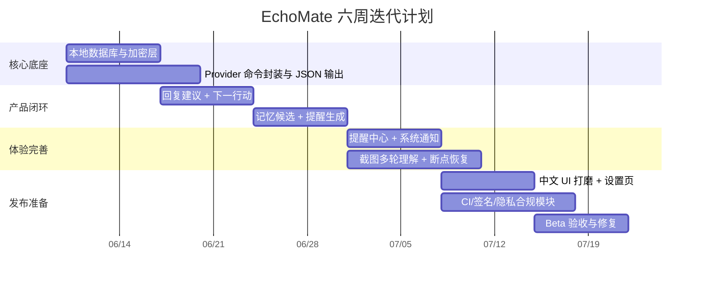
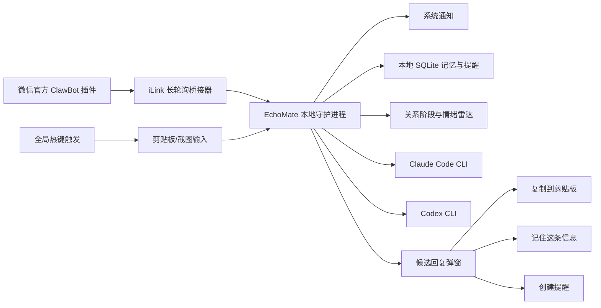
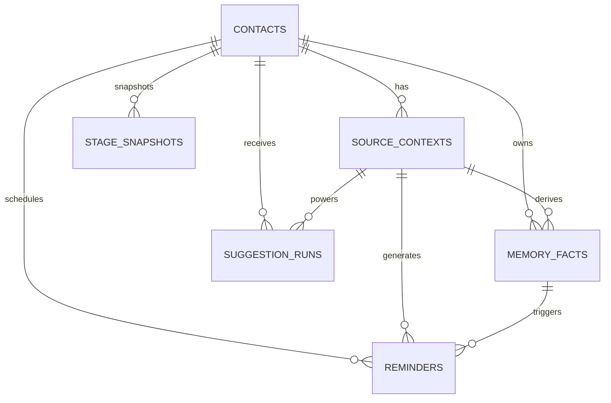

# EchoMate 深度研究与产品扩展方案

## 产品判断

EchoMate 最值得做的，不是再做一个“会写话术的聊天生成器”，而是做成**本地优先的个人关系 CRM + AI 回复副驾**。当前公开产品基本分成两类：一类像 Rizz、YourMove 这类 AI dating assistant，核心价值是“给你更快的回复、开场白和资料优化”；另一类像 Dex、Mesh、Monica 这类 personal CRM，核心价值是“记住人与人的上下文、提醒你别断联系、在合适的时间出现”。Google Messages 的 Magic Compose 和 SwiftKey 则说明，用户也愿意接受“写作辅助”“风格改写”“个性化输入”，前提是它看起来像**建议**，而不是替用户接管表达。EchoMate 恰好处在这两个市场的交叉点：**用本地桌面交互把“上下文理解、记忆、提醒、下一步动作建议”压缩到一个低打扰入口里**。citeturn6search10turn23search9turn8search7turn8search0turn24search10turn26search0turn27search0

从关系沟通角度，产品也不该优化“更会撩”，而应该优化**更会回应对方的连接请求、更少错过窗口、更少在不该追问时越界**。Gottman 将 “bids for connection” 视为亲密关系中“情绪沟通的基本单位”；APA 近年的讨论则提醒，AI 参与情感表达时，如果替代了真实表达，容易滑向“伪亲密”或“数字代理”而损害真实关系。因此，EchoMate 的价值不是让用户“像另一个人”，而是帮助用户**更稳定地做自己、但不漏掉重要细节**。citeturn9search0turn9search1turn9search4

结合这些公开资料，我建议 EchoMate 的产品原则固定为下表：

| 原则 | 具体含义 | 为什么重要 |
|---|---|---|
| 本地优先 | 聊天原文、记忆、提醒默认保存在本地；外部模型调用最小化 | Google Messages 把 Magic Compose 定位为可在设备上处理、且不把消息用于训练；Dex 与 Monica 都把“隐私/自托管/不卖数据”作为卖点，这对关系型数据尤其关键。 citeturn26search0turn23search2turn24search4 |
| 用户确认后再发 | EchoMate 只做建议、复制、提醒，不偷偷发消息 | 这既符合你当前“低打扰、即时辅助、不是自动代聊”的定位，也能显著降低误发、越界和隐私风险。Google 的生成式消息能力同样定位在“suggestions / rewrite”，而非默认自动发送。 citeturn26search0turn26search2 |
| 先记“窗口”，再记“信息” | 产品优先帮助用户记住明天面试、最近感冒、下周出差，而不是囤积所有聊天细节 | Personal CRM 的核心价值普遍不是“大而全档案”，而是“在对的时间提醒你做对的动作”。Dex、Mesh 的 reconnect / reminders 都是这个逻辑。 citeturn8search1turn8search5turn8search9 |
| 真实风格优先 | 做“风格约束”和“个人语料蒸馏”，不做“全自动数字分身” | SwiftKey 的思路是学习你的写作风格；Claude Code 的 output styles 也说明“风格约束”是可复用能力。但 APA 对 AI 关系代理的担忧说明，不应把产品做成情感替身。 citeturn27search0turn27search6turn12search2turn9search1turn9search4 |
| 边界感高于转化率 | 不做操控、PUA、隐蔽监听、批量轰炸 | 这既是伦理要求，也是产品信任底座；尤其在微信官方 ClawBot 场景下，腾讯条款明确区分微信插件只是信息收发工具，不提供 AI 结果担保，用户需自行承担后果。 citeturn30view0 |

关于“数字分身”，结论非常明确：**做“你的语气模板 + 你的禁忌词 + 你的常用节奏”，不要做“替你恋爱”的代理人格**。产品上应该限制为：风格一致、事实一致、边界一致，而不是情绪代演。citeturn27search6turn12search2turn9search4

## 竞品与用户需求

**竞品与相邻产品调研**

| 产品/类别 | 做得好的地方 | 明显短板 | 隐私模式 | 商业化路径 | EchoMate 可借鉴点 | 官方/原始资料 |
|---|---|---|---|---|---|---|
| Rizz / AI dating assistant | 强打“别再被晾着”“截图生成回复”，上手成本低，营销极强 | 重点在“即时话术”，缺少长期记忆、提醒与边界约束；更像即时外挂，不像关系系统 | App Store 页面显示会处理 User Content / Identifiers / Usage Data 等，隐私实践依赖开发者声明 | App 分发 + 创作者联盟增长 | **截图即得候选回复**、低门槛首屏体验；但不要继承“代聊心智” | citeturn6search10turn41search4turn41search5 |
| YourMove AI / dating co-pilot | 覆盖资料优化、开场白、聊天、照片，场景完整；直接承诺“texting on cruise control” | “代替你运营聊天”的心智较强，真实性风险更高 | 官方页称不保存对话、上传图片 7 天内删除，App Store 显示有订阅与最基本的识别/分析采集 | Freemium + 年/月订阅 + 工具矩阵 | **多场景包装能力**、聊天前后链路设计 | citeturn23search9turn25search17turn25search7 |
| Google Messages Magic Compose / 原生消息 AI | 官方消息场景、重写草稿、风格切换；公开强调消息不用于训练、数据留在设备上 | 只做消息重写，不提供长期关系记忆与提醒；平台受限 | 官方帮助中心明确：数据保持在设备上，Google 不存消息也不用于训练 | 系统级能力，不单独收费 | **“建议而非代发”**、**本地优先叙事** | citeturn26search0turn6search11 |
| Microsoft SwiftKey / AI keyboard | 学习用户写作风格，输入即辅助，进入任何 App 的阻力很低 | 键盘层很难理解多轮关系上下文；账号与云同步会增加隐私顾虑 | 官方说明可学习用户写作风格；2026 年起个性化输入数据迁至用户自己的 OneDrive | 免费工具带生态绑定 | **风格学习**、**跨 App 触达**；但 EchoMate 不应做输入法级全量接管 | citeturn27search0turn27search6turn27search4turn27search13 |
| Dex / personal CRM | 把“keep in touch reminder”做得很清楚；“remember where you left off”非常贴 EchoMate 方向 | 偏职业/社交网络管理，不是即时聊天副驾 | 官方明确“订阅而非广告，不卖数据”；同步数据加密；iMessage 集成仅在本地保留最近消息和基础元数据 | 订阅制 | **关系卡片、补联提醒、时间驱动 CRM** | citeturn8search7turn8search1turn23search2turn23search17turn23search26 |
| Mesh / relationship manager | 自动导入联系人、生日/提醒/更新流/重连提示，强调“the right person at the right time” | 偏“联系人中心”，即时回复建议不是核心 | 多平台集成，强调 notes / reminders / updates；数据在其平台生态中汇聚 | 订阅 | **更新流 + 关系动态 + 重连提示** | citeturn8search0turn8search9turn8search12 |
| Monica / 开源 personal CRM | 开源、自托管、家庭/朋友关系管理定位明确；无限提醒与自托管对隐私敏感用户很友好 | 即时聊天辅助弱，自动化能力不如现代 AI 产品 | 官方明确可自托管；若自己部署，官方甚至不知道你已下载使用 | Hosted 订阅 + 自托管免费 | **“私人关系不是销售漏斗”** 的产品叙事、可删除/可导出/可自持有的数据观 | citeturn24search10turn24search1turn24search2turn24search4 |
| 微信官方 ClawBot / 官方 iLink 通道 | 官方 QR 登录、长轮询收消息、发消息、typing、支持多账号；能把微信作为 AI 通道 | 本质是“AI 服务连接器”，不是为恋爱聊天副驾设计；一旦接入，就进入更高隐私敏感区 | 腾讯条款明确：输入/输出会传给你配置的第三方 AI，腾讯不在服务器保留正文，但会记录日志和设备信息 | 生态入口，不是直接面向该场景的独立 SaaS | **实时触发、消息事件、只读提醒可能性** | citeturn32view0turn30view0turn34search4 |

这些竞品共同说明了一个重要空白：**要么只会生成聊天内容，要么只会记联系人与提醒**。EchoMate 的机会在于把二者结合，而且坚持“本地桌面副驾”而不是“云端接管聊天”。这也是 EchoMate 最可能形成差异化壁垒的方向。citeturn8search7turn24search10turn23search9turn6search10

**用户核心 JTBD**

| JTBD | 用户真实想法 |
|---|---|
| 即时回复辅助 | “她发来一段话时，我不要空白几分钟，更不要回得像复制粘贴。” |
| 关系上下文记忆 | “她之前说过什么，我不想靠脑子硬记，也不想后面自相矛盾。” |
| 关键窗口不漏掉 | “她说明天考试/面试/加班，我希望第二天能记得跟进。” |
| 关系阶段判断 | “我不知道现在该继续聊、收束、约出来，还是先别追。” |
| 风格一致 | “我想保留自己的语气，不想一会儿像我、一会儿像 AI。” |
| 边界保护 | “我想更得体，不想显得监控、算计、油腻或冒犯。” |
| 焦虑降噪 | “我不是想让 AI 替我谈恋爱，我是想少一点内耗。” |

从公开产品定位和关系研究看，用户最核心的不是“生成一句更厉害的话”，而是**在高不确定、强情绪、信息稀碎的情境里，给出一个既真诚又不踩线的下一步**。这就是 EchoMate 的产品任务。citeturn9search0turn9search1turn8search1turn23search9

## 功能优先级与边界

下面这 20 个功能点，已经按**综合优先级**排序：先看影响力，再看实现难度，最后看风险。分值不是学术结论，而是面向首版落地的产品排序。

| 排名 | 功能点 | 影响力 | 实现难度 | 风险 | 说明 | 建议阶段 |
|---|---|---:|---:|---:|---|---|
| 1 | 候选回复 + 下一行动双输出 | 5 | 2 | 1 | 不只给“怎么回”，还给“该不该继续聊/收束/等待” | Phase 1 |
| 2 | 记忆候选抽取 | 5 | 3 | 2 | 从当前上下文提取“值得记住的事实”，但不默认保存 | Phase 1 |
| 3 | 一键创建 follow-up 提醒 | 5 | 2 | 1 | “她明天面试，明晚 8 点提醒我问结果” | Phase 1 |
| 4 | 单联系人关系卡 | 5 | 2 | 1 | 围绕一个人做 CRM，避免多联系人复杂度 | Phase 1 |
| 5 | 上下文摘要卡 | 4 | 2 | 1 | 让用户快速理解“最近聊到哪” | Phase 1 |
| 6 | 风格画像 | 4 | 2 | 1 | 温和/正式/幽默之外，加上“像我平时怎么说” | Phase 1 |
| 7 | 断点恢复 | 4 | 3 | 1 | 长时间未聊时，先给“续上话题”的建议 | Phase 1 |
| 8 | 关系阶段徽标 + 置信度 | 4 | 3 | 2 | 刚认识/探索期/稳定互动/冷淡期/冲突期 | Phase 2 |
| 9 | 情绪雷达 | 4 | 3 | 2 | 识别忙碌、压力、热情、敷衍，但必须显示低/中/高置信度 | Phase 2 |
| 10 | 历史提醒流 | 4 | 3 | 2 | 把过往保存的事实在合适时机重新浮现 | Phase 2 |
| 11 | 禁忌与边界卡 | 4 | 3 | 2 | “别追问家庭/别拿某话题开玩笑” | Phase 2 |
| 12 | 关怀模板库 | 4 | 2 | 1 | 面试、加班、感冒、旅行、生日、情绪低落等 | Phase 1 |
| 13 | 多截图拼接理解 | 3 | 3 | 1 | 多张截图合成长对话时间线 | Phase 2 |
| 14 | 邀约时机建议 | 4 | 4 | 3 | 需要依赖关系阶段、互相主动度和近期反馈 | Phase 2 |
| 15 | 记忆去重与 TTL | 4 | 3 | 1 | 防止记忆越存越乱、越存越 creepy | Phase 2 |
| 16 | 提醒节流与冷却策略 | 4 | 2 | 1 | 避免提醒过多造成骚扰和反感 | Phase 1 |
| 17 | 只读实验性微信通道提醒 | 3 | 4 | 4 | 技术上可行，但应后置、默认关闭 | Phase 3 |
| 18 | 历史导入向导 | 3 | 4 | 3 | 导入旧聊天做风格蒸馏和事实抽取 | Phase 3 |
| 19 | 加密导出/删除中心 | 3 | 2 | 1 | 建立信任感，支持备份与彻底删除 | Phase 1 |
| 20 | 跨设备加密同步 | 2 | 5 | 4 | 真有价值，但不是首版最该做 | Phase 3 |

这份排序和公开市场信号是一致的：**最高价值功能不是“更多花样回复”，而是“记忆候选 + 定时跟进 + 下一步动作建议”**。这正好也是 Dex、Mesh、Monica 这些 CRM 产品长期证明有价值的能力，而 Google / SwiftKey 证明了“风格化建议”是用户愿意接受的表达方式。citeturn8search1turn8search9turn24search10turn26search0turn27search6

**明确不应该做的功能**

| 不应该做 | 原因 |
|---|---|
| 自动发送消息 | 直接突破“辅助”边界，误发、冒犯、关系失真和责任归属问题都很大 |
| 隐蔽监控所有聊天并自动建档 | 即使技术上能做，也极易让产品变得 creepy；法律、隐私与信任风险都过高 |
| 自动伪装用户人格长期代聊 | 会把产品从“副驾”做成“替身”，与真实表达目标冲突，也更符合 APA 所担心的伪亲密风险。 citeturn9search1turn9search4 |
| PUA/操控/施压模板 | 与产品愿景冲突，且高投诉、高负面传播、高平台风险 |
| 批量群发或多对象流水线运营 | 很快滑向“情感销售自动化”，不仅违背定位，还会摧毁信任 |
| 默认长期保存敏感健康/性/财务信息 | 用户与第三方的风险都高，且很多场景根本不需要 |
| 偷偷上传全量截图/全量历史到外部服务 | 与“本地优先”冲突；在微信官方插件条款下还涉及对他人个人信息的谨慎处理义务。 citeturn30view0 |
| 使用社区灰色方案绕过微信生态限制 | 封号、合规、稳定性和产品可持续性都不成立 |

## 路线图、MVP与六周计划

**推荐的三阶段路线**

| 阶段 | 目标 | 关键用户流程 | 界面入口 | 数据结构草案 | 成功指标 |
|---|---|---|---|---|---|
| Phase 1 | 快速上线，兼容现有 Tauri 架构 | 触发热键 → 读取选中文本/截图 → 生成 5 条候选回复 + “建议动作” → 用户复制 → 可勾选“记住这条信息”/“创建提醒” | 主弹窗、托盘、设置页 | `contacts`、`source_contexts`、`style_profiles`、`memory_candidates`、`reminders`、`suggestion_runs` | 候选回复复制率、编辑后发送率、提醒创建率、提醒完成率、7 日留存 |
| Phase 2 | 建立记忆与提醒系统 | 保存被批准的事实 → 定时提醒/历史提醒 → 关系阶段/情绪雷达辅助 → 触发 follow-up 提示 | 关系卡、提醒中心、记忆抽屉 | 新增 `memory_facts`、`stage_snapshots`、`radar_signals`、`reminder_events` | 记忆采纳率、提醒点击率、提醒后回复率、用户自评“没漏掉窗口”提升 |
| Phase 3 | 更智能的长期关系副驾 | 导入历史 → 风格蒸馏 → 只读实验性官方微信通道提醒 → 多轮上下文连续理解 → 更稳的邀约时机判断 | 导入向导、实验室、桌面通知中心 | 新增 `imports`、`channel_accounts`、`message_events`、`style_corpus_items` | 付费转化、30 日留存、风格一致性评分、用户对“被帮助但仍像自己”的满意度 |

**优先级最高的 MVP**

我建议 MVP 不是“微信机器人”，而是下面这个最小闭环：

1. **单联系人模式**：首版默认就是“围绕一个人”的关系副驾，不急着做多联系人 CRM。  
2. **回复建议 + 行动建议**：弹窗里除了 5 条候选回复，再给 1 行“建议动作”。  
3. **记忆候选**：模型从当前上下文抽取 1–3 条“值得记住的事实”，但默认不入库，必须用户点“记住”。  
4. **提醒生成**：如果识别到时间窗口，默认弹出“要不要创建提醒”。  
5. **提醒通知**：到点给系统通知，点开后直接回到 EchoMate 并给 3 条 follow-up 文案。  
6. **全部本地存储**：先不做自动同步、不做后台监控、不做群聊。  

这个 MVP 的最大优点，是完全兼容你今天已经有的能力：**热键、剪贴板、截图、Claude/Codex CLI、候选回复弹窗**。新增的只是“结构化存储”和“提醒引擎”。citeturn10search0turn18search0turn37view0turn14view2

**六周执行时间线**



**逐周目标、交付物、验收标准**

| 周次 | 目标 | 交付物 | 验收标准 |
|---|---|---|---|
| 第 1 周 | 建立数据底座与 Provider 统一层 | SQLite schema、迁移、CLI 调用器、结构化 JSON 输出协议 | Claude/Codex 都能稳定返回 5 条候选回复 JSON |
| 第 2 周 | 完成“回复 + 动作建议”闭环 | 新弹窗、候选回复复制、建议动作徽标 | 热键触发到可复制结果 < 3 秒（纯文本场景） |
| 第 3 周 | 完成记忆候选与提醒生成 | “记住这条信息”“创建提醒”交互、提醒表 | 能从 10 个典型场景中稳定生成正确提醒草案 |
| 第 4 周 | 完成提醒中心和系统通知 | 提醒列表、延后、完成、再次提醒 | 到点通知可打开对应联系人关系卡并给出 follow-up 文案 |
| 第 5 周 | 强化截图理解和断点恢复 | 多截图拼接、摘要策略、断点续聊 | 两张以上聊天截图能给出合并摘要和续聊建议 |
| 第 6 周 | 发布准备 | 安装包、签名、隐私说明、日志开关、错误上报开关 | Windows/macOS 均可安装；默认本地存储；所有上传行为均有用户确认 |

## 记忆、提醒与行动引擎

**定时关怀模块设计**

| 场景 | 触发条件 | 信息来源 | 提醒文案模板 | 用户确认方式 | 避免骚扰和越界策略 |
|---|---|---|---|---|---|
| 生日 | 手动录入或聊天中明确出现生日且用户点“记住” | 手动 / 记忆候选 | “今天是她生日，要不要发一句简短真诚的祝福？” | 到点前 1 天、当天 2 次确认 | 不自动发；不建议长篇“感动文”；每年一次 |
| 考试/面试 | “明天考试/周五面试/下午答辩”被识别 | 聊天文本 / 截图 OCR | “她今天有面试，晚上 8 点提醒你轻轻问一句结果。” | 创建提醒前二次确认 | 如果对方明确说“别紧张我/别追问”，则不提醒 |
| 加班/项目冲刺 | “最近很忙/在赶 ddl/通宵” | 聊天文本 | “她最近压力大，建议明晚发一句不打扰的关心。” | 由用户决定时间 | 最多 1 次 follow-up，不连续催问 |
| 感冒/生病 | “发烧/咳嗽/感冒了” | 聊天文本 | “她前天说不舒服，今晚提醒你问问恢复得怎么样。” | 一键创建 | 48–72 小时内最多 1 次；不做医学建议 |
| 出差/旅行 | “明天去上海/周末旅行” | 聊天文本 / 手动 | “她今天出发，提醒你晚点问一句到没到。” | 一键创建 | 只做安全抵达或体验问候，不做位置追踪 |
| 情绪低落 | “最近有点烦/好累/有点崩” | 聊天文本 | “她前天状态不太好，今晚可发一句低压力问候。” | 用户手动确认 | 不连续追问；若上次未回应，则延后或取消 |
| 天气变化 | 城市 + 天气预警 + 用户允许天气联网 | 手动城市 / 天气服务 | “她在北京，今天降温明显，要不要顺手提醒添衣？” | 首次使用天气提醒需总开关授权 | 仅上传粗粒度城市，不上传聊天内容 |
| 生理期 | **仅在用户手动设置且明确勾选敏感提醒** | 手动 | “下周可能是她不舒服的时段，若你想，提前留意别安排高强度活动。” | 需要单独敏感权限确认 | 默认关闭；不自动生成消息；不做周期性骚扰提醒 |
| 冲突后 follow-up | 发生争执或情绪摩擦后 12–48 小时 | 聊天文本、情绪雷达 | “这段对话更像冲突后冷却期，建议明晚发一句缓和确认。” | 明确确认 | 不建议立刻长篇解释；先修复再推进 |
| 长时间静默后的轻碰 | 有意义话题后静默超过阈值 | 历史摘要、提醒引擎 | “上次停在她提的旅行话题，要不要轻轻续上？” | 手动确认 | 阈值基于双方基线，不做机械催聊 |

**历史提醒与记忆系统设计**

EchoMate 不该把所有聊天都变成资料库，而应该只保存三类信息：**时间窗口、持续主题、边界信息**。这和 Dex 的“remember where you left off”、Monica 的“document your contacts but under your control”，以及 Dex 在 iMessage 集成里只在本地存最近消息和元数据的做法高度一致。citeturn8search7turn24search10turn23search26

| 信息类别 | 默认建议记忆 | 抽取方式 | 去重键 | 保留时长 | 是否加密 | 规则 |
|---|---|---|---|---|---|---|
| 重要日期与计划 | 是 | 模型抽取 + 用户确认 | `contact_id + type + date` | 到事件后 30 天 | 是 | 面试、考试、出差、生日、搬家等 |
| 长期偏好 | 是 | 模型抽取 + 用户确认 | `contact_id + canonical_pref` | 180 天，可续期 | 是 | 喜欢的食物/电影/城市/约会形式 |
| 不喜欢/禁忌 | 是 | 模型抽取 + 用户确认 | `contact_id + taboo_key` | 365 天 | 是 | 不喜欢被追问、不喜欢某类玩笑 |
| 持续烦恼/压力源 | 条件性建议 | 抽取 + 用户确认 | `contact_id + issue_key` | 30–60 天 | 是 | 最近忙、家里有事、工作焦虑 |
| 关系里程碑 | 是 | 手动优先 | `contact_id + milestone_type + date` | 长期 | 是 | 第一次见面、第一次旅行、和好等 |
| 风格偏好 | 是 | 用户设置 | `user_id + style_key` | 长期 | 是 | 你自己的表达方式、禁用语、Emoji 程度 |
| 精确住址/身份证明/财务 | 否 | 不抽取 | - | 不保存 | - | 不值得为该产品保存 |
| 模糊健康细节/性相关敏感信息 | 默认否 | 仅手动敏感开关 | - | 短期或不存 | 强加密 | 避免 creepy 和不必要风险 |
| 第三方隐私信息 | 否 | 不抽取 | - | 不保存 | - | 她朋友/家人/同事的隐私不该记 |
| 未被用户确认的候选记忆 | 否 | 临时缓存 | 临时 ID | 24 小时自动清理 | 是 | 只用于当前建议，不进长期库 |

**推荐的记忆流水线**

- **抽取**：在每次建议生成后，让模型额外输出 `memory_candidates[]`，字段包含 `type`、`summary`、`source_quote`、`confidence`、`sensitivity`。  
- **去重**：先用规则归一化，再用向量或字符串近似比对。比如“周五面试”和“这周五去面试”归到同一事实。  
- **确认**：任何候选都要经用户手动点击“记住”。  
- **加密**：事实正文用应用级加密存储；数据库里只保留可用于列表的最小预览。  
- **保鲜**：超过 TTL 的事实自动降权；再次被聊天提及时续期。  
- **可解释**：每条记忆都能点开看到“来自哪段聊天”。  

**避免 creepy 的硬性规则**

- 只允许使用**用户亲眼看到、并自己确认保存**的信息，不做后台揣测。  
- 对高敏感信息默认关闭，尤其是健康、生理、性、财务、家庭矛盾。  
- 任何建议都要显示“为什么现在提醒你”。  
- 同一联系人的主动提醒上限建议设为：**每天最多 1 条、每周最多 2 条**。  
- 若用户连续 2 次忽略某类提醒，自动降低该类提醒频率。  
- 不要在不相关的时刻“秀记忆力”。例如她两个月前提过一次医院，不应在闲聊里主动拿出来当谈资。  

**情绪雷达与下一行动建议**

这里必须坚持“**识别信号，不做读心术**”。Gottman 的研究告诉我们，很多互动是“连接请求”而非复杂博弈；APA 关于 AI 情感替代的提醒也说明，过度解读很容易把辅助产品做成心理投射放大器。EchoMate 的情绪雷达应该只做**弱判断 + 置信度展示 + 行动建议**。citeturn9search0turn9search1

| 信号簇 | 可用信号 | 触发阈值 | 动作建议 | UI 文案 |
|---|---|---|---|---|
| 热情/投入 | 主动补充话题、反问、分享照片/语音、回复时长回到基线内 | 置信度 > 0.70 | 继续聊；若已多轮正反馈，可轻邀约 | “更像是有兴趣继续聊，可以顺势往前一点。” |
| 忙碌/压力 | 明说忙、加班、准备考试、短回复但礼貌、解释回复慢 | 置信度 > 0.65 | 收束 + 设置 follow-up，不追问 | “更像是忙，不适合深聊；收住反而加分。” |
| 敷衍/降温 | 多轮只有“嗯嗯/哈哈/好的”、无反问、明显低于双方基线 | 置信度 > 0.70 | 结束这轮，等待 24–72 小时 | “更像是没精力展开，不建议硬拉长。” |
| 情绪低落 | “烦/累/崩/难受”等词，或上下文连续负面事件 | 置信度 > 0.60 | 简短支持，不给建议，不要求即时回复 | “优先陪伴感，不要解决欲过强。” |
| 冲突/受伤 | 否定、抱怨、边界表达、重复解释、反感词 | 置信度 > 0.70 | 先确认感受/必要时道歉，暂停推进 | “先修复，再讨论内容；别继续辩。” |
| 不确定 | 信号混杂或样本不足 | 置信度 < 0.55 | 不给阶段结论，只给安全建议 | “信号不足，建议保持轻量与真诚。” |

**关系阶段机**

- 刚认识：样本少，重点是自然续聊，不做强判断。  
- 探索期：互相提问、分享生活，但还没形成稳定节奏。  
- 稳定互动：有复访、有专属梗、能自然接上前文。  
- 冷淡期：互动延迟显著拉长，且连续多轮缺乏扩展。  
- 冲突期：出现明显边界、误解或情绪碰撞。  

阶段判断永远要带置信度，且**不应该直接输出“她不喜欢你了”**这种强结论。

**十个真实使用场景与示例文案**

| 场景 | EchoMate 提示 | 示例提醒/回复文案 |
|---|---|---|
| 她说最近很忙 | 建议动作：收束 + 2 天后轻问候 | “先不打扰你啦，等你忙过这阵子再聊～” |
| 她提到明天考试 | 建议创建提醒：明晚 8 点 | “今天怎么样？不想复盘也没事，先好好放松一下。” |
| 她说感冒了 | 建议创建 48 小时 follow-up | “好点了吗？这两天别硬扛，早点休息。” |
| 她隔了很久才回 | 情绪雷达：更像忙而非冷淡 | “没事，你有空再回就行，我刚好也在忙。” |
| 她主动分享照片 | 建议动作：继续聊，围绕照片细节回应 | “这张拍得很有感觉，是你最近去的那个地方吗？” |
| 聊天快冷掉 | 建议动作：收束，不硬续 | “那你先忙，回头有空再和我说后续。” |
| 想约出来但不确定时机 | 关系阶段：探索期，中置信 | “如果你这周末不赶的话，要不要一起喝杯咖啡？” |
| 刚有点小误会 | 建议动作：先修复 | “我刚刚那句话可能说得不太好，我的本意不是那个意思。” |
| 她说周末要出差 | 建议创建提醒：出发当晚 | “到啦的话和我说一声，路上顺利就好。” |
| 她提到喜欢某家店/电影 | 建议记忆：长期偏好 | 后续提醒：“上次你提过想看那部电影，要不要哪天一起去？” |

## 截图、微信集成与技术落地

**截图上下文能力还能怎么扩展**

你的现有“截图上下文解析（左侧=对方、右侧=我）”已经是很强的差异点。下一步最值得扩展的是把它从“单图读懂”升级成“**多轮时间线理解**”。

| 能力 | 建议实现 | 说明 |
|---|---|---|
| 多轮拼接理解 | 允许一次选择多张截图，按拍摄顺序合并为对话时间线 | 解决长对话被截断的问题 |
| 双方语气分析 | 先做 OCR + 气泡归类，再抽取每轮“语气标签” | 让“热情/忙碌/敷衍/冲突”更可解释 |
| 断点恢复 | 自动识别最后一个有回应价值的话题 | 不只告诉你怎么回，还告诉你“从哪接比较自然” |
| 对话摘要 | 生成 3 层摘要：一句话、要点版、关系版 | 兼顾即时查看与长期记忆 |
| OCR 置信度回退 | OCR 低置信度时，再走视觉模型补偿 | 减少中文聊天截图识别失败 |
| 图片/表情/引用消息处理 | 将图片气泡、引用消息、语音占位独立建模 | 提升“她发照片”“她引用前文”场景的判断质量 |

技术上，我建议做成**本地 OCR 优先、视觉模型补偿**的双层策略。Windows 侧优先使用 Windows on-device 文本识别 API；macOS 侧优先用 Apple Vision 的 `RecognizeTextRequest`；跨平台 fallback 再走 Tesseract / `leptess`。这样首屏速度更快，也更符合本地优先。只有当 OCR 置信度低、存在复杂图片/表情/引用关系时，再把图片路径交给 Codex 或 Claude 做视觉理解。微软和苹果都提供了本地 OCR 能力；Tesseract 仍然适合做 fallback，但其官方文档也明确提到新版没有官方 Windows 安装器，产品化会更麻烦。OpenAI 的 Codex CLI 官方支持 `--image` / `-i` 图像输入；Claude Code 官方也支持通过拖拽、剪贴板或文件路径做图片分析。citeturn20search2turn20search3turn19search1turn19search14turn10search7turn15search2turn36search2turn36search18

**微信机器人集成评估**

先说结论：**技术上可以做，商业上可用于“只读提醒”和“上下文同步”，但不应作为 MVP 核心，且任何非官方灰色接入都不值得做。**

| 项目 | 能力判断 | 授权/官方性 | 是否可做实时消息提醒 | 对 EchoMate 的帮助 | 主要风险 | 结论 |
|---|---|---|---|---|---|---|
| 腾讯官方 `@tencent-weixin/openclaw-weixin` + `openclaw-weixin-cli` | QR 登录、HTTP 长轮询 `getUpdates`、`sendMessage`、`sendTyping`、多账号、DM 会话隔离 | 腾讯官方发布，MIT；微信 ClawBot 使用条款明确存在 | **可以**。官方 README 显示 `getUpdates` 为长轮询，建议超时 35s，可持续收到新消息 | 可做**只读提醒**、联系人事件触发、历史从接入时起同步 | 腾讯条款明确：输入/输出会传给你配置的第三方 AI；要谨慎处理包含他人个人信息的内容；腾讯会收集日志、IP、设备信息。自动代聊风险仍高 | **唯一值得评估的微信接入路径**，但建议只做实验性、默认关闭 | citeturn32view0turn30view0turn34search4 |
| `sgaofen/cli-in-wechat` | 在微信里路由 Claude Code / Codex / Gemini / Kimi / OpenCode，会话续接、`/resume`、AskUserQuestion 转发 | 社区项目，MIT，非腾讯官方 | 可以，因其本身就是基于 iLink 长轮询消息流 | 对 EchoMate 最大价值是**参考其桥接架构与 CLI 适配方式** | README 明写“最高权限默认开启”；这对本地机环境和 CLI 权限模型都偏激进 | **适合研究，不适合直接嵌入生产依赖** | citeturn33view3turn34search1 |
| `epiral/weixin-bot` | Node/Python SDK，扫码登录、长轮询、本地运行、自动管理 `context_token` | 社区项目，MIT；仓库无 SECURITY.md | 可以 | 适合作为 **iLink 协议 SDK 参考**，便于验证最小接入 | 无官方安全策略，生产信任度不足 | **适合 PoC，不建议首版直接依赖** | citeturn33view2turn35search0turn34search3 |

**能不能直接监控到“齐齐来了消息”，然后提醒我？**

如果走**腾讯官方 ClawBot/iLink** 路线，答案是：**技术上能，产品上应非常克制地做**。官方文档已经公开了长轮询 `getUpdates`、消息结构、`context_token`、35 秒超时等接口，这意味着你可以在本地守护进程里接收新消息事件，再触发操作系统通知。也就是说，“齐齐来消息了，EchoMate 桌面通知提醒你”这件事，**在官方通道下是可实现的**。citeturn32view0

但我不建议把它做成默认功能，原因有三点。第一，产品定位会从“手动触发副驾”滑向“后台监控代理”，隐私敏感度陡增。第二，腾讯的 ClawBot 条款明确写了：用户输入内容和输出结果会被收集并传输给你配置的第三方 AI 服务提供方；腾讯自己不在服务器保存正文，但你仍然要对第三方服务和他人个人信息处理负责。第三，一旦同时具备实时监听和自动回复能力，就非常容易越过“辅助”边界。citeturn30view0

因此，对 EchoMate 的建议是：

- **MVP 不做微信实时监听。**
- 如果将来做，只做 **实验性“只读提醒模式”**：
  - 需要用户主动绑定官方 ClawBot；
  - 明示开启状态；
  - 只允许白名单联系人；
  - 只发桌面通知，不自动回；
  - 默认不保存全文，只生成极简事件摘要；
  - 须有“一键暂停 24 小时 / 7 天”；
  - 首次启用要明示“消息内容会通过你配置的第三方 AI 通道处理”。  

**推荐的可选架构**

下图是我建议的“官方微信通道可选接入”架构。关键点是：**微信部分是可插拔实验模块，不进主路径；主路径仍然是手动热键 + 本地分析。**



上图中的微信支路之所以应该保持“可插拔”，是因为腾讯条款、第三方 AI 传输、平台生态与用户感受都决定了它不能成为默认模式。EchoMate 的主价值仍然是**用户触发时的高质量辅助**，而不是 24/7 代管消息。citeturn30view0turn32view0

**技术选型建议**

| 领域 | 推荐方案 | 选择理由 |
|---|---|---|
| 桌面壳层 | Tauri 2 + Rust | 官方支持 Windows / macOS 跨平台，体积小，适合本地工具。 citeturn17search0turn17search4 |
| 前端 | React + TypeScript + Zustand | 开发效率高，适合弹窗、设置页、关系卡等单页界面 |
| 全局热键 | `@tauri-apps/plugin-global-shortcut` | Tauri 官方插件，支持 Windows/macOS。 citeturn10search0turn10search8 |
| 剪贴板 | `@tauri-apps/plugin-clipboard-manager` / `@tauri-apps/plugin-clipboard` | 官方插件，读写系统剪贴板。 citeturn18search6turn18search20 |
| 通知 | `@tauri-apps/plugin-notification` | 官方系统通知能力，适合提醒中心。 citeturn18search0turn18search12 |
| 窗口与截图遮罩 | Tauri 多窗口 + 透明窗口 | 可做区域选择与悬浮弹窗。 citeturn21search2turn21search5 |
| 数据库 | **Rust 后端 `rusqlite` 管控 SQLite** | 比直接把 SQL 暴露给前端更安全，便于做加密、TTL、审计。 citeturn16search1turn16search5 |
| 密钥/敏感配置 | `keyring` 或 Tauri Stronghold | 适合存储本地加密密钥、Provider 凭证。 citeturn16search0turn16search2turn16search18 |
| OCR | Windows 优先 WinRT/`oneocr-rs`；macOS 优先 Apple Vision；fallback `leptess` | 本地优先、体验更稳；Tesseract 作为 fallback 足够。 citeturn20search2turn20search1turn20search3turn10search7 |
| 图像理解 | Codex CLI 优先；Claude Code 作为补充 | Codex 官方文档明确支持 `--image`；Claude Code 支持图片路径/粘贴/拖拽。 citeturn15search2turn36search2turn36search18 |
| Provider 调用 | Rust `tokio::process::Command` | 不把 shell 权限暴露给前端；权限集中在后端控制 |
| Claude Provider | `claude -p --output-format json --json-schema ...` | 官方 print mode 支持 JSON Schema、max-turns、无持久化。 citeturn37view0turn37view1 |
| Codex Provider | `codex exec --sandbox read-only --skip-git-repo-check ...` | 官方支持非交互、沙箱、resume、stdout。 citeturn14view2turn14view3 |

**建议目录结构**

```text
echomate/
├─ apps/
│  └─ desktop/
│     ├─ src/
│     │  ├─ pages/
│     │  │  ├─ 回复弹窗.tsx
│     │  │  ├─ 关系卡.tsx
│     │  │  ├─ 提醒中心.tsx
│     │  │  └─ 设置.tsx
│     │  ├─ components/
│     │  ├─ stores/
│     │  ├─ hooks/
│     │  └─ types/
│     └─ src-tauri/
│        ├─ src/
│        │  ├─ main.rs
│        │  ├─ commands/
│        │  │  ├─ analyze_context.rs
│        │  │  ├─ generate_replies.rs
│        │  │  ├─ memory.rs
│        │  │  ├─ reminders.rs
│        │  │  └─ providers.rs
│        │  ├─ domain/
│        │  │  ├─ contacts.rs
│        │  │  ├─ memory_facts.rs
│        │  │  ├─ stage_engine.rs
│        │  │  └─ reminder_engine.rs
│        │  ├─ infra/
│        │  │  ├─ db.rs
│        │  │  ├─ crypto.rs
│        │  │  ├─ ocr/
│        │  │  │  ├─ windows_ocr.rs
│        │  │  │  ├─ mac_vision.rs
│        │  │  │  └─ tesseract_fallback.rs
│        │  │  ├─ capture/
│        │  │  └─ providers/
│        │  │     ├─ claude_cli.rs
│        │  │     └─ codex_cli.rs
│        │  ├─ migrations/
│        │  └─ tests/
│        ├─ capabilities/
│        └─ tauri.conf.json
├─ schemas/
│  ├─ reply_candidates.schema.json
│  ├─ memory_candidates.schema.json
│  └─ action_advice.schema.json
└─ .github/workflows/
```

**关键命令示例**

下面这两类命令，足以让 Claude Code 或 Codex 很快实现 EchoMate 的首版 Provider 层。对应能力都来自官方 CLI 文档。citeturn37view0turn14view2turn15search2

```bash
# Claude Code：非交互 JSON 输出
claude -p \
  --output-format json \
  --json-schema ./schemas/reply_candidates.schema.json \
  --max-turns 2 \
  --no-session-persistence \
  "根据 ./tmp/context.json 生成 5 条中文候选回复、1 条动作建议、最多 3 条记忆候选。"

# Codex：非交互文本/JSON 工作流
codex exec \
  --sandbox read-only \
  --skip-git-repo-check \
  "Read ./tmp/context.json and return JSON with five reply candidates in zh-CN."

# Codex：图像输入
codex --image ./tmp/chat.png \
  "识别聊天截图中的左右气泡，输出按时间顺序排列的对话 JSON。"

# Claude Code：图像路径输入
claude "Analyze this image: ./tmp/chat.png. 请输出左右气泡时间线、摘要和建议动作。"
```

**数据库 schema 草案**

```sql
CREATE TABLE contacts (
  id TEXT PRIMARY KEY,
  display_name TEXT NOT NULL,
  channel TEXT NOT NULL DEFAULT 'manual',
  alias TEXT,
  is_favorite INTEGER NOT NULL DEFAULT 1,
  created_at INTEGER NOT NULL,
  updated_at INTEGER NOT NULL
);

CREATE TABLE source_contexts (
  id TEXT PRIMARY KEY,
  contact_id TEXT NOT NULL,
  source_type TEXT NOT NULL,              -- clipboard | screenshot | import | channel_event
  raw_text_cipher BLOB,
  ocr_json_cipher BLOB,
  summary_text TEXT,
  captured_at INTEGER NOT NULL,
  FOREIGN KEY(contact_id) REFERENCES contacts(id)
);

CREATE TABLE memory_facts (
  id TEXT PRIMARY KEY,
  contact_id TEXT NOT NULL,
  fact_type TEXT NOT NULL,                -- plan | preference | taboo | stressor | milestone
  canonical_key TEXT NOT NULL,
  value_preview TEXT NOT NULL,
  value_cipher BLOB NOT NULL,
  source_context_id TEXT,
  confidence REAL NOT NULL,
  sensitivity_level INTEGER NOT NULL DEFAULT 0,
  ttl_days INTEGER NOT NULL DEFAULT 180,
  status TEXT NOT NULL DEFAULT 'active',  -- active | snoozed | expired | deleted
  first_seen_at INTEGER NOT NULL,
  last_confirmed_at INTEGER NOT NULL,
  expires_at INTEGER,
  FOREIGN KEY(contact_id) REFERENCES contacts(id),
  FOREIGN KEY(source_context_id) REFERENCES source_contexts(id)
);

CREATE UNIQUE INDEX idx_memory_fact_unique
ON memory_facts(contact_id, canonical_key);

CREATE TABLE reminders (
  id TEXT PRIMARY KEY,
  contact_id TEXT NOT NULL,
  title TEXT NOT NULL,
  body TEXT,
  reminder_type TEXT NOT NULL,            -- followup | care | anniversary | manual
  trigger_at INTEGER NOT NULL,
  status TEXT NOT NULL DEFAULT 'pending', -- pending | done | snoozed | canceled
  linked_fact_id TEXT,
  source_context_id TEXT,
  created_at INTEGER NOT NULL,
  completed_at INTEGER,
  FOREIGN KEY(contact_id) REFERENCES contacts(id),
  FOREIGN KEY(linked_fact_id) REFERENCES memory_facts(id),
  FOREIGN KEY(source_context_id) REFERENCES source_contexts(id)
);

CREATE TABLE stage_snapshots (
  id TEXT PRIMARY KEY,
  contact_id TEXT NOT NULL,
  stage TEXT NOT NULL,                    -- 刚认识 | 探索期 | 稳定互动 | 冷淡期 | 冲突期
  confidence REAL NOT NULL,
  rationale_json TEXT NOT NULL,
  created_at INTEGER NOT NULL,
  FOREIGN KEY(contact_id) REFERENCES contacts(id)
);

CREATE TABLE suggestion_runs (
  id TEXT PRIMARY KEY,
  contact_id TEXT NOT NULL,
  source_context_id TEXT NOT NULL,
  provider TEXT NOT NULL,                 -- claude | codex
  candidates_json TEXT NOT NULL,
  action_advice_json TEXT NOT NULL,
  memory_candidates_json TEXT,
  created_at INTEGER NOT NULL,
  FOREIGN KEY(contact_id) REFERENCES contacts(id),
  FOREIGN KEY(source_context_id) REFERENCES source_contexts(id)
);
```

**关键实体关系图**



**中文 UI 草图**

```text
┌──────────────────────── EchoMate 回复副驾 ────────────────────────┐
│ 联系人：齐齐                         关系阶段：探索期（中置信）   │
│ 最近摘要：她说这周很忙，明天下午有面试，昨晚回得比较晚。         │
│ 建议动作：这轮先收住，明晚轻轻 follow-up。                       │
├─────────────────────────────────────────────────────────────────┤
│ 候选回复                                                          │
│ ① 那你先好好准备呀，别被我打扰了，明天结束后再和我说说～ [复制] │
│ ② 先专心面试，等你忙完这阵子我们再慢慢聊。               [复制] │
│ ③ 明天加油，晚上如果你愿意的话，我请你吃顿“面试后安慰餐”。[复制] │
│ ④ 收到，那我先不打扰你，等你好消息。                     [复制] │
│ ⑤ 你先忙正事，等你有空再回我也完全没事。                 [复制] │
├─────────────────────────────────────────────────────────────────┤
│ 记忆候选                                                          │
│ [ ] 她明天下午有面试        [记住]                               │
│ [ ] 她最近工作节奏很紧      [记住]                               │
├─────────────────────────────────────────────────────────────────┤
│ 提醒建议                                                          │
│ 明晚 20:00 提醒我：问问她面试结果                           [创建] │
│ 两天后 19:30 提醒我：如果她还很忙，就只发一句轻问候         [创建] │
├─────────────────────────────────────────────────────────────────┤
│ [重新分析]   [查看关系卡]   [提醒中心]   [设置]                  │
└─────────────────────────────────────────────────────────────────┘
```

**CI、发布与隐私合规要点**

| 模块 | 要点 |
|---|---|
| CI/CD | 使用 `tauri-action` 在 GitHub Actions 分别构建 Windows 和 macOS 安装包；发布到 GitHub Releases，后续可接 Tauri updater。 citeturn17search2turn17search6 |
| Windows 发布 | 做代码签名，减少 SmartScreen 警告；Tauri 官方明确指出 Windows code signing 对信任建立很重要。 citeturn17search1 |
| macOS 发布 | 走签名与 notarization，避免 Gatekeeper 阻断 |
| 首次启动隐私向导 | 告知哪些数据只存本地、哪些操作会调用 Claude/Codex、截图是否外发、如何关闭 |
| 最小化数据上传 | 默认只上传当前上下文；截图先 OCR 再压缩；天气提醒只上传粗粒度城市；WeChat 实验模块单独告知消息经第三方 AI 处理 |
| 用户控制 | 每条记忆可删、每个提醒可暂停、每个联系人可静默、整套数据可导出/清空 |
| 日志策略 | 默认只记技术日志，不记聊天正文；调试模式需再次确认 |
| 权限策略 | 不把 shell 能力暴露给前端；所有 CLI 调用经 Rust 后端白名单封装；Tauri Shell 若使用，必须做 scope 限制。 citeturn18search1turn18search13 |

**最后的明确判断**

- **最优产品定位**：本地 AI 回复副驾 + 单联系人关系 CRM。  
- **最强壁垒**：记住她说过什么、在合适时间提醒你、帮你判断什么时候继续/什么时候收束，而不是仅仅“生成一句更会说的话”。  
- **最优 MVP**：现有剪贴板/截图输入之上，补上**记忆候选、提醒生成、关系卡、动作建议**。  
- **微信机器人集成**：只评估**腾讯官方 ClawBot/iLink** 路线；可以作为 Phase 3 的实验性只读提醒通道。  
- **绝不优先做**：自动代聊、隐蔽监听、数字分身、批量运营。  

如果按务实程度排序，EchoMate 首版真正值得马上投入开发的，不是“机器人”，而是这四件事：**结构化摘要、记忆候选、提醒引擎、下一行动建议**。这四件事做扎实，EchoMate 就已经不是一个“聊天生成器”，而是一个开始形成产品壁垒的关系副驾。