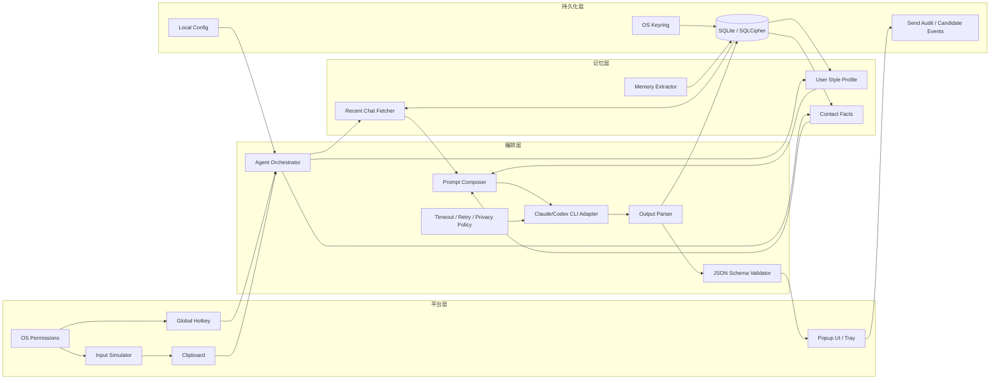
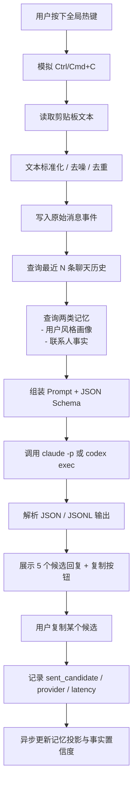
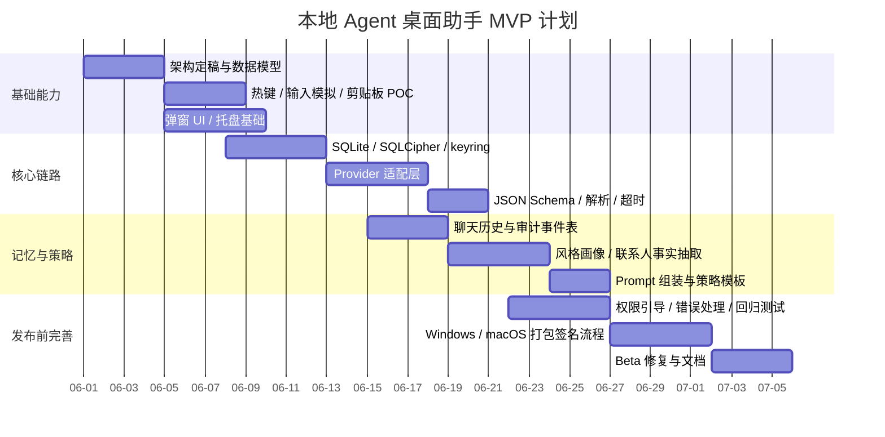

# Rust 与 Go 构建本地跨平台 Agent 桌面助手的技术选型报告

## 执行摘要

这类应用的真正难点，不在于“调用一个大模型”本身，而在于桌面集成的边角条件：全局热键、模拟复制、剪贴板一致性、加密 SQLite、macOS 权限、Windows 完整性级别限制、CLI 超时与 JSON 解析、以及最终的安装器与签名流程。对你描述的需求而言，**语言只决定一部分体验**；另外一大部分由 GUI 框架、输入模拟库、SQLite 加密方案、以及 Claude Code / Codex CLI 的工作方式决定。官方文档表明，Claude Code 已经支持 `claude -p`、`json` / `stream-json` 输出和 `--json-schema`，Codex CLI 也支持 `codex exec`、JSONL 流和 `--output-schema`，因此“通过本地子进程编排外部 CLI”这条路线是成立的。citeturn32view0turn32view1

如果把目标限定为 **Windows 10+ 与 macOS 12+、本地常驻热键守护进程、小弹窗展示 5 个候选回复、保存结构化历史并抽取记忆**，那么结论可以非常明确地分成两层：

**短期 MVP（4–8 周、单人或 Go 背景团队）优先 Go**。Go 的标准库在子进程、上下文取消、结构化日志、测试方面非常顺手；Go 官方调查也显示开发者满意度持续很高，且 Go 在 CLI 与后台工具场景非常强。对一个以“热键 + 剪贴板 + SQLite + subprocess + 小 UI”组成的本地助手来说，Go 能更快把主链路做通。citeturn23view0turn23view1turn18search0turn9search0turn27view0turn27view2

**长期产品化桌面应用优先 Rust，尤其是 Rust + Tauri 2**。原因不是“Rust 一定更快”这么简单，而是它在这个题目里同时拿到几项关键优势：无 GC 带来的更低 idle 负担、Tauri 更完整的桌面分发与权限模型、成熟的全局快捷键与剪贴板插件、以及对系统 API/原生依赖的长期控制力。官方资料还显示 Tauri 使用系统 WebView，最小应用体积可以做到很小，并且 bundler、插件权限、GitHub Actions 流程都很完整。citeturn10search1turn36view1turn36view2turn31search0turn31search1turn36view3

综合你的场景，我的推荐是：

**结论性建议：先 Go 做 MVP，但从第一天就按“未来可迁移到 Rust”的方式设计边界。**  
更具体一点：

- 如果你是 **单人开发、Go 熟悉、目标是 4–8 周内可用**：先做 **Go 核心 + Fyne 小弹窗外壳**，把平台集成、CLI 适配、记忆抽取、数据库都抽象成接口；这样最快。Fyne 的托盘与无渲染测试能力，对这种小弹窗工具非常合适。citeturn12search0turn12search1turn12search4turn35view3turn16view0
- 如果你从第一天就更看重 **安装器质量、最小权限、长期维护、较低常驻资源、桌面壳产品化**：直接做 **Rust + Tauri 2**。这会更慢上手，但长期更顺。citeturn36view1turn36view2turn31search0turn31search1turn31search2

需要特别说明的是，**目前没有针对“热键复制 + 外部 LLM CLI + 小弹窗 UI”这一精确工作负载的官方端到端基准**。因此下面关于启动、内存、维护性的结论，部分是基于运行时模型、工具链设计和官方生态文档做出的工程判断，而不是某个统一 benchmark 的机械结论。citeturn10search0turn10search1turn29view0turn30view0

## 对比结论与总表

先给一个简化版判断：**Go 更像“快做出来”的答案，Rust 更像“做得更像产品”的答案。** 下面这张表把你要求的维度逐项展开。

| 维度 | Go | Rust | 结论 | 依据 |
|---|---|---|---|---|
| 冷启动与常驻内存 | 有运行时、调度器与 GC；可通过 `GOGC` 等调节，但运行时始终存在 | 无 GC，内存由所有权规则在编译期约束；运行时负担通常更轻 | 对“常驻热键守护进程”这类工具，Rust 一般更有 idle RSS 优势；但端到端响应常被 CLI 调用和 UI 初始化主导 | citeturn10search0turn10search1turn10search16turn36view1 |
| 并发模型 | goroutine + channel 上手快，I/O 编排很省心 | `async`/Tokio 功能强，但 `Send/Sync`、生命周期与取消语义理解成本更高 | 这个项目需要的并发主要是 I/O 编排而非 CPU 计算，Go 更利于首版开发；Rust 更适合严格控制状态与资源 | citeturn10search11turn10search15turn27view0turn29view0 |
| 外部 CLI 调用 | `os/exec` + `context` 非常直接，支持取消、环境变量、stdout/stderr 管线 | `std::process` 与 `tokio::process` 都成熟；异步流式处理更灵活，但样板更多 | 两边都能做好；**Go 更省事，Rust 更细粒度** | citeturn22view0turn23view0turn22view1turn22view2turn21search6turn21search8 |
| 流式 I/O 与 JSON 输出 | 读取 `stdout`/`stderr`、逐行解析 JSON 很自然 | Tokio 的 process + stream 也很强，适合 JSONL 事件流 | 如果你要消费 `codex exec --json` 的 JSONL 流或 `claude -p --output-format stream-json`，两边都行；Rust 的异步模型更优雅，Go 的实现更短 | citeturn32view1turn32view0turn22view0turn22view2 |
| 超时、取消与错误处理 | `CommandContext` 默认可杀进程；`WaitDelay` 还能防 I/O 管道挂死 | `timeout`、`kill_on_drop`、`Child::kill` 更显式；错误类型表达力更强 | **Go 在“够用且简单”上更好，Rust 在“边界条件正确性”上更强** | citeturn23view0turn23view1turn21search6turn21search8turn18search2turn18search11 |
| 开发效率 | Go 团队主观满意度很高；常见痛点是 idiom、缺少某些语言特性、第三方模块筛选 | Rust 生产力在提升，但非用户对“难”“学习成本高”的感知仍明显；典型痛点是编译慢、调试支撑与工具资源占用 | 对 Go 背景开发者，**Go 首版速度显著更高**；Rust 更适合愿意为长期收益支付前期学习成本的团队 | citeturn27view0turn27view2turn30view0turn30view2turn29view0 |
| GUI 工具链 | Fyne 适合纯 Go 小工具与托盘；Wails 适合 webview 桌面壳，但需要 Node 前端栈 | Tauri 2 桌面壳能力强；另有 Slint、egui、iced 等路线 | **Rust 桌面生态整体更强；Go 做小弹窗可用但选择少一些** | citeturn35view3turn35view4turn35view2turn36view1turn36view2turn13search0turn13search1turn13search2 |
| 全局热键 | `golang.design/x/hotkey` 支持 macOS/Windows，但 macOS 需主线程事件循环 | `global-hotkey` / Tauri 官方插件都支持 Windows/macOS；macOS 也要求主线程事件循环 | 两边都可行；Rust 在 Tauri 内集成更顺，Go 在 Fyne 集成也有现成示例 | citeturn16view0turn16view1turn31search0 |
| 剪贴板 | `golang.design/x/clipboard` 跨平台直接可用 | `arboard` 可跨平台；Tauri 有官方 clipboard manager 插件 | 两边都成熟；如果已经选 Tauri，Rust 组合更统一 | citeturn6search4turn6search0turn31search1turn31search7 |
| 输入模拟 | 常用方案是 RobotGo；但会引入 GCC / 平台权限 / 原生依赖问题 | `enigo` 跨平台输入模拟更聚焦；权限说明单独文档化 | 在“模拟 Ctrl/Cmd+C”这个点上，**Rust 的库边界更清晰；Go 的现成库更偏 RPA 大而全** | citeturn16view3turn16view2 |
| SQLite | 纯 Go 有 `modernc.org/sqlite`，对 plain SQLite 非常友好 | `rusqlite` 很成熟 | 如果只是 SQLite，Go 很舒服；但你要求**加密 SQLite**，两边都要面对 SQLCipher 与原生链接复杂度 | citeturn26search0turn7search2turn8search1 |
| 加密 SQLite | `mattn/go-sqlite3` 是 cgo；SQLCipher 方案存在但会拉高构建复杂度 | `rusqlite` 支持 `bundled-sqlcipher` / `bundled-sqlcipher-vendored-openssl`；在 Windows 上如不用 vendored OpenSSL，会更麻烦 | **这项是 Go MVP 的最大扣分项，也是 Rust 长期方案的加分项** | citeturn26search1turn7search0turn8search1turn8search2turn8search4turn8search16 |
| 打包、安装器与签名 | Fyne 能打桌面包；Wails 文档已给出 NSIS、DMG、WiX、GoReleaser 路线 | Tauri bundler 可生成 `.msi`、NSIS、`.app` 等，并有官方 GitHub Actions 指南 | **Rust/Tauri 在桌面分发 story 上更完整**；Go 也能做，但更依赖具体 GUI 框架和额外脚本 | citeturn35view3turn35view0turn35view1turn25search0turn36view0turn36view3 |
| 二进制体积 | 纯 Go 可单文件，但一旦引入 cgo/SQLCipher/自动化依赖，体积与构建复杂度都会上升 | Tauri 使用系统 WebView，官方称最小 app 可低于 600KB | 如果选 Tauri，Rust 在“安装包体积/资源占用”叙事上更占优；Go 是否更小非常取决于你选 Fyne 还是 Wails、以及是否引入 cgo | citeturn36view1turn36view2turn26search1turn35view4 |
| FFI / 系统 API | `cgo` 易理解，但会把工具链复杂度直接带进来；Windows 可用 `x/sys/windows` | Rust 有 Microsoft 官方 `windows` crate 和 `objc2` 生态；unsafe 成本高，但能力边界更完整 | 简单定制 Go 易上手；深度平台集成 Rust 更强 | citeturn9search2turn34search2turn34search0turn34search3turn34search1turn34search22 |
| 测试与调试 | `go test`、结构化日志、Fyne 无渲染 UI 测试很友好 | `cargo test` 很成熟；但 Rust 社区官方调查仍把编译慢、调试支持列为生产力限制 | 为这个项目做回归测试，**Go 更轻松**；Rust 需要更好的工程纪律 | citeturn9search0turn12search1turn12search4turn9search1turn29view0 |
| 安全模型 | 主要靠你自己定边界；框架层内建权限模型较弱 | Tauri 插件与文件系统有显式权限/作用域；Codex 还有 CLI sandbox；Rust 本身又降低一类内存错误风险 | **Rust/Tauri 更适合做“默认最小权限”** | citeturn31search2turn36view1turn32view1turn4search0 |
| 社区与长期维护 | Go 官方调查显示满意度高，文档/标准库/工具链稳定 | Rust 官方调查显示在工作中使用比例上升，且企业使用增长明显 | 两边社区都强；Go 更“稳”，Rust 更“热”且在系统与桌面产品领域势头更足 | citeturn27view0turn27view2turn29view0 |

把这张表浓缩成一句话：  
**如果你把这个应用当“个人效率工具”去做，Go 更合适；如果你把它当“桌面产品外壳”去做，Rust 更合适。** 这个项目的性能瓶颈往往不是语言本身，而是模型网络调用、CLI 启动、WebView 初始化、数据库 I/O 和权限交互。所以语言差异更多体现在 **长期稳定性、常驻资源、打包发布与平台边界**，而不是“单次生成回复快多少毫秒”。这一点需要特别避免被常见的“语言跑分”误导。citeturn32view1turn32view0turn36view2turn10search0turn10search1

## 推荐架构

### 总体架构原则

无论 Go 还是 Rust，我都建议你把应用拆成四个层次：

1. **平台层**：全局热键、模拟复制、剪贴板、窗口显示、托盘、系统权限。  
2. **编排层**：拉取最近历史、检索记忆、拼 Prompt、调用 CLI、校验 JSON、生成候选。  
3. **持久化层**：消息历史、候选回复、记忆条目、审计事件、配置、密钥引用。  
4. **策略层**：风格模板、隐私策略、保留周期、CLI provider 切换、超时与重试。

这样做的核心价值，不是“代码更优雅”，而是为你未来的迁移留出空间：**最容易变化的是桌面壳与平台层，最应该保持稳定的是数据模型、Prompt Schema 与记忆规则。**

### 模块架构图



### 数据流图



### Go 方案

如果你选择 Go，我建议做成 **“单常驻进程 + 主线程 UI + 事件驱动编排”**：

- **UI**：Fyne 小窗 + 托盘；如果以后要更漂亮的 web UI，再换 Wails 外壳。Fyne 已经有系统托盘能力，并且支持无渲染 UI 测试，这对小工具非常实用。citeturn12search0turn12search1turn12search4turn35view3
- **热键**：`golang.design/x/hotkey`，macOS 走主线程事件循环。该库文档还明确提到与 Fyne 共用主线程模型的用法。citeturn16view0
- **剪贴板**：`golang.design/x/clipboard`。citeturn6search4
- **输入模拟**：首版用 RobotGo；如果以后要更稳，Windows 直接走 `SendInput`，macOS 直接走 CoreGraphics / Accessibility。RobotGo 能跑，但它的依赖与权限面更大。citeturn16view3turn15search2turn15search9
- **数据库**：如果严格要求“SQLite 文件整体加密”，建议直接接受 cgo 成本，走 SQLCipher 路线；如果你先做 plain SQLite MVP，`modernc.org/sqlite` 会让跨平台构建轻松很多。citeturn26search0turn26search1turn7search0
- **子进程**：Go 标准库 `os/exec` + `context`。citeturn22view0turn23view0
- **日志**：`log/slog`。citeturn18search0turn18search6

建议的包划分如下：

```text
/internal/app          // 程序入口、依赖注入
/internal/platform     // hotkey, clipboard, input, popup, tray
/internal/agent        // orchestrator, prompt composer, schema, parsing
/internal/provider     // claude, codex adapters
/internal/store        // sqlite repo, migrations, audit repo
/internal/memory       // style extractor, contact facts extractor, projections
/internal/config       // local config, defaults, validation
/internal/security     // keyring, db key bootstrap, redaction
/internal/testkit      // fake clipboard, fake provider, golden prompts
```

推荐的接口边界：

```go
type Clipboard interface {
    ReadText() (string, error)
    WriteText(text string) error
}

type InputSimulator interface {
    CopySelection(ctx context.Context) error
}

type HotkeyListener interface {
    Register() (<-chan struct{}, error)
    Close() error
}

type Provider interface {
    GenerateCandidates(ctx context.Context, req PromptRequest) (CandidateEnvelope, error)
}

type ChatStore interface {
    SaveMessage(ctx context.Context, m Message) error
    RecentMessages(ctx context.Context, contactID string, limit int) ([]Message, error)
    SaveCandidates(ctx context.Context, c CandidateBatch) error
    RecordSend(ctx context.Context, e SendEvent) error
}

type MemoryStore interface {
    LoadStyleProfile(ctx context.Context, localUserID string) (StyleProfile, error)
    LoadContactFacts(ctx context.Context, contactID string) (ContactFacts, error)
    ApplyMemoryPatch(ctx context.Context, patch MemoryPatch) error
}
```

### Rust 方案

如果你选择 Rust，我建议做成 **“Tauri 2 外壳 + Rust core service + provider adapter +严格 schema 输出”**：

- **UI**：Tauri 2。它的 bundler、插件权限、GitHub Actions、系统 WebView 使用方式都更完整，适合真正分发桌面应用。citeturn36view1turn36view2turn36view3
- **热键**：优先 Tauri 官方 global shortcut 插件；如果不走 Tauri，也可以直接用 `global-hotkey` crate。citeturn31search0turn16view1
- **剪贴板**：优先 Tauri 官方 clipboard manager；纯 Rust 备选 `arboard`。citeturn31search1turn31search7turn6search0
- **输入模拟**：`enigo`。citeturn16view2
- **数据库**：`rusqlite` + `bundled-sqlcipher-vendored-openssl`。这是该题下我最推荐的加密 SQLite 组合。citeturn8search1turn8search2turn8search4
- **子进程**：`tokio::process`；同步场景也可用 `std::process`。citeturn22view1turn22view2
- **日志**：`tracing` + `tracing-subscriber`。citeturn18search1turn18search4

建议的 crate 划分：

```text
src-tauri/src/
  app/                // boot, dependency wiring
  platform/           // hotkey, clipboard, input sim, permissions
  agent/              // orchestrator, prompt, parser, schema
  provider/           // claude.rs, codex.rs
  store/              // sqlite repos, migrations
  memory/             // style.rs, facts.rs, projection.rs
  security/           // keyring, db key, redaction
  ui/                 // tauri commands, window open/close, tray
  domain/             // message, candidate, memory_item, events
```

推荐的 trait 边界：

```rust
pub trait Provider {
    fn generate_candidates(
        &self,
        req: PromptRequest,
    ) -> impl std::future::Future<Output = anyhow::Result<CandidateEnvelope>> + Send;
}

pub trait ChatRepository {
    fn save_message(&self, msg: &Message) -> anyhow::Result<()>;
    fn recent_messages(&self, contact_id: &str, limit: usize) -> anyhow::Result<Vec<Message>>;
    fn record_send(&self, event: &SendEvent) -> anyhow::Result<()>;
}

pub trait MemoryRepository {
    fn load_style_profile(&self, user_id: &str) -> anyhow::Result<StyleProfile>;
    fn load_contact_facts(&self, contact_id: &str) -> anyhow::Result<ContactFacts>;
    fn apply_patch(&self, patch: &MemoryPatch) -> anyhow::Result<()>;
}
```

### 记忆模型建议

你在前面的对话里担心“没有历史就会前后矛盾”，这个担心是对的。这里最稳的不是“把所有聊天直接喂给模型”，而是做成 **事件日志 + 两类记忆投影**：

- **原始事件表**：完整消息、候选回复、最终发送记录、时间戳、provider、latency。
- **用户风格画像**：偏好短句/长句、是否爱用 emoji、是否主动提问、是否轻松幽默、是否偏礼貌、是否偏克制等。
- **联系人事实表**：工作、城市、作息、家人、偏好、禁忌、最近约会/话题、已承诺事项。
- **记忆证据表**：每个记忆都带 `evidence_message_ids`、`confidence`、`superseded_by`，避免硬覆盖造成事实漂移。

这一层建议做成**可解释记忆**，而不是一段“人物小传”。因为你未来一定会遇到：同一事实被更新、某个结论其实只是猜测、或者两段聊天互相冲突。如果每条记忆都有证据链，修正会容易得多。这部分属于工程设计建议，不依赖某一官方文档，但它是这类“聊天辅助器”避免前后矛盾的关键。

### 推荐第三方库清单

#### Go

| 类别 | 推荐 | 说明 | 备注 |
|---|---|---|---|
| GUI | Fyne | 纯 Go 小窗、托盘、可无渲染测试，适合 MVP 小工具 citeturn12search0turn12search1turn12search4turn12search19 | UI 观感不如 webview 壳灵活 |
| GUI 备选 | Wails | 适合需要更现代前端与安装器的 Go 桌面壳；Windows 无需额外 DLL citeturn35view4turn35view2turn35view1 | 要引入 Node/前端构建 |
| 热键 | `golang.design/x/hotkey` | 跨平台，全局热键，且有 Fyne 示例 citeturn16view0 | macOS 必须主线程 |
| 剪贴板 | `golang.design/x/clipboard` | 简洁，跨平台文本读写 citeturn6search4 | 复杂富文本能力有限 |
| 输入模拟 | RobotGo | 支持键盘鼠标/窗口；首版够用 citeturn16view3 | 依赖重、权限面大、偏 RPA |
| SQLite | `modernc.org/sqlite` | plain SQLite 场景下最利于跨平台构建 citeturn26search0 | 不等于 SQLCipher |
| 加密 SQLite | `mattn/go-sqlite3` + SQLCipher，或 go-sqlcipher 系路线 | 满足“加密 SQLite”需求 citeturn26search1turn7search0turn7search1 | cgo 与 OpenSSL/SQLCipher 构建复杂 |
| 密钥管理 | `zalando/go-keyring` | 跨平台系统 keyring 封装 citeturn14search0 | 适合作为 DB key 存储 |
| 备份加密 | `filippo.io/age` | 导出历史备份时很好用 citeturn14search2turn14search10 | 不替代 SQLCipher |
| 子进程 | 标准库 `os/exec` | 最稳妥的默认选择 citeturn22view0turn23view0 | 无须额外库 |
| 日志 | `log/slog` | 标准库结构化日志 citeturn18search0turn18search6 | 足够此类桌面工具 |

#### Rust

| 类别 | 推荐 | 说明 | 备注 |
|---|---|---|---|
| GUI | Tauri 2 | 打包、权限、插件、Actions、系统 WebView 路线完整 citeturn36view1turn36view2turn36view3 | 需要前端壳 |
| GUI 备选 | Slint | 非 webview、声明式 native GUI 路线 citeturn13search0turn13search3turn13search21 | 生态不如 Tauri 完整 |
| 热键 | `tauri-plugin-global-shortcut` / `global-hotkey` | 官方插件或底层 crate 二选一 citeturn31search0turn16view1 | 依旧要主线程事件循环 |
| 剪贴板 | `tauri-plugin-clipboard-manager` / `arboard` | 官方插件优先；纯 Rust 备选成熟 citeturn31search1turn31search7turn6search0 | 取决于是否选 Tauri |
| 输入模拟 | `enigo` | 聚焦跨平台输入模拟，能力边界清晰 citeturn16view2 | macOS/Windows 权限仍要自己处理 |
| SQLite | `rusqlite` | Rust 侧最务实的 SQLite 选择 citeturn7search2turn8search1 | 同步 API 为主 |
| 加密 SQLite | `rusqlite` + `bundled-sqlcipher-vendored-openssl` | 我最推荐的 Rust 加密 SQLite 方案 citeturn8search1turn8search2turn8search4 | 编译会慢一些 |
| 密钥管理 | `keyring` | 跨平台系统凭据存储 citeturn14search1turn14search21 | 适合保存 DB key |
| 应用级加密 | `orion` | 纯 Rust、提供 AEAD/KDF/Argon2i 等 citeturn14search3turn14search7 | 用于额外字段级加密更合适 |
| 子进程 | `tokio::process` / `std::process` | 非阻塞/同步均有成熟 API citeturn22view1turn22view2 | 选一种即可 |
| 日志 | `tracing` + `tracing-subscriber` | 结构化事件日志与诊断生态很好 citeturn18search1turn18search4 | 建议从 day 1 就接入 |

值得单独强调的一点是：**“加密 SQLite”几乎会改变这道题的选型结论。**  
如果没有这个要求，Go 的跨平台构建会轻松很多，因为 `modernc.org/sqlite` 能避免 cgo；但一旦必须上 SQLCipher，Go 的“轻构建”优势会明显下降，而 Rust 的 `bundled-sqlcipher-vendored-openssl` 组合反而更像一条长期可维护路径。citeturn26search0turn26search1turn8search1turn8search2

## 实现细节与代码

### 与 Claude Code CLI / Codex CLI 的集成策略

从官方文档看，你完全可以把两个 provider 都放在同一套抽象之下：

- **Claude Code**：`claude -p` 支持 print mode，支持 `--output-format text|json|stream-json`，并支持 `--json-schema`、`--max-turns`、`--no-session-persistence`、权限模式等。citeturn32view0
- **Codex CLI**：`codex exec` 是官方非交互入口；默认在只读 sandbox 运行，支持 `--json` 的 JSONL 流、`--output-schema`、`--ephemeral`，但默认要求在 Git 仓库中运行，非仓库场景需要 `--skip-git-repo-check`。citeturn32view1turn37view0turn37view1

基于此，我建议你的 provider 层统一成下面这个思路：

1. **PromptRequest**：统一输入，包括最近聊天片段、风格画像、联系人事实、当前剪贴板文本、候选数、风格模板、禁用话题、JSON Schema。
2. **ProviderAdapter**：把统一请求映射到 `claude -p` 或 `codex exec` 参数。
3. **Schema-first**：优先使用官方结构化输出能力，而不是靠正则或 fenced JSON。
4. **Timeout + kill**：无条件设定超时；Claude/Codex 都要当作“不可靠外部进程”处理。
5. **审计可追踪**：保存 prompt hash、provider、stdout 摘要、stderr 摘要、exit code、latency、用户选中的候选 ID。

建议的统一 JSON Schema 可以很简单：

```json
{
  "type": "object",
  "properties": {
    "candidates": {
      "type": "array",
      "minItems": 5,
      "maxItems": 5,
      "items": {
        "type": "object",
        "properties": {
          "text": { "type": "string" },
          "tone": { "type": "string" },
          "strategy": { "type": "string" },
          "risk": { "type": "string" }
        },
        "required": ["text", "tone", "strategy", "risk"],
        "additionalProperties": false
      }
    }
  },
  "required": ["candidates"],
  "additionalProperties": false
}
```

### Go 示例

下面这段 Go 代码重点示范三件事：**stdin、stdout/stderr 捕获、超时/WaitDelay**。这正好对应 Go 官方 `os/exec` 文档里最关键的能力。citeturn22view0turn23view0turn23view1

```go
package provider

import (
	"bytes"
	"context"
	"encoding/json"
	"errors"
	"fmt"
	"os/exec"
	"time"
)

type Candidate struct {
	Text     string `json:"text"`
	Tone     string `json:"tone"`
	Strategy string `json:"strategy"`
	Risk     string `json:"risk"`
}

type CandidateEnvelope struct {
	Candidates []Candidate `json:"candidates"`
}

type CLIResult struct {
	Stdout []byte
	Stderr []byte
}

func runCLI(ctx context.Context, bin string, args []string, stdinPayload []byte, timeout time.Duration) (CLIResult, error) {
	ctx, cancel := context.WithTimeout(ctx, timeout)
	defer cancel()

	cmd := exec.CommandContext(ctx, bin, args...)
	// 防止子进程退出后 I/O pipe 长时间不关闭
	cmd.WaitDelay = 2 * time.Second

	var stdout, stderr bytes.Buffer
	cmd.Stdout = &stdout
	cmd.Stderr = &stderr

	if len(stdinPayload) > 0 {
		cmd.Stdin = bytes.NewReader(stdinPayload)
	}

	err := cmd.Run()
	res := CLIResult{
		Stdout: stdout.Bytes(),
		Stderr: stderr.Bytes(),
	}

	if err != nil {
		return res, fmt.Errorf("run %s %v failed: %w; stderr=%s", bin, args, err, stderr.String())
	}
	return res, nil
}

func CallClaude(ctx context.Context, prompt string, jsonSchema string) (CandidateEnvelope, error) {
	args := []string{
		"-p",
		"--output-format", "json",
		"--json-schema", jsonSchema,
		"--max-turns", "2",
		"--no-session-persistence",
		prompt,
	}

	res, err := runCLI(ctx, "claude", args, nil, 45*time.Second)
	if err != nil {
		return CandidateEnvelope{}, err
	}

	// 按官方 CLI 约定，json 模式下应返回可解析 JSON；生产环境建议兼容 structured_output 嵌套结构。
	var out CandidateEnvelope
	if err := json.Unmarshal(res.Stdout, &out); err == nil {
		return out, nil
	}

	// 兼容 {"structured_output": {...}} 的包装形式
	var wrapped struct {
		StructuredOutput CandidateEnvelope `json:"structured_output"`
	}
	if err := json.Unmarshal(res.Stdout, &wrapped); err == nil && len(wrapped.StructuredOutput.Candidates) > 0 {
		return wrapped.StructuredOutput, nil
	}

	return CandidateEnvelope{}, errors.New("claude output is not valid candidate JSON")
}

func CallCodex(ctx context.Context, prompt string, schemaFile string, extraContext []byte) (CandidateEnvelope, error) {
	args := []string{
		"exec",
		"--json",
		"--output-schema", schemaFile,
		"--ephemeral",
		"--skip-git-repo-check",
		prompt,
	}

	// 如果 stdin 有内容，Codex 会把 prompt 视作指令、stdin 视作额外上下文
	res, err := runCLI(ctx, "codex", args, extraContext, 45*time.Second)
	if err != nil {
		return CandidateEnvelope{}, err
	}

	// 这里为了简洁，假设你已在别处做 JSONL 逐行提取；
	// 如果你只关心最终结构化输出，建议把 -o 指到临时文件后再读取。
	var out CandidateEnvelope
	if err := json.Unmarshal(res.Stdout, &out); err == nil {
		return out, nil
	}

	return CandidateEnvelope{}, fmt.Errorf("codex stdout is not final JSON; stderr=%s", string(res.Stderr))
}
```

这个实现有两个工程上很实用的点：

- `CommandContext` 会在超时后中断进程；  
- `WaitDelay` 能避免“子进程死了但 pipe 没关，Wait 卡住”的问题。  

这两个点在做桌面守护进程时非常重要，否则你迟早会遇到“偶发卡死、用户以为没响应、越来越多僵尸进程”的问题。citeturn23view0turn23view1

### Rust 示例

Rust 这段代码采用同步 `std::process` 路线，原因很简单：**更容易清晰地演示 stdin、stdout/stderr 捕获与超时杀进程**。如果你后面要消费 `codex exec --json` 的 JSONL 流，建议再切到 `tokio::process` + `BufReader`。官方标准库与 Tokio 都支持这条路。citeturn22view1turn22view2turn21search6

```rust
use anyhow::{anyhow, bail, Context, Result};
use serde::Deserialize;
use std::io::{Read, Write};
use std::process::{Command, Stdio};
use std::sync::mpsc;
use std::thread;
use std::time::{Duration, Instant};

#[derive(Debug, Deserialize)]
struct Candidate {
    text: String,
    tone: String,
    strategy: String,
    risk: String,
}

#[derive(Debug, Deserialize)]
struct CandidateEnvelope {
    candidates: Vec<Candidate>,
}

fn run_cli(
    bin: &str,
    args: &[&str],
    stdin_payload: Option<&[u8]>,
    timeout: Duration,
) -> Result<(Vec<u8>, Vec<u8>)> {
    let mut child = Command::new(bin)
        .args(args)
        .stdin(Stdio::piped())
        .stdout(Stdio::piped())
        .stderr(Stdio::piped())
        .spawn()
        .with_context(|| format!("failed to spawn {bin}"))?;

    if let Some(payload) = stdin_payload {
        if let Some(mut stdin) = child.stdin.take() {
            stdin.write_all(payload)?;
            // 关闭 stdin，让子进程知道输入结束
            drop(stdin);
        }
    } else {
        let _ = child.stdin.take();
    }

    let mut stdout_reader = child
        .stdout
        .take()
        .ok_or_else(|| anyhow!("missing stdout pipe"))?;
    let mut stderr_reader = child
        .stderr
        .take()
        .ok_or_else(|| anyhow!("missing stderr pipe"))?;

    let (tx_out, rx_out) = mpsc::channel();
    let (tx_err, rx_err) = mpsc::channel();

    thread::spawn(move || {
        let mut buf = Vec::new();
        let _ = stdout_reader.read_to_end(&mut buf);
        let _ = tx_out.send(buf);
    });

    thread::spawn(move || {
        let mut buf = Vec::new();
        let _ = stderr_reader.read_to_end(&mut buf);
        let _ = tx_err.send(buf);
    });

    let start = Instant::now();
    loop {
        match child.try_wait()? {
            Some(status) => {
                let stdout = rx_out.recv().unwrap_or_default();
                let stderr = rx_err.recv().unwrap_or_default();
                if !status.success() {
                    bail!(
                        "process exited with status {}: {}",
                        status,
                        String::from_utf8_lossy(&stderr)
                    );
                }
                return Ok((stdout, stderr));
            }
            None => {
                if start.elapsed() >= timeout {
                    let _ = child.kill();
                    let _ = child.wait();
                    bail!("process timeout after {:?}", timeout);
                }
                thread::sleep(Duration::from_millis(25));
            }
        }
    }
}

fn call_claude(prompt: &str, json_schema: &str) -> Result<CandidateEnvelope> {
    let args = [
        "-p",
        "--output-format",
        "json",
        "--json-schema",
        json_schema,
        "--max-turns",
        "2",
        "--no-session-persistence",
        prompt,
    ];

    let (stdout, _stderr) = run_cli("claude", &args, None, Duration::from_secs(45))?;

    if let Ok(v) = serde_json::from_slice::<CandidateEnvelope>(&stdout) {
        return Ok(v);
    }

    #[derive(Deserialize)]
    struct Wrapped {
        structured_output: CandidateEnvelope,
    }

    let wrapped: Wrapped = serde_json::from_slice(&stdout)
        .context("claude output is not valid candidate JSON")?;
    Ok(wrapped.structured_output)
}

fn call_codex(prompt: &str, schema_file: &str, extra_context: &[u8]) -> Result<CandidateEnvelope> {
    let args = [
        "exec",
        "--json",
        "--output-schema",
        schema_file,
        "--ephemeral",
        "--skip-git-repo-check",
        prompt,
    ];

    let (stdout, stderr) = run_cli("codex", &args, Some(extra_context), Duration::from_secs(45))?;

    // 若实际是 JSONL 流，生产环境应逐行提取最终对象；这里仅示意直接解析最终 JSON。
    serde_json::from_slice::<CandidateEnvelope>(&stdout).with_context(|| {
        format!(
            "codex stdout is not final JSON; stderr={}",
            String::from_utf8_lossy(&stderr)
        )
    })
}
```

如果你后续走 Tauri 2，实际更推荐在 Rust 里把 provider 调用单独放进 `spawn_blocking` 或异步任务中，让 UI 线程只接收候选结果，而不直接等待外部 CLI。

### Claude 与 Codex 的实务差异

这两家 CLI 在实务上有几处很关键的差别，值得你在架构里提前吸收：

- **Claude 更适合“严格 schema 返回 5 个候选回复”**。`claude -p` 的 `--json-schema`、`--output-format json`、`--no-session-persistence` 对这个场景非常贴合。citeturn32view0
- **Codex 更像“带 sandbox 的脚本 Agent”**。`codex exec` 默认只读 sandbox，这对安全是好事；但它默认要求在 Git 仓库中运行，所以你的聊天助手这种“非 repo 目录”场景，必须显式考虑 `--skip-git-repo-check`。citeturn32view1turn37view0
- **Codex 的 JSONL 流能力更强**，适合做高级进度展示；但你这个产品只需要 5 个候选文本，所以首版完全可以只取最终结构化结果。citeturn32view1

在中文资源可得性方面，Anthropic 的 Claude Code 文档已经提供 **zh-CN 的 Agent SDK / Skills 内容**；Tauri 文档站也提供简体中文界面切换。相比之下，Codex CLI 官方文档目前仍以英文为主。JetBrains 的 2024 开发生态系统报告也提供官方简体中文版，可作为补充阅读。citeturn20search8turn20search20turn36view3turn19search6turn19search13

## 打包发布与迁移

### Windows 与 macOS 打包建议

#### Go 路线

如果你选 **Fyne**，最省事的首版做法是先生成 `.app` / `.exe` 包，然后再接额外安装器。Fyne 官方文档已经提供 `fyne package` 的桌面打包流程。citeturn35view3

如果你选 **Wails**，安装器路线更成熟：

- Windows 可直接用 `wails build -nsis` 生成 NSIS 安装器。citeturn35view0
- Wails v3 文档已经把 Windows（NSIS / WiX）、macOS（DMG / codesign / notarize）、Linux 包装、以及 GoReleaser 自动化全部列出来了。citeturn35view1

建议的 Windows 构建链：

```bash
# 仅示意
go build -trimpath -ldflags="-s -w" -o build/bin/agent.exe ./cmd/agent
# 如用 Wails
wails build -nsis
```

建议的 macOS 构建链：

```bash
# Fyne
fyne package -os darwin -icon app.png

# 或 Wails
wails build
hdiutil create -volname "Agent" -srcfolder build/bin/Agent.app -ov -format UDZO Agent.dmg
codesign --deep --force --verify --verbose --sign "Developer ID Application: YOUR NAME" Agent.app
xcrun notarytool submit Agent.dmg --wait
```

#### Rust 路线

如果你选 **Tauri 2**，官方 bundler 与 CI 文档都已经非常完整：

- Windows 支持 `.msi`（WiX）与 NSIS setup。citeturn36view0
- `tauri build` 能直接生成安装器；GitHub Actions 也有官方 `tauri-action` 指南。citeturn36view0turn36view3

建议的本地构建：

```bash
# Windows
cargo tauri build

# macOS
cargo tauri build
```

Tauri 在 Windows 上还要注意一点：**MSI 只能在 Windows 上构建**；NSIS 跨编译虽可行，但官方也明确说“应作为最后手段”。所以比较理想的 CI 还是 **Windows runner 构建 Windows，macOS runner 构建 macOS**。citeturn36view0

### CI 建议

最实用的 CI 方案是 **GitHub Actions matrix**：

- **Go**：
  - `ubuntu-latest` 跑纯逻辑测试；
  - `windows-latest` / `macos-latest` 分别产物构建；
  - 如果用 Wails，可参考其官方 cross-platform build 指南或 GoReleaser。citeturn25search0turn25search2turn25search16
- **Rust/Tauri**：
  - 用官方 `tauri-action`；
  - 分别在 Windows / macOS 原生 runner 生成安装器；
  - code signing 和 notarization 放在 release workflow。citeturn25search1turn36view3

一个稳妥的 release 流程应该包含：

1. 单元测试与 schema golden tests  
2. 平台 runner 原生构建  
3. 产物签名  
4. macOS notarization  
5. 产物 hash / SBOM / release notes  
6. smoke test：热键、复制、剪贴板、弹窗、数据库打开、provider dry-run

### 签名与 installer 现实问题

如果你要分发给真实用户，**签名与 notarization 不是可选项**：

- Apple 官方要求，面向 macOS 10.15+ 的 Developer ID 分发软件应经过 notarization。citeturn24search0turn24search3
- Microsoft 官方文档也明确指出，非商店分发时签名与 SmartScreen 声誉相关，且声誉会随着时间积累。citeturn24search4

这意味着，无论 Go 还是 Rust，你都要把下面这些视为“产品成本”，而不是“发布前再补”：

- Apple Developer ID
- macOS codesign + notarization
- Windows code signing / SmartScreen 声誉搭建

### 从 Go 迁到 Rust，或反过来

这是这道题里非常值得提前设计的部分。

#### 先 Go，后 Rust

这是我最推荐的迁移顺序。做法是：

- **数据库 schema 稳定优先**：`messages`、`candidate_batches`、`send_events`、`memory_items`、`memory_evidence` 的表结构不要绑死语言实现。
- **PromptRequest / CandidateEnvelope 用 JSON Schema 固化**：这样 provider 调用层以后可直接平移。
- **平台适配器单独抽象**：`Clipboard`、`HotkeyListener`、`InputSimulator`、`PopupPresenter` 不要把具体 GUI 框架 API 渗透进业务层。
- **CLI 适配器独立**：把 Claude/Codex 的命令构造、stdout 解析、stderr 摘要等封装起来。
- **记忆抽取保持幂等**：让 Rust 重写后可以直接从消息事件表重建两类记忆。

迁移顺序我建议是：

1. 先保持 DB 与 JSON Schema 不变；  
2. 先把平台壳、输入模拟和 provider adapter 迁到 Rust；  
3. 最后再看是否需要迁 core orchestration。  

这样最小化了对真实用户历史数据的影响。

#### 先 Rust，后 Go

这种顺序通常只在“团队后来决定回到 Go 完成二开工具或内部版”时成立。此时建议反过来保持：

- CLI contract 不变  
- Prompt Schema 不变  
- SQLite schema 不变  
- 只替换 UI 壳或简化 provider 组合  

但就这个题目而言，**先 Rust 再 Go** 并不是主流路径。

## 安全与隐私基线

### 平台权限与边界

你的应用一定会碰到系统权限：

- **macOS**：输入监控与辅助功能权限是敏感项。Apple 官方支持文档明确说明 Input Monitoring 用于监控键盘/鼠标，Accessibility 权限用于允许辅助功能类应用控制系统。输入模拟类工具几乎不可避免会触发这些权限。citeturn15search1turn15search9
- **Windows**：`SendInput` 受 UIPI 约束，只能向相同或更低完整性级别的进程注入输入。也就是说，你的普通用户态应用不能可靠控制更高权限进程。citeturn15search2turn15search14

因此默认策略应该是：

- **绝不要求管理员权限**；
- **只在用户当前会话、当前完整性级别下工作**；
- 在 macOS 首次启动就主动解释为什么需要 Accessibility，而不是让用户撞墙后自己猜。

### 默认安全配置建议

下面这张表是我建议的默认配置。

| 配置项 | 默认值 | 说明 |
|---|---|---|
| `telemetry` | `none` | 不做 opt-out，直接默认不采集遥测 |
| `local_http_server` | `disabled` | 不开本地 HTTP 服务，避免额外攻击面 |
| `retention.raw_messages_days` | `90` | 90 天原始消息保留；到期按批清理 |
| `retention.send_events_days` | `180` | 审计发送事件可保留更久 |
| `candidate_count` | `5` | 与产品需求一致 |
| `provider.default` | `claude` 或 `codex` | 用户可切换，但只启用一个默认 provider |
| `provider.timeout_seconds` | `45` | 外部 CLI 一律硬超时 |
| `provider.retry` | `0` 或 `1` | 首版不要做多重自动重试，避免重复生成 |
| `prompt.max_recent_messages` | `20` | 近期上下文控制在可预期范围 |
| `memory.style_items_limit` | `30` | 风格画像保持稀疏、可解释 |
| `memory.contact_fact_items_limit` | `50` | 联系人事实不要无限膨胀 |
| `db.encryption` | `sqlcipher` | 数据库默认加密 |
| `db.key_storage` | `os_keyring` | 通过系统 keyring 保存主密钥引用 |
| `export.backup_encryption` | `age` | 导出备份二次加密 |
| `sandbox.workspace` | `app_data_temp` | provider 工作目录固定在应用私有 temp |
| `provider.codex.flags` | `--json --output-schema ... --ephemeral --skip-git-repo-check` | 非 repo 场景避免误判 |
| `provider.claude.flags` | `-p --output-format json --json-schema ... --no-session-persistence --max-turns 2` | 控制输出与落盘 |

这些默认值中，最关键的不是参数本身，而是两个原则：

**第一，最小权限。**  
对 Codex，默认保留只读 sandbox，不要一开始就给 `workspace-write` 或更大权限。官方文档也是这么建议的。citeturn32view1

**第二，最小持久化。**  
Claude Code 官方提供了 `--no-session-persistence`，非常适合你这种“本地工具自己持久化、不要再让 provider 私自保存会话”的场景。citeturn32view0

### 安全与隐私检查清单

上线前至少做完下面这些项：

- 外部 CLI 路径使用 **绝对路径 allowlist**，不要直接信任 `PATH`。
- 所有 provider 调用都带 **硬超时**、**stderr 摘要**、**退出码审计**。
- 所有消息入库前做一次 **本地敏感信息脱敏**，例如手机号、邮箱、银行卡模式识别。
- 数据库主密钥不写入配置文件，使用 **OS keyring** 保存。citeturn14search0turn14search1
- 保持 **事件日志与记忆投影分离**，删除记忆时不要直接破坏原始审计。
- 不自动上传日志；崩溃日志也要本地留存、用户手动导出。
- provider 的工作目录固定到应用私有目录，不在聊天记录目录执行任何 CLI。
- macOS 首次启动提供 **权限向导**；Windows 明示“无法控制管理员权限窗口”。
- 对 Codex 非 repo 模式显式加 `--skip-git-repo-check`，并且只在你自己控制的应用目录内运行。citeturn37view0
- 如果以后加“粘贴发送”，必须增加 **发送前确认**，不要自动发送。

### 关于“本地 only”的一个现实提醒

如果你的 provider 是 Claude Code CLI 或 Codex CLI，那么**应用本身可以是本地架构，但模型推理并不等于离线**。你现在给出的需求没有指定本地模型，所以本文所谓“local only”应理解为：

- 不自建云端中间层；
- 历史与记忆主要本地存储；
- 通过用户机器上的官方 CLI 调用服务商能力。  

如果你未来真的需要完全离线、内网可用、零外发上下文，那会把选型问题改写成“本地模型 + 本地推理引擎 + 本地向量/规则系统”，那是另一道题。

## 工期评估与风险矩阵

### MVP 时间线

下面给一个现实可落地的 **6 周 MVP** 节奏；它落在你要求的 4–8 周区间里。



### 开发量估算

| 方案 | 预计人周 | 说明 |
|---|---:|---|
| Go MVP | 4–6 人周 | 假设你熟 Go，UI 选 Fyne，先不追求很花哨的前端 |
| Go + Wails MVP | 5–7 人周 | 前端壳更漂亮，但要搭 Node/Vite 与安装器流程 |
| Rust + Tauri MVP | 6–8 人周 | 如果你是 Go 背景单人开发，学习成本显著 |
| Rust + Tauri 产品化首版 | 8–10 人周 | 包括签名、notarization、权限引导、重试与审计完善 |

这些数字不是“语言跑分”，而是包含了桌面项目最耗时的杂事：权限、签名、构建、异常路径、UI 状态机、数据库迁移。

### 风险矩阵

| 风险 | 概率 | 影响 | 哪边更容易遇到 | 缓解策略 |
|---|---|---|---|---|
| macOS 权限导致输入模拟失败 | 高 | 高 | 两边都高 | 首启权限向导、预检、失败提示回退为“手动复制文本” |
| SQLCipher 跨平台构建问题 | 中高 | 高 | Go 更高 | MVP 若必须加密，早点做；Rust 走 vendored OpenSSL |
| 外部 CLI 输出格式漂移 | 中 | 中高 | 两边一样 | 所有 provider 走 JSON Schema，不解析自然语言 |
| Codex 非 repo 模式失败 | 中 | 中 | 两边一样 | 固定加 `--skip-git-repo-check`，单独 temp workspace |
| Go cgo 引入后跨平台构建变脆 | 中高 | 中高 | Go | 纯 Go 能不用 cgo 就不用；必须用则原生 runner 构建 |
| Rust 学习曲线拖慢交付 | 高 | 中高 | Rust | 把首版 scope 压小，只做必需路径 |
| UI 框架能力与平台行为不一致 | 中 | 中 | Go 略高 | Popup 做得极简，不做复杂富组件 |
| 发送审计与记忆更新前后不一致 | 中 | 中 | 两边一样 | 采用事务 + event sourcing |
| SmartScreen / notarization 阻碍安装 | 中 | 高 | 两边一样 | 尽早接入签名与 notarization 流程 |
| 常驻进程偶发卡死 | 中 | 高 | 两边一样 | 所有 provider 外部进程硬超时、stderr 摘要、看门狗 |

### 最后的推荐判断

如果把你的需求按优先级排序，我认为权重最高的是：

- **能不能尽快做出可用链路**
- **本地记录与记忆是否一致**
- **跨平台桌面行为是否稳定**
- **外部 CLI 调用是否可控**
- **发布与权限是否可解释**

按这个排序，最务实的选择是：

**推荐方案 A：Go MVP，Rust 预留升级路径**  
适合你现在就要开工、而且你本身是 Go 后端开发者的情况。你会更快得到一个“能真实使用”的工具。  

**推荐方案 B：Rust/Tauri 作为正式产品主线**  
适合你从第一天就把它当成要长期分发给别人用的桌面应用外壳。  

如果你逼我只给一个最终答案，我会这样写：

> **在“你本人是 Go 开发者、MVP 目标 4–8 周”的前提下，先选 Go；在“要把它长期做成跨平台桌面产品”的前提下，最终目标应是 Rust/Tauri。**

## 开放问题与限制

本报告中有几项输入仍然是未指定状态，因此我只能按最合理假设给出建议：

- **CLI 认证方式未指定**：是用户本机已登录 Claude/Codex，还是要你引导登录，或者走 API key，都会影响启动体验与密钥管理策略。Codex 官方还特别强调了 API key 与 `auth.json` 的暴露风险。citeturn32view1turn37view0
- **是否允许 provider 保存自己的会话未指定**：Claude 可通过 `--no-session-persistence` 关闭；Codex 有 `--ephemeral`。如果你要完全由自己掌控历史，应该统一关闭/最小化 provider 侧持久化。citeturn32view0turn32view1
- **是否一定要“严格加密 SQLite”而不是“明文 SQLite + 字段级加密/备份加密”未指定**：这会显著改变 Go 的构建复杂度。
- **是否要分发给真实外部用户还是仅自用未指定**：一旦变成外部分发，签名、notarization、SmartScreen 就必须提到前面做。citeturn24search0turn24search4
- **性能结论没有官方端到端 benchmark 可直接套用**：关于启动、内存、维护性，文中的判断是基于官方运行时、桌面框架、打包、调查数据所做的工程推断，而不是“同 workload 下的官方基准测试”。citeturn10search0turn10search1turn29view0turn30view0

在这些未指定项之外，本文的高置信结论不变：  
**这类桌面本地 Agent 的成败，主要取决于“平台集成与发布质量”，其次才是语言本身。Go 更快到达 MVP，Rust 更适合做成桌面产品。**